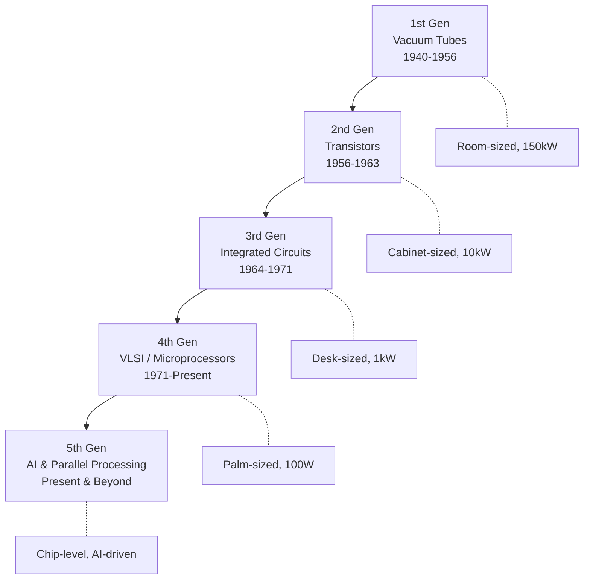

# Topic 1: 1.1 Evolution of Computers

[Index](index.md) | [Next: 1.2 Stored program concept >](topic-02.md)

---

## In Simple Words

Computers didn't appear overnight. They evolved through **five generations**, each defined by a breakthrough in the underlying electronic technology — from vacuum tubes to artificial intelligence chips.

---

## Detailed Explanation

### Why Study Computer Evolution?

Understanding how computers evolved helps you appreciate why modern systems are designed the way they are. Each generation solved a major limitation of the previous one.

### Generation-by-Generation Breakdown

#### First Generation (1940 - 1956) — Vacuum Tubes

- **Technology:** Vacuum tubes (thermionic valves) acted as electronic switches.
- **Size:** Filled entire rooms. ENIAC weighed 30 tons and occupied 1,800 sq ft.
- **Speed:** Could perform about 5,000 additions per second.
- **Input/Output:** Punch cards and paper tape.
- **Programming:** Machine language (raw binary).
- **Problems:** Enormous heat generation, frequent tube burnouts (tubes lasted ~1,000 hours), very high electricity consumption.
- **Examples:** ENIAC, UNIVAC I, IBM 701.

#### Second Generation (1956 - 1963) — Transistors

- **Technology:** Transistors replaced vacuum tubes. A transistor is a semiconductor device that can switch or amplify signals.
- **Size:** Reduced from room-sized to large cabinet-sized.
- **Speed:** About 10x faster than first generation.
- **Programming:** Assembly language was introduced, making programming slightly easier than raw binary.
- **Key advance:** Transistors are smaller, cheaper, generate less heat, and are far more reliable than vacuum tubes.
- **Memory:** Magnetic core memory was used.
- **Examples:** IBM 7094, CDC 1604, UNIVAC 1108.

#### Third Generation (1964 - 1971) — Integrated Circuits (ICs)

- **Technology:** Multiple transistors were fabricated on a single silicon chip (IC), invented by Jack Kilby and Robert Noyce.
- **Types of ICs:**
  - **SSI** (Small Scale Integration): up to 100 transistors per chip
  - **MSI** (Medium Scale Integration): 100 to 1,000 transistors per chip
- **Programming:** High-level languages (FORTRAN, COBOL, C) became common. Operating systems were introduced.
- **Key advance:** Dramatic reduction in size, cost, and power consumption. Computers became accessible to medium-sized businesses.
- **Examples:** IBM 360 series, PDP-8, PDP-11.

#### Fourth Generation (1971 - Present) — VLSI / Microprocessors

- **Technology:** VLSI (Very Large Scale Integration) placed hundreds of thousands to billions of transistors on a single chip.
- **Milestone:** Intel 4004 (1971) — the first commercial microprocessor, containing 2,300 transistors.
- **Modern chips:** Apple M2 has ~20 billion transistors; AMD EPYC has ~50+ billion.
- **Key advance:** Entire CPU on a single chip — this enabled personal computers, laptops, and eventually smartphones.
- **Programming:** Object-oriented languages, GUIs, networking, internet.
- **Examples:** Intel 8086, Pentium series, ARM processors.

#### Fifth Generation (Present and Beyond) — AI and Parallel Processing

- **Technology:** Focuses on AI, machine learning, natural language processing, and massively parallel architectures.
- **Key ideas:** Neural networks on silicon (TPUs, NPUs), quantum computing research, bio-computing.
- **Goal:** Computers that can "think," learn, and make decisions.
- **Examples:** IBM Watson, Google TPU, neuromorphic chips.

### Summary Comparison Table

| Feature | Gen 1 | Gen 2 | Gen 3 | Gen 4 | Gen 5 |
|---|---|---|---|---|---|
| **Technology** | Vacuum Tubes | Transistors | ICs | VLSI | AI / Quantum |
| **Speed** | Slow (ms) | Moderate (us) | Fast (ns) | Very Fast (ps) | Ultra Fast |
| **Size** | Room-sized | Cabinet-sized | Desk-sized | Palm-sized | Chip-level |
| **Memory** | Magnetic Drum | Magnetic Core | Semiconductor | Semiconductor | Distributed |
| **Language** | Machine | Assembly | High-level | OOP / GUI | AI-based |
| **Failure Rate** | Very High | Moderate | Low | Very Low | Minimal |
| **Power** | ~150 kW | ~10 kW | ~1 kW | ~100 W | ~5-50 W |

---

## Real-Life Example

Think of **transportation evolution**: first there were horse carts (slow, unreliable — like vacuum tubes), then steam engines (faster but bulky — like transistors), then cars with internal combustion (compact, efficient — like ICs), then electric cars (clean, smart — like VLSI microprocessors), and now self-driving cars (AI-based — like 5th generation computers). Each leap made travel faster, cheaper, and more accessible — exactly what happened with computers.

---

## Visual Flow

---

## Quick Revision

| Point | Remember |
|---|---|
| Gen 1 technology | Vacuum tubes |
| Gen 2 technology | Transistors |
| Gen 3 technology | Integrated Circuits (SSI, MSI) |
| Gen 4 technology | VLSI, Microprocessors |
| Gen 5 technology | AI, Parallel, Quantum |
| First microprocessor | Intel 4004 (1971) |
| Biggest Gen 1 problem | Heat, burnout, huge size |
| Programming evolution | Machine -> Assembly -> High-level -> OOP -> AI |

> **Exam Tip:** Always compare generations using these 5 parameters: technology, speed, size, language, and reliability.

---

[Index](index.md) | [Next: 1.2 Stored program concept >](topic-02.md)

