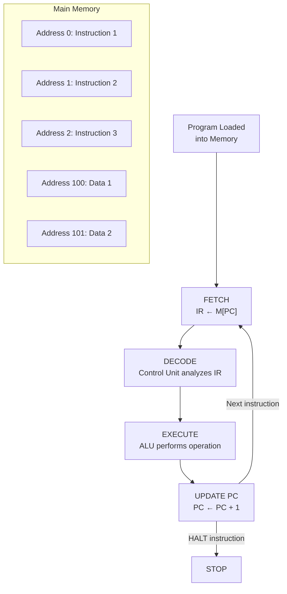

# Topic 2: 1.2 Stored Program Concept

[< Prev: 1.1 Evolution of Computers](topic-01.md) | [Index](index.md) | [Next: 1.3 Von-Neumann Architecture >](topic-03.md)

---

## In Simple Words

The **stored program concept** means that both the **program (instructions)** and the **data** it works on are stored in the **same main memory**. The CPU reads instructions one by one from memory, decodes them, and executes them automatically.

---

## Detailed Explanation

### The Problem Before Stored Programs

In early computers like ENIAC, programs were not stored in memory. Instead, operators had to **physically rewire** the machine using patch cables and switches for every new task. Changing a program could take **days of manual labor**. The hardware and software were not separate.

### The Breakthrough Idea

In 1945, **John von Neumann** (along with Eckert and Mauchly) proposed a revolutionary idea:

> *"Store the program instructions in the same memory where data is stored, and let the CPU fetch and execute them automatically."*

This is the **stored program concept** — the foundation of virtually every modern computer.

### How It Works — Step by Step

1. **Program is loaded into memory:** Instructions are placed in consecutive memory locations, just like data. Each instruction has a unique memory address.

2. **Program Counter (PC)** holds the address of the **next instruction** to be fetched.

3. **Fetch:** The CPU reads the instruction from the memory address pointed to by PC, and loads it into the **Instruction Register (IR)**.

4. **Decode:** The control unit examines the instruction in IR to determine what operation to perform and what operands are needed.

5. **Execute:** The ALU or other functional units carry out the operation (add, subtract, load, store, etc.).

6. **Update PC:** The PC is incremented to point to the next instruction (or changed by a branch/jump instruction).

7. **Repeat:** The cycle continues until a HALT instruction is encountered.

### The Fetch-Decode-Execute Cycle

This is also called the **instruction cycle** or **machine cycle**:

```
REPEAT:
    MAR ← PC                  // Put address into Memory Address Register
    IR  ← M[MAR]              // Fetch instruction from memory into IR
    PC  ← PC + 1              // Increment program counter
    Decode IR                  // Control unit decodes the instruction
    Execute the operation      // ALU performs computation
UNTIL HALT
```

### Key Properties of Stored Program Computers

| Property | Explanation |
|---|---|
| **Instructions in memory** | Program code lives in the same memory as data |
| **Sequential execution** | Instructions are fetched and executed in sequence (unless a branch occurs) |
| **Program modifiability** | Programs can be changed without hardware modification — just load new instructions into memory |
| **Self-modifying code** | A program can theoretically modify its own instructions (used in early computers, now avoided for safety) |
| **Universality** | The same hardware can run ANY program — it's a general-purpose machine |

### What Changed After This Concept?

| Before (Hardwired Programs) | After (Stored Programs) |
|---|---|
| Program defined by physical wiring | Program stored as data in memory |
| Changing program = rewiring hardware | Changing program = loading new software |
| Single-purpose machine | General-purpose machine |
| Days to reprogram | Seconds to load new program |

### Important: Stored Program ≠ Von Neumann Architecture

The stored program concept is an **idea** (store instructions in memory). Von Neumann architecture is a specific **implementation** of that idea (single memory, single bus). Harvard architecture is another implementation (separate instruction and data memories). Both use the stored program concept.

---

## Real-Life Example

Think of a **music player**. The songs (data) and the playlist order (instructions — which song to play next) are both stored on the **same storage device** (your phone's memory). You don't need to buy a new music player every time you want to listen to a different playlist — you just change the playlist (software). That's exactly what the stored program concept enables: **change the program without changing the hardware**.

Before stored programs, it was like having a **separate physical jukebox for every single song** — to play a different song, you'd need a different machine.

---

## Visual Flow



---

## Quick Revision

| Point | Remember |
|---|---|
| Core idea | Instructions AND data stored in same memory |
| Who proposed it? | John von Neumann (1945) |
| What is PC? | Program Counter — holds address of next instruction |
| What is IR? | Instruction Register — holds the fetched instruction |
| Instruction cycle | Fetch → Decode → Execute → Update PC → Repeat |
| Before stored programs | Rewiring needed for each new program |
| Key benefit | General-purpose computing — same hardware, different software |
| Self-modifying code | Program can change its own instructions (rarely used today) |

> **Exam Tip:** If asked "What is the stored program concept?", always mention: (1) instructions and data in same memory, (2) CPU fetches instructions sequentially via PC, and (3) programs can be changed without hardware modification.

---

[< Prev: 1.1 Evolution of Computers](topic-01.md) | [Index](index.md) | [Next: 1.3 Von-Neumann Architecture >](topic-03.md)

