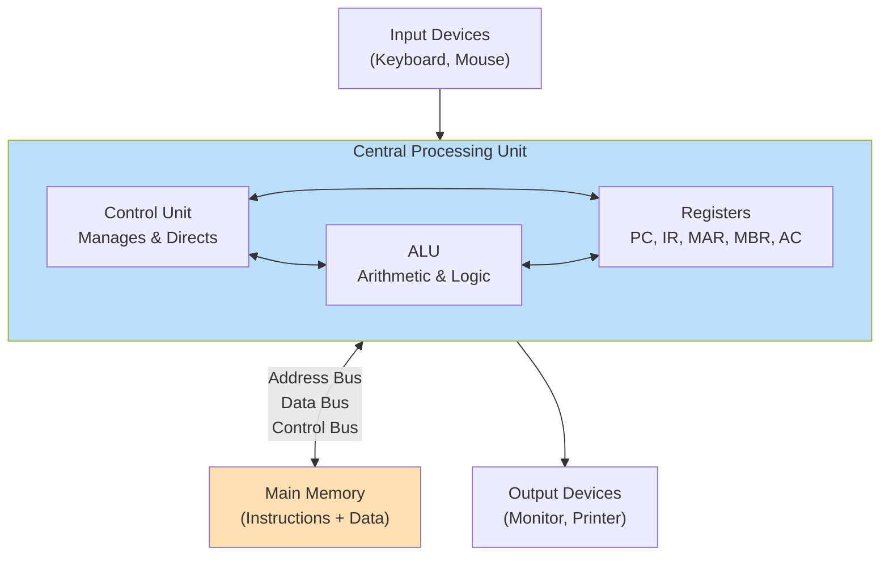

# Topic 3: 1.3 Von-Neumann Architecture

[< Prev: 1.2 Stored Program Concept](topic-02.md) | [Index](index.md) | [Next: 1.4 Information Representation and Codes >](topic-04.md)

---

## In Simple Words

The **Von Neumann Architecture** is the blueprint of almost every modern computer. It has **one single memory** that stores both instructions and data, a **CPU** that processes everything, and **buses** that connect all parts together.

---

## Detailed Explanation

### Who Proposed It?

**John von Neumann** described this architecture in a 1945 draft report called *"First Draft of a Report on the EDVAC"*. It became the standard blueprint for computer design.

### The Five Major Components

```
Von Neumann Computer

        ┌───────────────┐
        │   Input Unit     │
        └───────┬───────┘
                  │
                ▼
        ┌─────────────────┐
        │       CPU          │
        │ ┌─────────────┐ │
        │ │ Control Unit.  │ │
        │ │     (CU)       │ │
        │ └─────────────┘ │
        │ ┌─────────────┐ │
        │ │     ALU        │ │
        │ └─────────────┘ │
        │ ┌─────────────┐ │
        │ │  Registers     │ │
        │ └─────────────┘ │
        └───────┬─────────┘
                │
           System Bus
                │
                ▼
        ┌─────────────────┐
        │   Main Memory      │
        │ (Program+Data)     │
        └───────┬─────────┘
                │
                ▼
        ┌───────────────┐
        │  Output Unit     │
        └───────────────┘
```

#### 1. Central Processing Unit (CPU)

The CPU is the "brain" of the computer. It has three sub-parts:

| Sub-component | Function |
|---|---|
| **Control Unit (CU)** | Directs the operation of the processor. It fetches instructions, decodes them, and sends control signals to other units. It does NOT process data — it only manages the flow. |
| **Arithmetic Logic Unit (ALU)** | Performs all arithmetic operations (add, subtract, multiply, divide) and logical operations (AND, OR, NOT, comparison). |
| **Registers** | Small, ultra-fast storage locations inside the CPU. Key registers: PC (Program Counter), IR (Instruction Register), MAR (Memory Address Register), MBR/MDR (Memory Buffer/Data Register), Accumulator (AC). |

#### 2. Main Memory (RAM)

- Stores **both** program instructions and data in the **same address space**.
- Memory is organized as an array of addressable locations.
- Each location has a unique **address** (like a house number on a street).
- Memory is **volatile** — contents are lost when power is off.

#### 3. Input Unit

- Accepts data and instructions from the outside world (keyboard, mouse, scanner, etc.).
- Converts human-readable input into binary form the computer can process.

#### 4. Output Unit

- Presents processed results to the user (monitor, printer, speakers, etc.).
- Converts binary results back to human-readable form.

#### 5. System Bus

The bus is the communication highway connecting all components. It has three parts:

| Bus | Width | Purpose |
|---|---|---|
| **Data Bus** | 8, 16, 32, or 64 bits | Carries actual data/instructions between CPU and memory |
| **Address Bus** | Determines addressable memory | Carries the address of the memory location to read/write |
| **Control Bus** | Varies | Carries control signals: Read, Write, Clock, Interrupt, etc. |

**Address bus width determines maximum memory:** If address bus = 16 bits → max addressable memory = $2^{16}$ = 64 KB. If 32 bits → $2^{32}$ = 4 GB.

### How Data Flows in Von Neumann Architecture

1. **PC** holds the address of the next instruction.
2. Address goes on the **address bus** to memory.
3. Memory sends the instruction back on the **data bus** to the **IR**.
4. **CU** decodes the instruction in IR.
5. If data is needed, CU sends another address on the address bus to fetch data from memory.
6. Data comes back on the data bus and goes to the **ALU** for processing.
7. Result is stored back in a register or memory.
8. **PC** is updated, and the cycle repeats.

### The Von Neumann Bottleneck

This is the **most important limitation** of this architecture:

> Since instructions and data share the **same memory** and the **same bus**, the CPU can only do **one thing at a time** — either fetch an instruction OR fetch/store data. It cannot do both simultaneously.

- The single bus becomes a **bandwidth bottleneck** because the CPU is often faster than the memory access speed.
- This is called the **Von Neumann bottleneck** (also called the **memory wall**).

**Solutions to the bottleneck:**
- **Cache memory:** Small, fast memory between CPU and main memory.
- **Harvard architecture:** Separate memory and bus for instructions and data.
- **Pipelining:** Overlap fetch and execute stages.
- **Wider buses:** Increase data bus width for more throughput.

### Von Neumann vs. Harvard Architecture

| Feature | Von Neumann | Harvard |
|---|---|---|
| Memory | Single memory for instructions + data | Separate memory for instructions and data |
| Bus | Single bus (shared) | Separate buses for instructions and data |
| Bottleneck | Yes — shared memory creates contention | Reduced — parallel access possible |
| Complexity | Simpler design | More complex (more wiring) |
| Usage | General-purpose computers (desktops, servers) | Embedded systems, DSPs, microcontrollers |
| Can fetch instruction while reading data? | No | Yes |

### Key Registers in Von Neumann Architecture

| Register | Full Name | Purpose |
|---|---|---|
| **PC** | Program Counter | Holds address of the next instruction to fetch |
| **IR** | Instruction Register | Holds the currently fetched instruction |
| **MAR** | Memory Address Register | Holds the address being sent to memory |
| **MBR/MDR** | Memory Buffer/Data Register | Holds data being read from or written to memory |
| **AC** | Accumulator | General-purpose register for ALU results |

---

## Real-Life Example

Imagine a **single-lane road** connecting a factory (CPU) to a warehouse (memory). The factory needs both **raw materials** (data) and **work orders** (instructions) from the warehouse.

- Since there's only **one lane**, the truck can carry either raw materials OR a work order — **not both at the same time**.
- If the factory is very fast but the truck is slow, the factory sits idle waiting — this is the **Von Neumann bottleneck**.
- **Solution:** Build a **small storage room at the factory** (cache) so frequently needed items are already there. Or build **two separate lanes** — one for materials, one for orders (Harvard architecture).

---

## Visual Flow



---

## Quick Revision

| Point | Remember |
|---|---|
| Year | 1945 — John von Neumann |
| Key idea | One memory stores BOTH instructions and data |
| CPU parts | Control Unit + ALU + Registers |
| Three buses | Data Bus, Address Bus, Control Bus |
| Address bus width | Determines max addressable memory ($2^n$ bytes) |
| Bottleneck | Single bus shared for instructions and data = CPU waits |
| Bottleneck solutions | Cache, Harvard architecture, pipelining, wider bus |
| Von Neumann vs Harvard | Von Neumann = shared memory; Harvard = separate memories |
| Key registers | PC, IR, MAR, MBR/MDR, AC |

> **Exam Tip:** Draw the block diagram showing CPU (with CU, ALU, Registers), Memory, I/O, and the three buses. Always mention the Von Neumann bottleneck and at least two solutions.

---

[< Prev: 1.2 Stored Program Concept](topic-02.md) | [Index](index.md) | [Next: 1.4 Information Representation and Codes >](topic-04.md)

