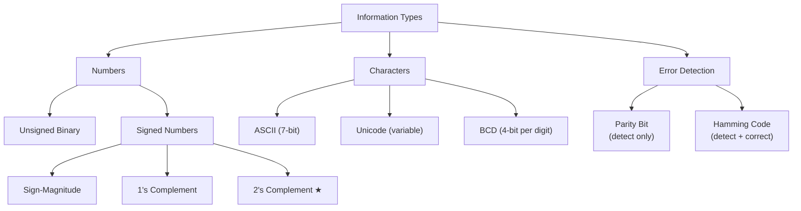

# Topic 4: 1.4 Information Representation and Codes

[< Prev: 1.3 Von-Neumann Architecture](topic-03.md) | [Index](index.md) | [Next: 1.5 Building Blocks of Computers >](topic-05.md)

---

## In Simple Words

Computers only understand **0s and 1s** (binary). Everything — numbers, text, images, sound — must be converted into binary before a computer can process it. **Information representation** is the set of rules and coding systems that make this conversion possible.

---

## Detailed Explanation

### Why Binary?

Computers use electronic switches (transistors) that have only two states: **ON (1)** and **OFF (0)**. It's physically simple and reliable to distinguish between two voltage levels. This is why the entire digital world is built on **binary (base-2)**.

### Number Systems Used in Computers

| System | Base | Digits | Example | Use |
|---|---|---|---|---|
| **Binary** | 2 | 0, 1 | 1010₂ = 10₁₀ | Internal storage and processing |
| **Octal** | 8 | 0-7 | 12₈ = 10₁₀ | Shorthand for binary (3 bits = 1 octal digit) |
| **Decimal** | 10 | 0-9 | 10₁₀ | Human-readable input/output |
| **Hexadecimal** | 16 | 0-9, A-F | A₁₆ = 10₁₀ | Shorthand for binary (4 bits = 1 hex digit) |

### Conversion Quick Reference

**Binary to Decimal:** Multiply each bit by its positional power of 2 and sum.
- Example: $1101_2 = 1 \times 2^3 + 1 \times 2^2 + 0 \times 2^1 + 1 \times 2^0 = 8 + 4 + 0 + 1 = 13_{10}$

**Decimal to Binary:** Repeatedly divide by 2, record remainders bottom-to-top.
- Example: $13 \div 2 = 6R1, \; 6 \div 2 = 3R0, \; 3 \div 2 = 1R1, \; 1 \div 2 = 0R1 → 1101_2$

**Binary to Hex:** Group bits in sets of 4 from right. $1010\;1100_2$ = $\text{AC}_{16}$

**Binary to Octal:** Group bits in sets of 3 from right. $101\;011\;100_2$ = $534_8$

### Unsigned Binary Numbers

- Use all bits to represent magnitude (no sign bit).
- **n bits** can represent values from **0** to **$2^n - 1$**.
  - 8 bits: 0 to 255
  - 16 bits: 0 to 65,535

### Signed Number Representation

When we need negative numbers, we use one of these methods:

#### 1. Sign-Magnitude

- **MSB (leftmost bit)** = sign bit (0 = positive, 1 = negative).
- Remaining bits = magnitude.
- Example (8-bit): +5 = `00000101`, -5 = `10000101`
- **Problem:** Two representations of zero (+0 = `00000000`, -0 = `10000000`). Arithmetic is complicated.

#### 2. 1's Complement

- Positive numbers: same as sign-magnitude.
- Negative numbers: **flip all bits** of the positive number.
- Example: +5 = `00000101`, -5 = `11111010`
- **Problem:** Still has two zeros (+0 and -0). Addition requires end-around carry.

#### 3. 2's Complement (Most Important!)

- Positive numbers: same as binary.
- Negative numbers: **flip all bits and add 1**.
- Example: +5 = `00000101`, -5 = `11111010 + 1` = `11111011`
- **Advantages:**
  - Only ONE representation of zero.
  - Addition and subtraction use the same hardware circuit.
  - Range for n bits: $-2^{n-1}$ to $+2^{n-1} - 1$
  - 8-bit range: -128 to +127

**2's Complement Shortcut:** Starting from the rightmost bit, keep all bits up to and including the first `1` unchanged, then flip all remaining bits to the left.

#### Comparison Table

| Method | +5 (8-bit) | -5 (8-bit) | Zero representations | Range (8-bit) |
|---|---|---|---|---|
| Sign-Magnitude | 00000101 | 10000101 | Two (+0, -0) | -127 to +127 |
| 1's Complement | 00000101 | 11111010 | Two (+0, -0) | -127 to +127 |
| **2's Complement** | 00000101 | **11111011** | **One** | **-128 to +127** |

### Binary Arithmetic

#### Binary Addition Rules

| A | B | Sum | Carry |
|---|---|---|---|
| 0 | 0 | 0 | 0 |
| 0 | 1 | 1 | 0 |
| 1 | 0 | 1 | 0 |
| 1 | 1 | 0 | 1 |

**Example:** $1011 + 1101 = 11000$ (11 + 13 = 24)

#### Subtraction Using 2's Complement

To compute $A - B$: Calculate $A + (\text{2's complement of } B)$. Discard any carry beyond n bits.

**Example (4-bit):** $7 - 3 = 0111 + 1101 = (1)0100$ → discard carry → $0100 = 4$ ✓

### Character Codes

#### ASCII (American Standard Code for Information Interchange)

- **7-bit code** → 128 characters (0-127).
- Uppercase A = 65 (01000001), 'a' = 97, '0' = 48.
- Extended ASCII uses 8 bits (256 characters).
- Covers English letters, digits, punctuation, and control characters.

#### Unicode (UTF-8, UTF-16, UTF-32)

- Supports **every language** in the world — 1,114,112 code points.
- UTF-8: Variable-length (1 to 4 bytes). Backward compatible with ASCII.
- UTF-16: Used in Java and Windows internally.
- Handles Hindi, Chinese, Arabic, emoji, and all scripts.

### BCD (Binary Coded Decimal)

- Each **decimal digit** is independently coded in **4 bits**.
- Example: Decimal 97 = `1001 0111` (9 = 1001, 7 = 0111).
- **Advantage:** No rounding errors for decimal arithmetic (important in financial systems).
- **Disadvantage:** Wastes bits (4 bits per digit vs. pure binary).

| Decimal | BCD | Pure Binary |
|---|---|---|
| 5 | 0101 | 101 |
| 9 | 1001 | 1001 |
| 15 | 0001 0101 (8 bits) | 1111 (4 bits) |

### Error Detection Codes

#### Parity Bit

- One extra bit added to data to make total number of 1s either **even** (even parity) or **odd** (odd parity).
- **Even parity** example: Data = `1010001` (three 1s) → parity bit = 1 → transmitted: `11010001` (four 1s = even).
- **Detects:** Single-bit errors only. Cannot correct errors.

#### Hamming Code

- Can **detect AND correct** single-bit errors.
- Adds multiple parity bits at positions that are powers of 2 (1, 2, 4, 8...).
- Used in ECC memory (Error-Correcting Code RAM).

---

## Real-Life Example

When you type the letter **"A"** on your keyboard:
1. The keyboard sends ASCII code **65** (binary `01000001`) to the computer.
2. The CPU stores this as binary in memory.
3. When displaying, the graphics system reads the code 65 and draws the shape "A" on screen.

**For negative numbers in a bank:** If your account has a balance of -500, the computer stores -500 in **2's complement** format. When adding a deposit of +700, it simply performs binary addition: $-500 + 700 = +200$. The same hardware circuit handles both addition and subtraction — that's the power of 2's complement.

---

## Visual Flow

---

## Quick Revision

| Point | Remember |
|---|---|
| Why binary? | Transistors have 2 states: ON/OFF |
| 2's complement of N | Flip all bits, add 1 |
| 2's complement range (n bits) | $-2^{n-1}$ to $+2^{n-1} - 1$ |
| 2's complement advantage | Single zero, same circuit for add/subtract |
| ASCII 'A' | 65 (7-bit code) |
| BCD for 97 | 1001 0111 (each digit separate) |
| Even parity | Add bit to make total 1s even |
| Hamming code | Parity bits at positions 1, 2, 4, 8... |
| Hex shorthand | 4 binary bits = 1 hex digit |
| Address bus 32 bits → memory | $2^{32}$ = 4 GB addressable |

> **Exam Tip:** Practice at least 5 decimal-to-2's-complement conversions and 5 binary additions before the exam. BCD and parity are usually short-answer questions.

---

[< Prev: 1.3 Von-Neumann Architecture](topic-03.md) | [Index](index.md) | [Next: 1.5 Building Blocks of Computers >](topic-05.md)

