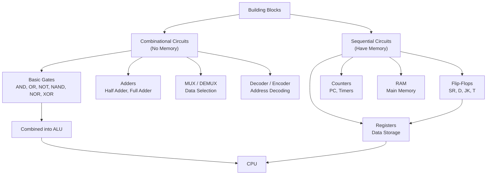

# Topic 5: 1.5 Building Blocks of Computers

[< Prev: 1.4 Information Representation and Codes](topic-04.md) | [Index](index.md) | [Next: 2.1 Concept of Bus >](topic-06.md)

---

## In Simple Words

Every computer is built from two types of digital circuits: **combinational circuits** (output depends only on current inputs — no memory) and **sequential circuits** (output depends on current inputs AND past history — they have memory). Together, these form all the hardware inside a CPU.

---

## Detailed Explanation

### Logic Gates — The Fundamental Building Blocks

All digital circuits are made from basic **logic gates**:

| Gate | Symbol | Function | Truth Table Highlight |
|---|---|---|---|
| **AND** | A · B | Output 1 only when ALL inputs are 1 | 1·1 = 1, everything else = 0 |
| **OR** | A + B | Output 1 when ANY input is 1 | 0+0 = 0, everything else = 1 |
| **NOT** | A' | Inverts the input | 0' = 1, 1' = 0 |
| **NAND** | (A·B)' | AND followed by NOT — **universal gate** | 1·1 = 0 |
| **NOR** | (A+B)' | OR followed by NOT — **universal gate** | 0+0 = 1 |
| **XOR** | A ⊕ B | Output 1 when inputs are **different** | 0⊕1 = 1, 1⊕1 = 0 |
| **XNOR** | (A⊕B)' | Output 1 when inputs are **same** | 0⊕0 = 1, 1⊕1 = 1 |

**NAND and NOR are universal gates** — you can build ANY other gate using only NAND gates (or only NOR gates).

### Combinational Circuits

These are circuits with **no memory**. The output is entirely determined by the **current inputs** at that instant.

#### Key Combinational Circuits

**1. Half Adder**
- Adds **two single bits** (A and B).
- Outputs: **Sum** = A ⊕ B, **Carry** = A · B.
- Cannot handle carry-in from a previous stage.

**2. Full Adder**
- Adds **three bits**: A, B, and Carry-in (Cin).
- Outputs: **Sum** = A ⊕ B ⊕ Cin, **Carry-out** = AB + BCin + ACin.
- Multiple full adders chained together form a **Ripple Carry Adder** for multi-bit addition.

**3. Multiplexer (MUX) — Data Selector**
- **2ⁿ inputs**, **n selection lines**, **1 output**.
- Selects one of the inputs based on the selection lines and routes it to output.
- Example: 4:1 MUX has 4 data inputs (I0, I1, I2, I3), 2 select lines (S1, S0), and 1 output.
- **Use in CPU:** Selecting which register value to send to the ALU.

**4. Demultiplexer (DEMUX) — Data Distributor**
- **1 input**, **n selection lines**, **2ⁿ outputs**.
- Routes the single input to one of the outputs based on selection.
- Opposite of MUX.

**5. Decoder**
- **n input lines**, **2ⁿ output lines**.
- Exactly **one output** is active (HIGH) for each input combination.
- Example: 3-to-8 decoder activates one of 8 output lines based on 3-bit input.
- **Use in CPU:** Memory address decoding — select which memory chip is active.

**6. Encoder**
- Opposite of decoder: **2ⁿ input lines**, **n output lines**.
- Converts active input line number to a binary code.
- **Priority encoder** handles the case when multiple inputs are active — it outputs the code for the highest-priority input.

**7. Comparator**
- Compares two binary numbers and outputs whether A > B, A < B, or A = B.

### Sequential Circuits

These circuits have **memory** — their output depends on both **current inputs** and **previous state**. They use **flip-flops** as the basic building blocks.

#### Flip-Flops (1-Bit Memory Elements)

| Type | Behavior | Use |
|---|---|---|
| **SR Flip-Flop** | Set (S=1) → Q=1, Reset (R=1) → Q=0. S=R=1 is **invalid**. | Basic latch, rarely used alone |
| **D Flip-Flop** | Q takes the value of D at the clock edge. | **Most commonly used** — registers, data storage |
| **JK Flip-Flop** | Like SR but J=K=1 **toggles** output instead of being invalid. | Counters, frequency dividers |
| **T Flip-Flop** | When T=1, output toggles on each clock edge. When T=0, no change. | Binary counters |

**Clock signal** is crucial — flip-flops change state only at the **rising edge** (or falling edge) of the clock. This ensures synchronized operation.

#### Key Sequential Circuits

**1. Registers**
- A group of **D flip-flops** that store a multi-bit value.
- An **n-bit register** uses n flip-flops.
- Example: A 16-bit register stores one 16-bit number or instruction.
- Registers have **Load** control — when Load = 1, new data is written on the next clock edge.

**2. Shift Registers**
- Registers that can **shift** their contents left or right by one position per clock cycle.
- Types: SISO (Serial In Serial Out), SIPO, PISO, PIPO.
- **Use:** Serial-to-parallel conversion, multiplication/division by 2.

**3. Counters**
- Sequential circuits that cycle through a sequence of states.
- **Binary counter:** Counts 0, 1, 2, 3, ..., 2ⁿ-1, then wraps to 0.
- **Up counter:** Counts upward. **Down counter:** Counts downward.
- **Ring counter:** Only one flip-flop is set at a time — used for timing sequences.
- **Use in CPU:** Program Counter (PC) is essentially an up-counter with load capability.

**4. Memory (RAM)**
- An array of registers, each with a unique address.
- **Read:** Put address on address lines → memory outputs the data at that location.
- **Write:** Put address + data + write signal → data is stored at that address.

### Combinational vs. Sequential — Key Difference

| Feature | Combinational | Sequential |
|---|---|---|
| Memory | **No** | **Yes** (flip-flops) |
| Output depends on | Current inputs only | Current inputs + past state |
| Clock needed? | No | Yes |
| Examples | Adder, MUX, Decoder | Register, Counter, RAM |
| Speed | Faster (no clock delay) | Governed by clock frequency |

### How These Blocks Build a CPU

```
CPU = Datapath + Control Unit

Datapath:
  - Registers (sequential) → store operands and results
  - ALU (combinational) → performs arithmetic/logic
  - MUX (combinational) → selects inputs for ALU
  - Bus (wiring) → connects components

Control Unit:
  - Decoder (combinational) → decodes opcode into control signals
  - Sequencer (sequential) → determines timing of operations
  - Generates: register load, ALU operation, MUX select, memory read/write signals
```

---

## Real-Life Example

Think of building a house:
- **Logic gates** are like individual bricks — the smallest unit.
- **Combinational circuits** (adders, MUX) are like **rooms** — they take input (people entering) and produce output (people exiting through a specific door), but they don't remember who came before.
- **Sequential circuits** (flip-flops, registers) are like **rooms with attendance registers** — they keep track of who came and when, and their behavior depends on the history of visitors.
- A complete **CPU** is like the entire building — rooms (datapath) connected by hallways (buses) with a manager's office (control unit) coordinating everything.

---

## Visual Flow



---

## Quick Revision

| Point | Remember |
|---|---|
| Universal gates | NAND, NOR (can build any circuit) |
| Half Adder | Adds 2 bits; Sum = A⊕B, Carry = A·B |
| Full Adder | Adds 3 bits (A, B, Cin); chains to make Ripple Carry Adder |
| MUX | 2ⁿ inputs → 1 output (data selector) |
| Decoder | n inputs → 2ⁿ outputs (one-hot activation) |
| D Flip-Flop | Q = D at clock edge; most commonly used |
| JK Flip-Flop | Like SR but J=K=1 toggles (no invalid state) |
| Register | Group of D flip-flops storing n-bit value |
| Counter | Sequential circuit counting through states (used for PC) |
| Combinational vs Sequential | No memory vs has memory (flip-flops) |

> **Exam Tip:** Be ready to draw a Full Adder circuit diagram and a 4:1 MUX. Know the truth tables of all flip-flop types. When asked "building blocks of CPU," start with gates → adders → MUX/decoder → flip-flops → registers → ALU + control = CPU.

---

[< Prev: 1.4 Information Representation and Codes](topic-04.md) | [Index](index.md) | [Next: 2.1 Concept of Bus >](topic-06.md)

