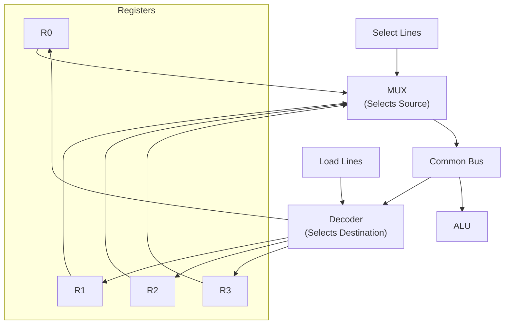

# Topic 6: 2.1 Concept of Bus

[< Prev: 1.5 Building Blocks of Computers](topic-05.md) | [Index](index.md) | [Next: 2.2 Data Movement Among Registers >](topic-07.md)

---

## In Simple Words

A **bus** is a shared communication pathway (a group of wires) that connects the CPU, memory, and I/O devices. Instead of having a separate wire between every pair of components, all components share the same set of lines — reducing wiring complexity but requiring rules for who gets to "talk" on the bus at any time.

---

## Detailed Explanation

### Why Do We Need Buses?

Without buses, if you had **n** components, you'd need direct wiring between every pair — that's $\frac{n(n-1)}{2}$ connections. For 10 components, that's 45 separate wired connections. A bus replaces all of that with a **single shared pathway** that every component connects to.

### Types of Buses

#### 1. Data Bus

- Carries the **actual data** being transferred (instruction bytes, operand values, results).
- **Bidirectional** — data can flow in both directions (CPU → Memory and Memory → CPU).
- **Width** determines how many bits are transferred at once:
  - 8-bit data bus → transfers 1 byte per cycle
  - 32-bit data bus → transfers 4 bytes per cycle
  - 64-bit data bus → transfers 8 bytes per cycle
- **Wider data bus = faster throughput** (more data per transfer).

#### 2. Address Bus

- Carries the **address** (location number) of the memory or I/O port being accessed.
- **Unidirectional** — address always flows from CPU to memory/I/O.
- Width determines maximum addressable memory:
  - 16-bit address bus → $2^{16}$ = 64 KB
  - 32-bit address bus → $2^{32}$ = 4 GB
  - 64-bit address bus → $2^{64}$ = 16 exabytes (theoretical)

#### 3. Control Bus

- Carries **command and timing signals** that coordinate all operations.
- Includes signals like:
  - **Memory Read (MEMR)** — CPU wants to read from memory
  - **Memory Write (MEMW)** — CPU wants to write to memory
  - **I/O Read / I/O Write** — for peripheral devices
  - **Interrupt Request (IRQ)** — device needs CPU attention
  - **Bus Request / Bus Grant** — for DMA operations
  - **Clock** — synchronization signal
- Mix of unidirectional and bidirectional signals.

### Bus Organization in Register Transfer

When a CPU has multiple registers (R0, R1, R2, ..., Rn), they need a way to transfer data between themselves and to/from the ALU. There are three main approaches:

#### Approach 1: Dedicated Lines (Point-to-Point)

- Every register has a direct connection to every other register.
- **Very fast** but **extremely expensive** in terms of wiring.
- Not practical for more than a few registers.

#### Approach 2: Common Bus (Single Bus)

- All registers connect to **one shared bus**.
- A **multiplexer (MUX)** selects which register's output is placed on the bus.
- A **decoder** selects which register loads from the bus.
- **Only one transfer can happen at a time** — e.g., R1 → Bus → R2.

**How MUX-based bus works:**
```
For n registers of k bits each:
- Use n-to-1 MUX (k copies — one for each bit position)
- Select lines (log₂n bits) choose which register drives the bus
- Destination register has its Load line activated

Example: 4 registers, 16-bit each
- Four 16-bit registers connect to 4-to-1 MUX (16 copies)
- 2 select lines choose source register
- Decoder enables load for destination register
```

#### Approach 3: Three-Bus Architecture

- **Three separate buses** (Bus A, Bus B, Bus C).
- Two source buses (A, B) feed the ALU inputs simultaneously.
- One result bus (C) carries the ALU output back to registers.
- **Allows A + B → C in a single cycle** — much faster than single bus.

### Bus Arbitration

Since the bus is shared, **only one device can use it at a time**. We need rules to decide who gets access:

| Method | How it works |
|---|---|
| **Daisy Chain** | Priority flows through a chain — first device in line gets highest priority |
| **Centralized Parallel** | A bus controller receives all requests and grants access based on priority |
| **Distributed** | Each device has its own priority logic and they resolve conflicts among themselves |

### Tri-State Buffers

To connect multiple registers to a common bus, we use **tri-state buffers** at each register output:

| Control | Output State |
|---|---|
| Enable = 1 | Buffer passes register value to bus (0 or 1) |
| Enable = 0 | **High impedance (Z)** — effectively disconnected from bus |

This ensures only **one register drives the bus at a time**, preventing electrical conflicts.

---

## Real-Life Example

Think of a **single-lane road** shared by all houses in a neighborhood:

- The road is the **bus** — everyone shares it.
- House numbers on mailboxes are the **address bus** — they identify which house to deliver to.
- The packages being delivered are the **data bus** — actual content being transferred.
- Traffic signals and delivery rules are the **control bus** — they decide when someone can send/receive.
- Only **one vehicle** can use the road at a time — this is why we need **bus arbitration** (like traffic signals).
- If you want faster delivery, make the road **wider** (wider data bus = more lanes = faster throughput).

---

## Visual Flow



---

## Quick Revision

| Point | Remember |
|---|---|
| Three buses | Data Bus (bidirectional), Address Bus (unidirectional), Control Bus (mixed) |
| Data bus width | Determines transfer throughput (bits per cycle) |
| Address bus width | Determines max addressable memory ($2^n$ bytes) |
| Common bus implementation | MUX for source selection + Decoder for destination selection |
| Tri-state buffer states | 0, 1, or High-Z (disconnected) |
| Bus arbitration | Daisy chain, centralized parallel, distributed |
| Single bus limitation | Only one transfer per clock cycle |
| Three-bus advantage | Two sources + one destination simultaneously |

> **Exam Tip:** If asked to design a bus system for 4 registers, draw the MUX-based common bus. Show MUX with select lines, registers with load lines, and explain that only one register drives the bus at a time using tri-state buffers.

---

[< Prev: 1.5 Building Blocks of Computers](topic-05.md) | [Index](index.md) | [Next: 2.2 Data Movement Among Registers >](topic-07.md)

