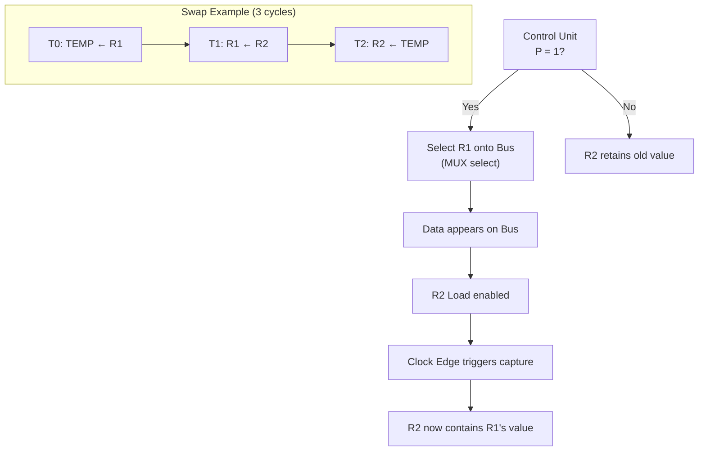

# Topic 7: 2.2 Data Movement Among Registers

[< Prev: 2.1 Concept of Bus](topic-06.md) | [Index](index.md) | [Next: 2.3 A Language to Represent Conditional Data Transfer (RTL) >](topic-08.md)

---

## In Simple Words

**Register transfer** is the most fundamental operation inside a CPU — it means copying the contents of one register into another register during a single clock cycle. All computation inside a CPU is ultimately a sequence of register transfers.

---

## Detailed Explanation

### What is a Register Transfer?

A register transfer copies the **binary content** of a source register to a destination register. The source register is **not modified** — only the destination gets a new value.

**Notation:** `R2 ← R1`

This reads: "The contents of R1 are transferred to R2." After this operation:
- R2 contains a **copy** of whatever was in R1
- R1 still holds its original value (unchanged)

### Hardware Required for a Transfer

For `R2 ← R1` to happen, you need:

1. **R1's output** connected to the bus (via tri-state buffer or MUX).
2. **Bus** carries the data.
3. **R2's load input** activated (enabled) so it captures the bus value on the next clock edge.
4. **Clock edge** triggers the actual capture.

```
Before clock edge:  R1 = 0101,  R2 = 1100
After clock edge:   R1 = 0101,  R2 = 0101 (R2 gets R1's value)
```

### Conditional Register Transfer

Most transfers don't happen unconditionally — they happen only when a **control condition** is true:

**Notation:** `P: R2 ← R1`

This means: "IF control signal P = 1, THEN transfer R1 to R2 on the next clock edge."

**Hardware implementation:**
```
R2_Load = P AND Clock_Edge
```
The Load input of R2 is the AND of the control signal P and the clock. If P = 0, R2 retains its old value even when the clock ticks.

### Simultaneous Transfers

Multiple independent transfers can happen **in the same clock cycle** if they use different destination registers:

```
T3: R1 ← R2, R3 ← R4
```

This means: At time T3, simultaneously copy R2 into R1 AND copy R4 into R3. This works because R1 and R3 are different destination registers — there's no conflict.

**INVALID:** You **cannot** have two transfers to the **same** destination in the same cycle:
```
T3: R1 ← R2, R1 ← R4    ← CONFLICT! Which value does R1 get?
```

### Register Swap Operation

Swapping the contents of two registers requires a **temporary register** (TEMP) because both need to be read before either is overwritten:

```
T0: TEMP ← R1        // Save R1 in temporary register
T1: R1 ← R2          // Copy R2 into R1
T2: R2 ← TEMP        // Copy original R1 (saved in TEMP) into R2
```

**Note:** This takes 3 clock cycles. With a three-bus architecture, some swap operations can be done faster, but the concept remains the same.

### Types of Register Transfer Microoperations

| Category | Example | Meaning |
|---|---|---|
| **Register to Register** | R2 ← R1 | Copy R1 to R2 |
| **Immediate to Register** | R1 ← 5 | Load constant value 5 into R1 |
| **Memory to Register** | R1 ← M[MAR] | Load memory contents at address MAR into R1 |
| **Register to Memory** | M[MAR] ← R1 | Store R1 value into memory at address MAR |
| **Arithmetic** | R3 ← R1 + R2 | Add R1 and R2, result in R3 |
| **Shift** | R1 ← shl R1 | Shift R1 left by 1 bit |

### How the Control Unit Manages Transfers

The control unit generates signals that orchestrate every transfer:

1. **Select the source:** MUX select lines choose which register drives the bus.
2. **Enable the bus:** Tri-state buffer or MUX output is activated.
3. **Signal the destination:** Load line of the destination register is raised.
4. **Wait for clock edge:** The actual data capture happens at the clock edge.
5. **Deactivate signals:** Control signals return to inactive state after the clock edge.

---

## Real-Life Example

Imagine an office with employees (registers) and a shared whiteboard (bus):

- **R1 ← R2** is like Employee 2 writing their report on the whiteboard, and Employee 1 copying it down. Employee 2 still has their original report.
- **Conditional transfer (P: R1 ← R2)** is like: "Only if the manager says OK (P = 1), should Employee 1 copy from the whiteboard."
- **Swap** requires a temp sticky note: Employee 1 writes on a sticky note (TEMP), copies from Employee 2, then Employee 2 copies from the sticky note.

---

## Visual Flow



---

## Quick Revision

| Point | Remember |
|---|---|
| Basic notation | R2 ← R1 (copy R1 to R2; R1 unchanged) |
| Conditional transfer | P: R2 ← R1 (transfer only if P = 1) |
| Hardware for transfer | Source → Bus (MUX) → Destination (Load + Clock edge) |
| Simultaneous transfers | OK if different destinations; ILLEGAL if same destination |
| Swap needs | 3 steps with a TEMP register |
| Transfer happens at | Clock edge (edge-triggered) |
| Source after transfer | Unchanged — transfer is a copy, not a move |

> **Exam Tip:** When writing RTL statements, always specify the timing label (T0, T1, ...) and the condition. Remember that ← means "receives" and the source is never destroyed by a transfer.

---

[< Prev: 2.1 Concept of Bus](topic-06.md) | [Index](index.md) | [Next: 2.3 A Language to Represent Conditional Data Transfer (RTL) >](topic-08.md)

