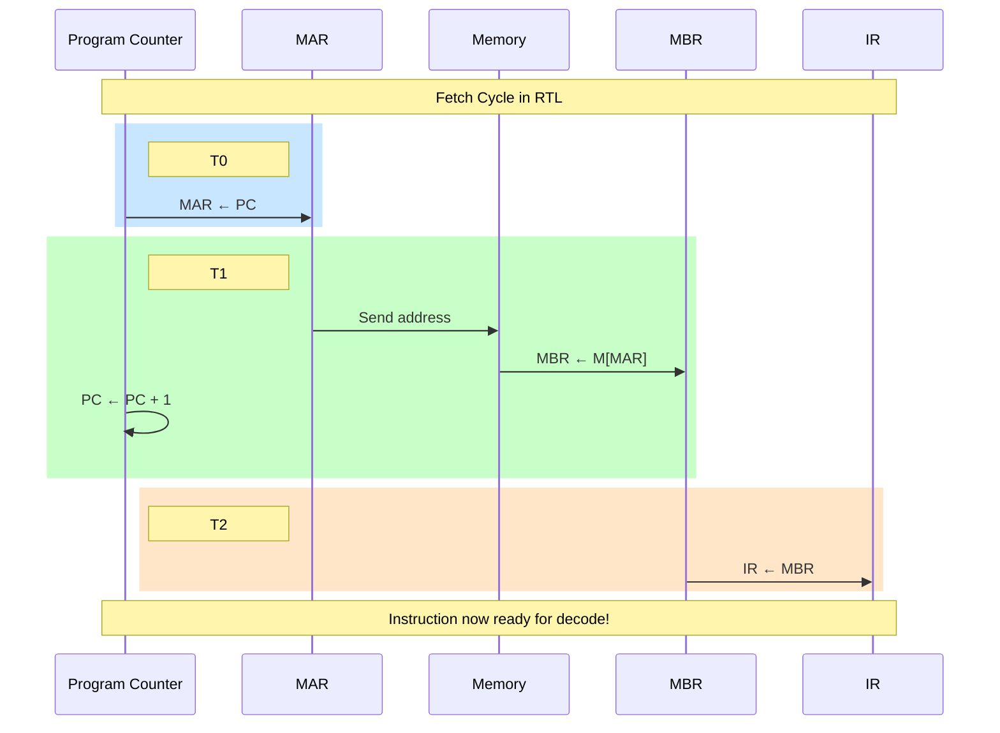

# Topic 8: 2.3 Register Transfer Language (RTL)

[< Prev: 2.2 Data Movement Among Registers](topic-07.md) | [Index](index.md) | [Next: 2.4 Data Movement from/to Memory >](topic-09.md)

---

## In Simple Words

**Register Transfer Language (RTL)** is a formal notation used to describe the **sequence of microoperations** that happen inside a CPU during each clock cycle. It tells us **what data moves where**, **under what condition**, and **at what time**.

---

## Detailed Explanation

### Why Do We Need RTL?

Writing "the CPU adds two numbers and stores the result" is vague for hardware design. RTL gives us a **precise, unambiguous notation** that specifies:
- **Which registers** are involved (source and destination)
- **What operation** is performed
- **What condition** must be true for the operation to occur
- **When** (which clock cycle) it happens

### RTL Syntax Rules

#### 1. Basic Transfer

```
R2 ← R1
```
Read as: "Register R2 receives the content of Register R1."

- The **left side** is always the **destination**.
- The **right side** is the **source** (expression).
- The source is NOT modified.

#### 2. Conditional Transfer

```
P: R2 ← R1
```
Read as: "IF control variable P = 1, THEN R2 receives R1's contents."

- `P` is a Boolean control variable (0 or 1).
- The hardware: `R2_Load = P AND Clock`.

#### 3. Multiple Conditions

```
P · Q: R3 ← R1 + R2
```
Read as: "IF P = 1 AND Q = 1, THEN R3 receives R1 + R2."

You can combine control conditions using AND (·), OR (+), NOT (').

#### 4. Simultaneous Operations (Comma Separated)

```
T2: R1 ← R2, R3 ← R4
```
Read as: "At time T2, simultaneously: R1 gets R2, and R3 gets R4."

Rules for simultaneous operations:
- All operate in the **same clock cycle**.
- Each must have a **different destination** register.
- All source values are read **before** any destination is written (this is important!).

#### 5. Arithmetic Operations

```
R3 ← R1 + R2       // Addition
R3 ← R1 - R2       // Subtraction  
R1 ← R1 + 1        // Increment
R1 ← R1 - 1        // Decrement
R3 ← R1 · R2       // Multiply (if supported)
```

#### 6. Logic Operations

```
R3 ← R1 ∧ R2       // Bitwise AND
R3 ← R1 ∨ R2       // Bitwise OR
R3 ← R1 ⊕ R2       // Bitwise XOR
R1 ← R1'            // Complement (NOT) all bits
```

#### 7. Shift Operations

```
R1 ← shl R1        // Shift left (multiply by 2)
R1 ← shr R1        // Shift right (divide by 2)
R1 ← cil R1        // Circular shift left
R1 ← cir R1        // Circular shift right
```

### Complete RTL Symbols Reference

| Symbol | Meaning | Example |
|---|---|---|
| ← | Transfer (assign) | R2 ← R1 |
| : | Condition separator | P: R1 ← R2 |
| , | Simultaneous operations | R1 ← R2, R3 ← R4 |
| + | Addition (arithmetic context) | R3 ← R1 + R2 |
| - | Subtraction | R3 ← R1 - R2 |
| ∧ | Bitwise AND | R3 ← R1 ∧ R2 |
| ∨ | Bitwise OR | R3 ← R1 ∨ R2 |
| ⊕ | Bitwise XOR | R3 ← R1 ⊕ R2 |
| ' | Complement (NOT) | R1 ← R1' |
| shl, shr | Shift left, Shift right | R1 ← shl R1 |
| M[address] | Memory access at address | R1 ← M[MAR] |
| T0, T1, ... | Timing labels | T0: MAR ← PC |

### The Fetch Cycle in RTL

The most important RTL example is the **instruction fetch cycle** — the sequence that every instruction begins with:

```
T0: MAR ← PC                    // Step 1: Put PC value into Memory Address Register
T1: MBR ← M[MAR], PC ← PC + 1  // Step 2: Read memory at that address into MBR, 
                                 //         and increment PC (simultaneously)
T2: IR ← MBR                    // Step 3: Move instruction to Instruction Register
```

**What happens at each step:**

| Cycle | RTL | Hardware Action |
|---|---|---|
| T0 | MAR ← PC | PC drives the bus, MAR loads from bus |
| T1 | MBR ← M[MAR], PC ← PC + 1 | Memory outputs data at address MAR onto bus → MBR loads; simultaneously, incrementer adds 1 to PC |
| T2 | IR ← MBR | MBR drives bus, IR loads from bus |

After T2, the instruction is in IR and ready to be decoded by the control unit.

### Execution Phase RTL Examples

**ADD instruction** (R3 = R1 + R2):
```
T3: R3 ← R1 + R2
```

**LOAD from memory** (R1 = memory contents at address in R2):
```
T3: MAR ← R2           // Put address into MAR
T4: MBR ← M[MAR]       // Read memory
T5: R1 ← MBR           // Transfer to destination register
```

**STORE to memory** (put R1's value into memory at address in R2):
```
T3: MAR ← R2           // Put address into MAR
T4: MBR ← R1           // Put data into MBR
T5: M[MAR] ← MBR       // Write MBR contents to memory
```

**Conditional Branch** (IF flag Z = 1 THEN jump to address in IR):
```
T3: Z: PC ← IR(address field)
```

### How RTL Maps to Hardware

Every RTL statement translates directly into control signals:

| RTL Statement | Control Signals Generated |
|---|---|
| MAR ← PC | MUX selects PC, MAR load enabled, clock edge |
| MBR ← M[MAR] | Memory Read signal active, MBR load enabled |
| PC ← PC + 1 | PC increment signal active, PC load enabled |
| R3 ← R1 + R2 | MUX-A selects R1, MUX-B selects R2, ALU = ADD, R3 load enabled |

This is exactly how the **control unit** is designed — each timing step generates the right combination of control signals.

---

## Real-Life Example

RTL is like a **choreography script** for a dance performance:

- **Timing labels (T0, T1, T2)** are like beats in the music — "On beat 1, do this; on beat 2, do that."
- **Registers** are like dancers — each has a position (value).
- **The bus** is like the stage center — only one dancer moves through it at a time.
- **Conditions (P:)** are like cues — "IF the spotlight turns red, dancer A moves to position B."
- **Simultaneous operations (comma)** are like two dancers performing different moves **at the same beat**, as long as they don't collide.

Without this script, the dancers (hardware) wouldn't know what to do or when to do it.

---

## Visual Flow



---

## Quick Revision

| Point | Remember |
|---|---|
| RTL full form | Register Transfer Language |
| ← means | Destination receives source value |
| P: R2 ← R1 | Conditional — transfer only if P = 1 |
| Comma (,) | Simultaneous operations in same clock cycle |
| Fetch cycle steps | T0: MAR←PC, T1: MBR←M[MAR] + PC←PC+1, T2: IR←MBR |
| M[MAR] | Access memory at address stored in MAR |
| shl, shr | Shift left (x2), Shift right (÷2) |
| Source after transfer | Always UNCHANGED |
| RTL → Hardware | Each statement = specific control signals activated |

> **Exam Tip:** The fetch cycle RTL (3 steps) is asked in almost every exam. Memorize it perfectly. For execution phase, know RTL for ADD, LOAD, STORE, and BRANCH operations.

---

[< Prev: 2.2 Data Movement Among Registers](topic-07.md) | [Index](index.md) | [Next: 2.4 Data Movement from/to Memory >](topic-09.md)

