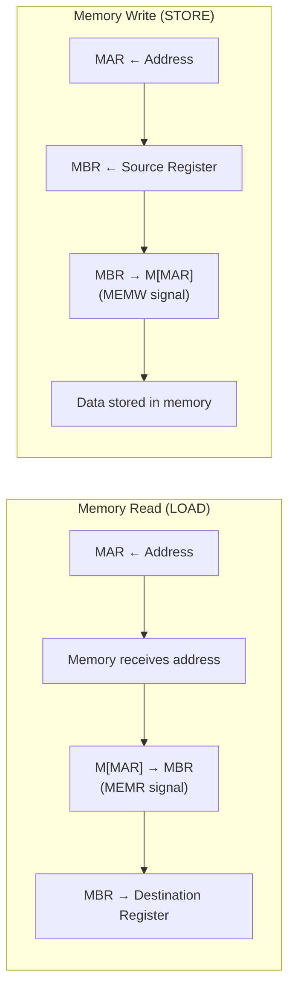

# Topic 9: 2.4 Data Movement from/to Memory

[< Prev: 2.3 Register Transfer Language (RTL)](topic-08.md) | [Index](index.md) | [Next: 2.5 Arithmetic Operations with Register Transfer >](topic-10.md)

---

## In Simple Words

When the CPU needs to **read data from memory** or **write data to memory**, it uses two special registers: **MAR** (Memory Address Register) tells memory **WHERE** to look, and **MBR/MDR** (Memory Buffer/Data Register) holds the **VALUE** being read or written.

---

## Detailed Explanation

### Why Can't the CPU Access Memory Directly?

The CPU and memory are separate chips connected by a bus. The CPU cannot directly peek into a memory cell — it must:
1. Place the **address** on the address bus → memory reads the address.
2. Send a **Read or Write** control signal → memory knows what to do.
3. Data flows on the **data bus** → between memory and CPU.

Two dedicated registers handle this communication:

| Register | Purpose | Direction |
|---|---|---|
| **MAR** (Memory Address Register) | Holds the **address** of the memory location to be accessed | CPU → Memory (via address bus) |
| **MBR / MDR** (Memory Buffer / Data Register) | Holds the **data** being transferred | Bidirectional (CPU ↔ Memory via data bus) |

### Memory Read Operation (Load)

**Goal:** Read a value from memory at a specific address into a CPU register.

**RTL Sequence:**
```
T0: MAR ← Address           // Put the memory address into MAR
T1: MBR ← M[MAR]            // Memory sends data at that address to MBR
                             // (Memory Read control signal is active)
T2: Rdest ← MBR             // Transfer data from MBR to destination register
```

**What happens in hardware at each step:**

| Step | Address Bus | Data Bus | Control Signal | Action |
|---|---|---|---|---|
| T0 | MAR drives address | — | — | Address placed on bus |
| T1 | MAR → Memory | Memory → MBR | **MEMR (Memory Read) = 1** | Memory outputs data at address |
| T2 | — | MBR → Register bus | — | CPU register loads from MBR |

**Notation shorthand:** `R1 ← M[MAR]` means "R1 gets the memory word at the address stored in MAR."

### Memory Write Operation (Store)

**Goal:** Write a value from a CPU register into a memory location.

**RTL Sequence:**
```
T0: MAR ← Address           // Put the target memory address into MAR
T1: MBR ← Rsource           // Put the data to be written into MBR
T2: M[MAR] ← MBR            // Memory stores MBR's contents at address MAR
                             // (Memory Write control signal is active)
```

**Hardware at each step:**

| Step | Address Bus | Data Bus | Control Signal | Action |
|---|---|---|---|---|
| T0 | MAR loads address | — | — | Address set up |
| T1 | — | Rsource → MBR | — | Data prepared in MBR |
| T2 | MAR → Memory | MBR → Memory | **MEMW (Memory Write) = 1** | Memory stores the data |

### Combining Steps (Optimization)

In practice, some steps can be combined if the hardware supports it:

**Optimized Read:**
```
T0: MAR ← PC
T1: MBR ← M[MAR], PC ← PC + 1    // Read and increment happen simultaneously
T2: IR ← MBR
```

**Optimized Write:**
```
T0: MAR ← R2, MBR ← R1           // Address and data prepared simultaneously
T1: M[MAR] ← MBR                  // Write in one cycle
```

### Memory Access Time

Memory is much **slower** than the CPU. A typical scenario:

| Component | Speed |
|---|---|
| CPU register access | ~1 nanosecond |
| Cache (L1) | ~1-4 nanoseconds |
| Cache (L2) | ~5-15 nanoseconds |
| Main Memory (RAM) | ~50-100 nanoseconds |

The **memory access time** is the delay between when MAR provides the address and when MBR receives the data. During this time, the CPU may need to **wait** (insert wait states) or use techniques like **pipelining** and **caching** to stay busy.

### Read vs. Write — Comparison

| Feature | Memory Read | Memory Write |
|---|---|---|
| RTL shorthand | R ← M[MAR] | M[MAR] ← R |
| Control signal | Memory Read (MEMR) | Memory Write (MEMW) |
| Data direction | Memory → MBR → Register | Register → MBR → Memory |
| Address direction | MAR → Memory (same for both) | MAR → Memory (same for both) |
| Purpose | Load data into CPU | Store CPU data into memory |

### The Role of MAR and MBR in the CPU

```
                      ┌─────────────────────────┐
                      │          CPU             │
                      │                          │
  Address Bus ←──── │  MAR ──────────┐          │
                      │               │          │
  Data Bus ←────→  │  MBR ←────────→ ALU       │
                      │       ↕                  │
                      │    Registers (R0-Rn)     │
                      │                          │
  Control Bus ←──── │  Control Unit             │
                      └─────────────────────────┘
                            ↕
                     ┌──────────────┐
                     │    Memory     │
                     │  (RAM)        │
                     │  Address 0: ─ │
                     │  Address 1: ─ │
                     │  Address 2: ─ │
                     │     ...       │
                     └──────────────┘
```

MAR and MBR are the **interface** between the CPU's internal world (registers, ALU) and the external memory system.

---

## Real-Life Example

Think of a **library** system:

- **MAR** = the **catalog card** where you write the book's shelf number (address).
- **MBR** = the **reading desk** where books are placed for you to read, or where you place books to return.
- **Memory Read** = You fill out a request slip (MAR ← address), the librarian fetches the book (MBR ← M[MAR]), and you take it to your desk (Register ← MBR).
- **Memory Write** = You have a new book (MBR ← Register), you specify which shelf it goes on (MAR ← address), and the librarian places it there (M[MAR] ← MBR).
- The librarian takes time to walk to the shelf and back — this delay is the **memory access time**.

---

## Visual Flow



---

## Quick Revision

| Point | Remember |
|---|---|
| MAR purpose | Holds the MEMORY ADDRESS to access |
| MBR/MDR purpose | Holds the DATA being read from or written to memory |
| Read RTL | MAR←addr, MBR←M[MAR], R←MBR |
| Write RTL | MAR←addr, MBR←R, M[MAR]←MBR |
| Read control signal | MEMR (Memory Read) |
| Write control signal | MEMW (Memory Write) |
| M[MAR] notation | "Contents of memory at address in MAR" |
| RAM is slower than CPU | ~50-100x slower than registers |
| Data bus direction | Bidirectional for read and write |
| Address bus direction | Unidirectional (CPU → Memory always) |

> **Exam Tip:** Always write the complete RTL for memory read and write operations. The three-step sequence (address → data transfer → register load/store) is a standard question. Remember that MAR = address and MBR = data.

---

[< Prev: 2.3 Register Transfer Language (RTL)](topic-08.md) | [Index](index.md) | [Next: 2.5 Arithmetic Operations with Register Transfer >](topic-10.md)

