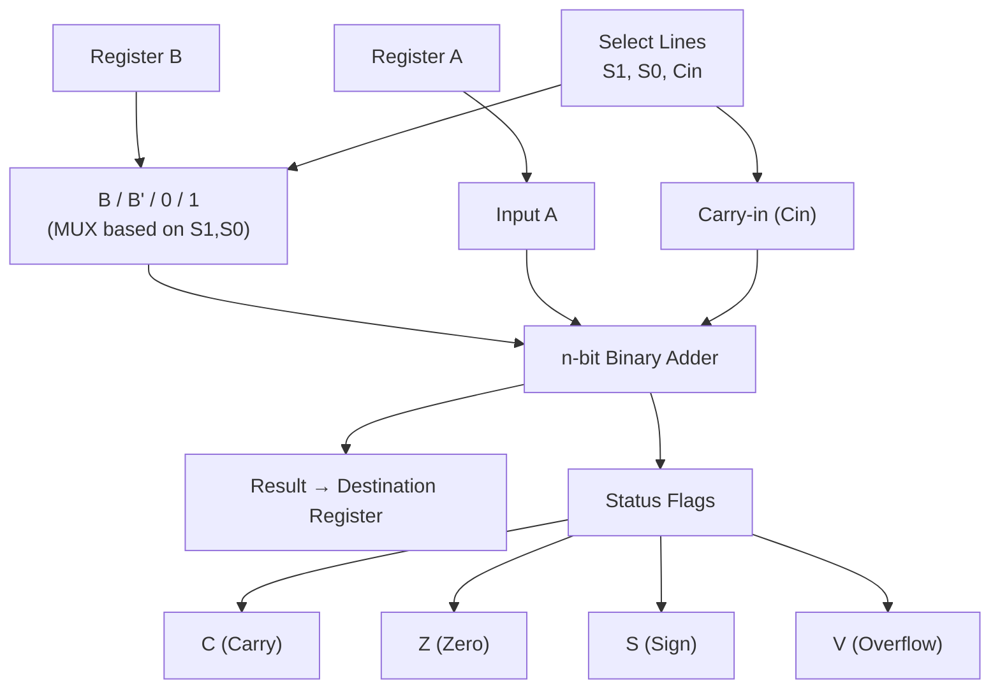

# Topic 10: 2.5 Arithmetic Operations with Register Transfer

[< Prev: 2.4 Data Movement from/to Memory](topic-09.md) | [Index](index.md) | [Next: 2.6 Logical Operations with Register Transfer >](topic-11.md)

---

## In Simple Words

**Arithmetic microoperations** are the mathematical operations performed on data stored in registers — add, subtract, increment, decrement, and complement. These operations are carried out by the **ALU** (Arithmetic Logic Unit) and are expressed using RTL notation.

---

## Detailed Explanation

### What Are Arithmetic Microoperations?

They are the basic **mathematical operations** performed on register contents during a single clock cycle. The ALU takes inputs from one or two registers, performs the operation, and stores the result in a destination register.

### List of All Arithmetic Microoperations

| RTL Statement | Operation | Description |
|---|---|---|
| R3 ← R1 + R2 | **Addition** | Add contents of R1 and R2, store in R3 |
| R3 ← R1 - R2 | **Subtraction** | Subtract R2 from R1, store in R3 |
| R1 ← R1 + 1 | **Increment** | Add 1 to R1 |
| R1 ← R1 - 1 | **Decrement** | Subtract 1 from R1 |
| R2 ← R1' | **1's Complement** | Flip all bits of R1, store in R2 |
| R2 ← R1' + 1 | **2's Complement (Negate)** | Negate R1 (make negative), store in R2 |
| R1 ← 0 | **Clear** | Set all bits of R1 to zero |

### Binary Addition in Detail

**Binary Adder:** Built from Full Adders chained together (Ripple Carry Adder).

For n-bit addition, you need n Full Adders:

```
Example: 4-bit addition of 5 + 3

    0 1 0 1    (5)
  + 0 0 1 1    (3)
  ---------
    1 0 0 0    (8)

Carry propagation: bit 0 carry → bit 1 carry → bit 2 carry → ...
```

**Carry out (Cout):** If the addition produces a carry beyond the MSB, Cout = 1. This indicates:
- For unsigned numbers: **overflow** (result doesn't fit in n bits).
- For signed 2's complement: does NOT necessarily mean overflow.

### Subtraction Using 2's Complement

Hardware doesn't need a separate subtractor circuit! Subtraction is done as:

$$A - B = A + (\text{2's complement of } B) = A + B' + 1$$

**Hardware trick:** Use the **same adder** but:
1. **Complement B** (pass through XOR gates with control = 1).
2. Set **Carry-in = 1** (adds the +1 for 2's complement).

```
R3 ← R1 + R2' + 1     // This computes R1 - R2

Example: 7 - 3 using 4-bit 2's complement
R1 = 0111 (7)
R2 = 0011 (3)
R2' = 1100 (1's complement)
R2' + 1 = 1101 (2's complement = -3)

0111 + 1101 = (1)0100
Discard carry → 0100 = 4 ✓
```

### The Adder-Subtractor Circuit

A single circuit does both addition and subtraction using a control signal **M**:

| M (Mode) | Operation | B input to adder | Carry-in |
|---|---|---|---|
| M = 0 | Addition (A + B) | B (unchanged) | 0 |
| M = 1 | Subtraction (A - B) | B' (complemented via XOR) | 1 |

```
Each bit: B_input = B XOR M
Carry-in = M

When M = 0: B XOR 0 = B, Cin = 0  →  A + B + 0  =  A + B
When M = 1: B XOR 1 = B', Cin = 1  →  A + B' + 1  =  A - B
```

### Increment and Decrement

**Increment (R1 ← R1 + 1):**
- Uses a simple **binary counter** or adds 1 through the adder with B = 0 and Carry-in = 1.
- Most commonly used for the **Program Counter (PC)**: `PC ← PC + 1`.

**Decrement (R1 ← R1 - 1):**
- `R1 ← R1 + 1111...1` (all 1s in 2's complement = -1).
- Or use: `R1 ← R1 - 1` with specialized decrementer circuit.

### Status Flags (Condition Codes)

After every arithmetic operation, the ALU sets **status flags** that indicate special conditions:

| Flag | Name | Set When | Example |
|---|---|---|---|
| **C** | Carry | Carry out of MSB position | 1111 + 0001 → C = 1 |
| **Z** | Zero | Result is all zeros | 0101 - 0101 → Z = 1 |
| **S** | Sign (Negative) | MSB of result is 1 | Result = 1xxx → S = 1 |
| **V** | Overflow | Signed overflow occurred | +7 + +1 → -8 in 4-bit → V = 1 |

**Overflow detection rule (signed numbers):**
- V = 1 when **both operands have the same sign** but the **result has a different sign**.
- Or: V = Carry into MSB XOR Carry out of MSB.

### Arithmetic Circuit Design

An **n-bit arithmetic circuit** uses:
- n Full Adders in parallel
- MUX at each B-input to select the operation
- Select lines (S1, S0) + Cin to choose among 8 operations:

| S1 | S0 | Cin | Y input | Operation | RTL |
|---|---|---|---|---|---|
| 0 | 0 | 0 | B = 0 | Transfer A | R ← A |
| 0 | 0 | 1 | B = 0 | Increment | R ← A + 1 |
| 0 | 1 | 0 | B | Addition | R ← A + B |
| 0 | 1 | 1 | B | Add with carry | R ← A + B + 1 |
| 1 | 0 | 0 | B' | A + complement | R ← A + B' |
| 1 | 0 | 1 | B' | Subtraction | R ← A - B |
| 1 | 1 | 0 | All 1s | Decrement | R ← A - 1 |
| 1 | 1 | 1 | All 1s | Transfer A | R ← A |

---

## Real-Life Example

Think of a **calculator**:

- **Addition/Subtraction**: You key in two numbers and press + or -. Inside, the calculator's ALU adds or subtracts the binary values.
- **Increment**: Every time you press "=" to repeat the last operation, an internal counter increments (+1).
- **Status flags**: The calculator shows "E" for error when the result is too large (overflow), or displays "0" prominently (zero flag).
- The clever part: the calculator uses the **same circuit** for both addition and subtraction (adder-subtractor with complementer), just like a CPU. Pressing "-" simply flips the complement mode.

---

## Visual Flow



---

## Quick Revision

| Point | Remember |
|---|---|
| A - B in hardware | A + B' + 1 (2's complement addition) |
| Adder-Subtractor control | M = 0 → Add; M = 1 → Subtract |
| Carry flag (C) | Set when carry out of MSB |
| Zero flag (Z) | Set when result = 0 |
| Sign flag (S) | Set when MSB of result = 1 |
| Overflow flag (V) | Set when signed result is wrong (different sign than expected) |
| Overflow rule | V = Cin(MSB) XOR Cout(MSB) |
| Increment | R ← R + 1 (used for PC) |
| Arithmetic circuit ops | 8 operations using S1, S0, Cin |
| Same adder for +/- | XOR gates on B inputs + Cin = 1 for subtraction |

> **Exam Tip:** Draw the adder-subtractor circuit (with XOR gates and Full Adders). Know the truth table for all 8 arithmetic operations. Practice 4-bit subtraction examples using 2's complement method, and show the status flags for each result.

---

[< Prev: 2.4 Data Movement from/to Memory](topic-09.md) | [Index](index.md) | [Next: 2.6 Logical Operations with Register Transfer >](topic-11.md)

