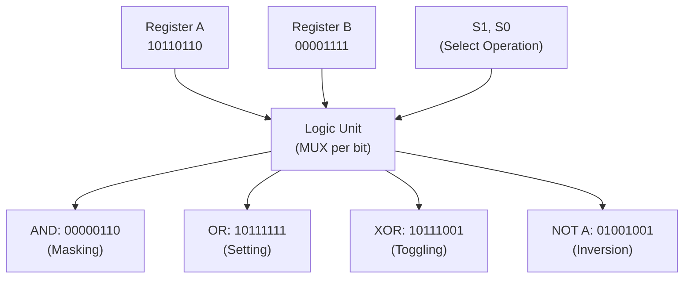

# Topic 11: 2.6 Logical Operations with Register Transfer

[< Prev: 2.5 Arithmetic Operations with Register Transfer](topic-10.md) | [Index](index.md) | [Next: 2.7 Timing in Register Transfer >](topic-12.md)

---

## In Simple Words

**Logical microoperations** perform **bit-by-bit (bitwise)** Boolean operations on register contents. Unlike arithmetic operations that treat the entire register as a number, logical operations work on **each bit independently**. They are used for masking, setting, clearing, and toggling specific bits.

---

## Detailed Explanation

### The Four Basic Logical Microoperations

| Operation | RTL | Rule | Use |
|---|---|---|---|
| **AND** | R3 ← R1 ∧ R2 | Output 1 only if BOTH bits are 1 | **Masking** — extract specific bits |
| **OR** | R3 ← R1 ∨ R2 | Output 1 if EITHER bit is 1 | **Setting** — force bits to 1 |
| **XOR** | R3 ← R1 ⊕ R2 | Output 1 if bits are DIFFERENT | **Toggling** — flip specific bits |
| **NOT (Complement)** | R2 ← R1' | Flip every bit | **Inversion** — 0→1, 1→0 |

### Bitwise Operation Examples (8-bit)

#### AND — Masking (Extracting Bits)

```
R1 = 1 0 1 1 0 1 1 0
R2 = 0 0 0 0 1 1 1 1    ← Mask
─────────────────────
R3 = 0 0 0 0 0 1 1 0    ← Only lower 4 bits survive
```

**Use case:** To check if bit 3 of a register is set, AND it with `00001000`. If result ≠ 0, bit 3 was set.

#### OR — Setting Bits

```
R1 = 1 0 1 1 0 0 0 0
R2 = 0 0 0 0 1 1 1 1    ← Set mask
─────────────────────
R3 = 1 0 1 1 1 1 1 1    ← Lower 4 bits forced to 1, others unchanged
```

**Use case:** To set bit 5 to 1 regardless of its current value, OR with `00100000`.

#### XOR — Toggling Bits

```
R1 = 1 0 1 1 0 1 1 0
R2 = 0 0 0 0 1 1 1 1    ← Toggle mask
─────────────────────
R3 = 1 0 1 1 1 0 0 1    ← Lower 4 bits flipped, others unchanged
```

**Use case:** Toggle LED on/off → XOR the LED control bit with 1.

**Special XOR property:** `A ⊕ A = 0` (XOR a value with itself gives zero). This is the fastest way to clear a register: `R1 ← R1 ⊕ R1`.

#### NOT — Complement (1's Complement)

```
R1 = 1 0 1 1 0 1 1 0
─────────────────────
R2 = 0 1 0 0 1 0 0 1    ← Every bit flipped
```

**Use case:** First step of computing 2's complement (negate a number).

### All 16 Possible Logical Functions

For two input bits, there are exactly $2^4 = 16$ possible logical functions:

| # | Function | Expression | Output for (A,B) = (00,01,10,11) |
|---|---|---|---|
| 0 | Clear | F = 0 | 0 0 0 0 |
| 1 | AND | F = A ∧ B | 0 0 0 1 |
| 2 | Inhibit | F = A ∧ B' | 0 0 1 0 |
| 3 | Transfer A | F = A | 0 0 1 1 |
| 4 | Inhibit | F = A' ∧ B | 0 1 0 0 |
| 5 | Transfer B | F = B | 0 1 0 1 |
| 6 | XOR | F = A ⊕ B | 0 1 1 0 |
| 7 | OR | F = A ∨ B | 0 1 1 1 |
| 8 | NOR | F = (A ∨ B)' | 1 0 0 0 |
| 9 | XNOR | F = (A ⊕ B)' | 1 0 0 1 |
| 10 | Complement B | F = B' | 1 0 1 0 |
| 11 | — | F = A ∨ B' | 1 0 1 1 |
| 12 | Complement A | F = A' | 1 1 0 0 |
| 13 | — | F = A' ∨ B | 1 1 0 1 |
| 14 | NAND | F = (A ∧ B)' | 1 1 1 0 |
| 15 | Set | F = 1 | 1 1 1 1 |

The **logic unit** in the ALU implements these 16 functions using select lines (S1, S0) and input manipulation.

### Logic Unit Circuit Design

A logic unit for one bit position uses a **4-to-1 MUX** with:

| S1 | S0 | Output | Operation |
|---|---|---|---|
| 0 | 0 | A ∧ B | AND |
| 0 | 1 | A ∨ B | OR |
| 1 | 0 | A ⊕ B | XOR |
| 1 | 1 | A' | Complement A |

For an n-bit logic unit, use **n copies** of this 1-bit circuit (one per bit position).

### Practical Applications in Computing

| Application | Operation | Example |
|---|---|---|
| Check if bit is set | AND with mask | `status ∧ 00001000` → check bit 3 |
| Set a flag | OR with mask | `flags ∨ 00000100` → set bit 2 |
| Clear a flag | AND with inverted mask | `flags ∧ 11111011` → clear bit 2 |
| Toggle a bit | XOR with mask | `control ⊕ 00010000` → toggle bit 4 |
| Clear register | XOR with itself | `R ⊕ R = 0` |
| Swap without temp | Three XORs | A⊕=B, B⊕=A, A⊕=B |
| Parity check | XOR all bits | Odd number of 1s → P=1 |
| Network subnet mask | AND with IP address | Extract network portion |

### XOR Swap Algorithm (No Temporary Register Needed!)

```
R1 ← R1 ⊕ R2     // R1 now holds R1⊕R2
R2 ← R1 ⊕ R2     // R2 now holds original R1
R1 ← R1 ⊕ R2     // R1 now holds original R2
```

This swaps R1 and R2 without needing a temp register.

---

## Real-Life Example

Think of **light switches** in a house:

- **AND (Mask):** You have a master switch panel. Only rooms where BOTH the master switch AND the room switch are ON will have lights. This is like AND masking — only bits where the mask is 1 survive.
- **OR (Set):** A backup generator turns ON all emergency lights regardless of individual switches. This is like OR — force specific bits to 1.
- **XOR (Toggle):** A dimmer toggle switch — press once to turn ON, press again to turn OFF. Each press XORs the current state with 1.
- **NOT (Complement):** A night mode that inverts all lights — rooms that were bright go dark, and dark rooms light up.

---

## Visual Flow



---

## Quick Revision

| Point | Remember |
|---|---|
| AND use | Masking — extract specific bits |
| OR use | Setting — force bits to 1 |
| XOR use | Toggling — flip specific bits |
| NOT use | Inversion — 1's complement |
| A ⊕ A = | 0 (fastest way to clear a register) |
| Clear bit n | AND with mask that has 0 at position n |
| Set bit n | OR with mask that has 1 at position n |
| Toggle bit n | XOR with mask that has 1 at position n |
| Logic unit design | 4:1 MUX per bit, S1 S0 select operation |
| 16 functions | All possible 2-input Boolean functions |
| XOR swap | A⊕=B, B⊕=A, A⊕=B — no temp needed |

> **Exam Tip:** Show bitwise operation examples with 8-bit values. Know all four operations and their practical uses (mask, set, clear, toggle). The 4:1 MUX logic unit design is a common diagram question.

---

[< Prev: 2.5 Arithmetic Operations with Register Transfer](topic-10.md) | [Index](index.md) | [Next: 2.7 Timing in Register Transfer >](topic-12.md)

