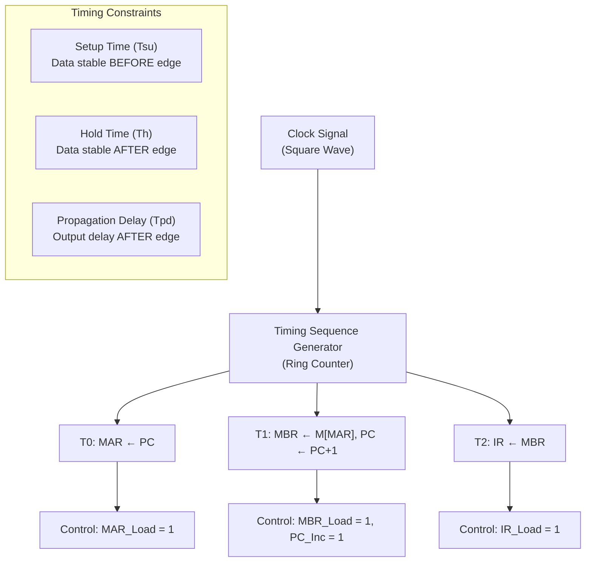

# Topic 12: 2.7 Timing in Register Transfer

[< Prev: 2.6 Logical Operations with Register Transfer](topic-11.md) | [Index](index.md) | [Next: 3.1 Instruction Format >](topic-13.md)

---

## In Simple Words

**Timing** is what makes register transfers happen in the correct order. Every operation inside a CPU is synchronized by a **clock signal** — registers only capture new values at the **clock edge**, and control signals determine which transfers occur during each cycle.

---

## Detailed Explanation

### Why Is Timing Crucial?

Without precise timing control, multiple registers could try to change simultaneously, data could be captured before it's stable, and the entire computation would become unpredictable. The **clock signal** acts as the "heartbeat" of the computer, ensuring everything happens in an orderly, step-by-step manner.

### The Clock Signal

The clock is a continuous square wave that oscillates between HIGH (1) and LOW (0):

```
        ┌───┐   ┌───┐   ┌───┐   ┌───┐
CLK:    │   │   │   │   │   │   │   │
   ─────┘   └───┘   └───┘   └───┘   └───
        ↑       ↑       ↑       ↑
     Rising  Rising  Rising  Rising
      Edge    Edge    Edge    Edge
      
     |←─── 1 Period ───→|
```

| Term | Definition |
|---|---|
| **Clock Period (T)** | Time for one complete HIGH + LOW cycle |
| **Clock Frequency (f)** | Number of cycles per second. $f = 1/T$ |
| **Rising Edge** | Transition from LOW to HIGH (↑) |
| **Falling Edge** | Transition from HIGH to LOW (↓) |
| **Duty Cycle** | Percentage of period that clock is HIGH |

**Example:** A 1 GHz clock has a period of $T = 1/10^9 = 1$ nanosecond. Each clock cycle is 1 ns.

### Edge-Triggered vs. Level-Triggered

| Type | When Data is Captured | Used In |
|---|---|---|
| **Edge-triggered** | Only at the **rising edge** (or falling edge) of clock | Modern registers and flip-flops |
| **Level-triggered** | Entire time clock is HIGH (or LOW) | Older latches |

**Modern CPUs use edge-triggered flip-flops** because they provide a precise, unambiguous moment for data capture. Data must be **stable before** the edge and remain stable **after** the edge.

### Setup Time and Hold Time

For reliable data capture, two critical timing constraints must be satisfied:

```
        ┌──────────────────────────
DATA:   │   stable data value     
   ─────┘                         
   |←Tsu→|←── Th ──→|
              ↑
          Clock Edge
```

| Constraint | Definition | What Happens If Violated |
|---|---|---|
| **Setup Time ($T_{su}$)** | Data must be **stable** for at least $T_{su}$ **before** the clock edge | **Metastability** — flip-flop may capture wrong value |
| **Hold Time ($T_h$)** | Data must remain **stable** for at least $T_h$ **after** the clock edge | **Metastability** — captured value becomes unpredictable |

**Setup + Hold = The stability window around the clock edge.**

### Propagation Delay

After the clock edge, the output doesn't change instantly. There's a small delay called **propagation delay** ($T_{pd}$):

- **Flip-flop propagation delay:** Time from clock edge to output changing.
- **Gate propagation delay:** Time for signal to pass through a logic gate.
- **Critical path:** The longest chain of gates through which a signal must propagate in one clock cycle. This determines the **maximum clock frequency**.

$$f_{max} = \frac{1}{T_{pd}(\text{critical path}) + T_{su}}$$

### Timing of a Register Transfer

For the operation `P: R2 ← R1`, here's exactly what happens in time:

```
Clock Cycle N:
1. Control unit asserts P = 1 (early in the cycle)
2. R1's output is placed on the bus (after some propagation delay)
3. Data stabilizes on the bus (must satisfy Tsu before next edge)

Clock Edge (Rising Edge of Cycle N):
4. R2 captures the bus value (if P AND Clock_Edge is true)
5. R2's output changes to the new value (after Tpd)

Clock Cycle N+1:
6. New value of R2 is now available for use
7. Control unit may assert new control signals
```

### Timing Diagram Example

For the fetch cycle: `T0: MAR ← PC; T1: MBR ← M[MAR], PC ← PC+1; T2: IR ← MBR`

```
CLK:    __|‾‾|__|‾‾|__|‾‾|__|‾‾|__
            T0      T1      T2
            
MAR:    ──────[PC value]──────────────
                   ↑
               MAR loads at T0 edge
               
MBR:    ──────────────[M[MAR]]────────
                          ↑
                      MBR loads at T1 edge
                      
PC:     ──[old]───────[old+1]─────────
                          ↑
                      PC loads at T1 edge
                      
IR:     ──────────────────────[instr]─
                                  ↑
                              IR loads at T2 edge
```

### Timing Sequence Generator

A **timing sequence generator** produces timing signals T0, T1, T2, ..., Tn that activate in sequence, one per clock cycle:

```
T0: |‾‾‾‾|________________
T1: _____|‾‾‾‾|___________
T2: __________|‾‾‾‾|______
T3: _______________|‾‾‾‾|_
```

**Implementation:** A **ring counter** (or a decoder driven by a counter) generates these signals. Only **one timing signal is active** at any time.

At each timing step, the **control signals** for that step are generated:
```
MAR_Load = T0        // MAR loads during T0
MBR_Load = T1        // MBR loads during T1
PC_Inc = T1          // PC increments during T1
IR_Load = T2         // IR loads during T2
```

### Clock Skew

In real circuits, the clock signal doesn't arrive at all flip-flops at exactly the same time. This difference is called **clock skew**:

- **Positive skew:** Clock arrives later at receiving flip-flop → relaxes setup time but tightens hold time.
- **Negative skew:** Clock arrives earlier at receiving flip-flop → tightens setup time.
- **Solution:** Careful clock distribution (clock trees, balanced routing).

---

## Real-Life Example

Think of an **orchestra**:

- The **clock signal** is the **conductor's baton** — everyone waits for the beat.
- Each **beat (clock edge)** is when musicians play their note. Between beats, they prepare (setup time).
- **Setup time** is like musicians getting their fingers in position **before** the beat.
- **Hold time** is like holding the note steady **after** the beat, not rushing to the next note.
- If a musician changes too early (setup violation) or too quickly (hold violation), the music sounds wrong — that's **metastability** in digital circuits.
- **Propagation delay** is like the time sound takes to travel from instruments to the audience — there's always a small delay.
- The **timing sequence generator** is like the conductor pointing to different sections: "T0: violins play, T1: trumpets play, T2: drums play."

---

## Visual Flow



---

## Quick Revision

| Point | Remember |
|---|---|
| Clock purpose | Synchronizes all register transfers |
| Edge-triggered | Data captured only at clock edge (rising or falling) |
| Setup time ($T_{su}$) | Data must be stable BEFORE clock edge |
| Hold time ($T_h$) | Data must be stable AFTER clock edge |
| Propagation delay ($T_{pd}$) | Time from clock edge to output change |
| Metastability | Wrong capture when setup/hold violated |
| Critical path | Longest delay path → limits max clock frequency |
| $f_{max}$ formula | $f_{max} = 1 / (T_{pd} + T_{su})$ |
| Timing generator | Ring counter producing T0, T1, T2, ... signals |
| Clock skew | Uneven clock arrival at different flip-flops |
| 1 GHz clock | Period = 1 nanosecond |

> **Exam Tip:** Draw timing diagrams showing clock, control signals, and register values changing at clock edges. Know setup/hold definitions. If asked about maximum clock frequency, find the critical path delay and add setup time.

---

[< Prev: 2.6 Logical Operations with Register Transfer](topic-11.md) | [Index](index.md) | [Next: 3.1 Instruction Format >](topic-13.md)

