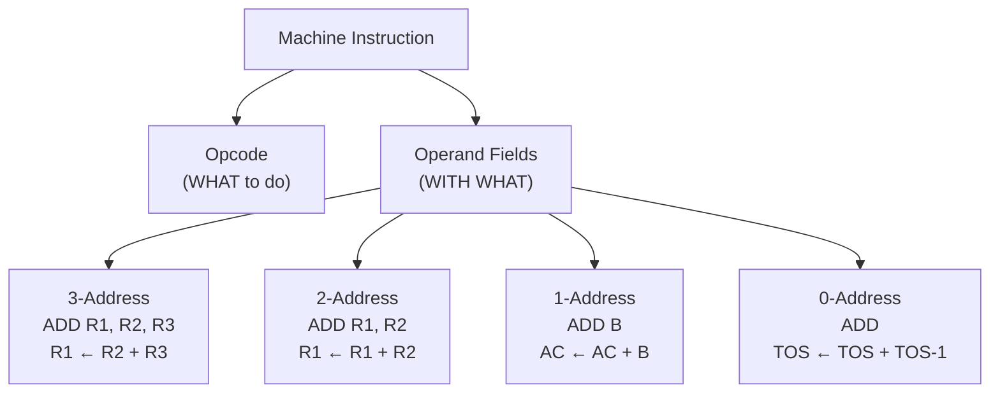

# Topic 13: 3.1 Instruction Format

[< Prev: 2.7 Timing in Register Transfer](topic-12.md) | [Index](index.md) | [Next: 3.2 Instruction Execution >](topic-14.md)

---

## In Simple Words

An **instruction format** defines how the bits of a machine instruction are divided into fields — primarily the **opcode** (what to do) and the **operand fields** (what to do it with). The format determines instruction size, flexibility, and the number of operations needed to complete a task.

---

## Detailed Explanation

### What Is an Instruction?

An instruction is a **binary-coded command** that tells the CPU what operation to perform. Every instruction has at least two parts:

```
┌──────────────┬──────────────────────────────┐
│   OPCODE     │       OPERAND FIELD(S)        │
│  (Operation) │  (Register/Address/Immediate)  │
└──────────────┴──────────────────────────────┘
```

| Field | Purpose | Example |
|---|---|---|
| **Opcode** | Specifies the operation (ADD, SUB, LOAD, STORE, JUMP, etc.) | 0001 = ADD |
| **Operand** | Specifies where data comes from or goes to | Register number, memory address, or immediate value |

### How Many Operands? — The Four Instruction Formats

The key difference between instruction formats is **how many explicit operand addresses** they contain:

#### 1. Three-Address Format

```
┌────────┬──────┬──────┬──────┐
│ OPCODE │  R1  │  R2  │  R3  │
└────────┴──────┴──────┴──────┘
```

- **Syntax:** `OPCODE Dest, Src1, Src2`
- **Example:** `ADD R1, R2, R3` → means R1 ← R2 + R3
- **Advantages:**
  - Most flexible — all three locations explicitly specified.
  - Does NOT destroy any source operand.
  - Fewer instructions needed per computation.
- **Disadvantages:**
  - Longest instruction word (more bits needed for 3 addresses).
  - More memory per instruction.
- **Used in:** MIPS, ARM, RISC-V architectures.

**Program: X = (A + B) * (C + D)**
```
ADD R1, A, B       // R1 = A + B
ADD R2, C, D       // R2 = C + D
MUL X, R1, R2      // X = R1 * R2
→ 3 instructions
```

#### 2. Two-Address Format

```
┌────────┬──────┬──────┐
│ OPCODE │  R1  │  R2  │
└────────┴──────┴──────┘
```

- **Syntax:** `OPCODE Dest, Src`
- **Example:** `ADD R1, R2` → means R1 ← R1 + R2 (destination is also a source)
- **Key characteristic:** One operand serves as **both source and destination** — the original value is **overwritten**.
- **Used in:** x86 (Intel/AMD) architecture.

**Program: X = (A + B) * (C + D)**
```
MOV R1, A          // R1 = A
ADD R1, B          // R1 = A + B
MOV R2, C          // R2 = C
ADD R2, D          // R2 = C + D
MUL R1, R2         // R1 = (A+B) * (C+D)
MOV X, R1          // X = R1
→ 6 instructions
```

#### 3. One-Address Format (Accumulator Machine)

```
┌────────┬──────┐
│ OPCODE │  ADR │
└────────┴──────┘
```

- **Syntax:** `OPCODE Operand`
- **Implicit operand:** The **Accumulator (AC)** is always the other operand and the destination.
- **Example:** `ADD B` → means AC ← AC + B
- **Used in:** Early computers (PDP-8), simple microcontrollers.

**Program: X = (A + B) * (C + D)**
```
LOAD A             // AC = A
ADD B              // AC = A + B
STORE T            // T = A + B (save to temp)
LOAD C             // AC = C
ADD D              // AC = C + D
MUL T              // AC = (C+D) * (A+B)
STORE X            // X = result
→ 7 instructions
```

#### 4. Zero-Address Format (Stack Machine)

```
┌────────┐
│ OPCODE │
└────────┘
```

- **Syntax:** `OPCODE` (no explicit operands!)
- **Operands come from the stack.** Results are pushed back onto the stack.
- **Example:** `ADD` → pops two values from stack, adds them, pushes result.
- **Special instructions:** `PUSH X` and `POP X` to move data between memory and stack.
- **Used in:** Java Virtual Machine (JVM), HP calculators, Forth language.

**Program: X = (A + B) * (C + D)**
```
PUSH A             // Stack: A
PUSH B             // Stack: A, B
ADD                // Stack: A+B
PUSH C             // Stack: A+B, C
PUSH D             // Stack: A+B, C, D
ADD                // Stack: A+B, C+D
MUL                // Stack: (A+B)*(C+D)
POP X              // X = result
→ 8 instructions
```

### Comparison of All Four Formats

| Feature | 3-Address | 2-Address | 1-Address | 0-Address |
|---|---|---|---|---|
| **Instruction length** | Longest | Medium | Short | Shortest (opcode only) |
| **Instructions per task** | Fewest | More | Even more | Most |
| **Program size (total)** | May be similar | Moderate | Moderate | May be similar |
| **Implicit operand** | None | Dest = Src1 | Accumulator | Stack (TOS) |
| **Complexity** | Most complex CPU | Moderate | Simpler CPU | Stack hardware needed |
| **Example ISA** | MIPS, ARM | x86 | PDP-8 | JVM, Forth |

### Instruction Word Size

The instruction word must be large enough to hold:

$$\text{Instruction bits} = \text{Opcode bits} + (\text{Number of address fields} \times \text{Bits per address})$$

**Example:** 
- 32 operations need $\log_2(32) = 5$ opcode bits
- 64 registers need $\log_2(64) = 6$ bits per register field
- 3-address: $5 + 3 \times 6 = 23$ bits minimum
- 2-address: $5 + 2 \times 6 = 17$ bits minimum
- 1-address: $5 + 1 \times 6 = 11$ bits minimum

### Expanding Opcode Technique

When you want MORE instructions but can't increase instruction word size:
- Use **fewer address fields** → free up bits for the opcode.
- Example: 16-bit instruction, 4-bit opcode, 4-bit register fields.
  - 3-address: 4 bits opcode + 3×4 = 12 bits → 4-bit opcode → 15 three-address instructions (save one code as "escape")
  - The escape code means "look at next bits for 2-address instruction" → more opcodes available.
  - This cascades to give even more 1-address and 0-address instructions.

---

## Real-Life Example

Think of **giving directions** to someone:

- **3-address:** "Take the file FROM desk A, combine it WITH desk B, and put the result ON desk C." — Very clear, but lengthy.
- **2-address:** "Take desk A's file, combine it with desk B's file, and put the result BACK ON desk A." — Shorter, but desk A's original file is lost.
- **1-address:** "You're always working on the clipboard (accumulator). Get a file, combine it, put it back on the clipboard." — Simple, but many steps.
- **0-address:** "Everything goes in a pile on your desk (stack). Top two items get processed, result goes back on top." — No desk numbers, but you need to carefully manage the pile.

---

## Visual Flow



---

## Quick Revision

| Point | Remember |
|---|---|
| Opcode field | Tells CPU WHAT operation to perform |
| Operand field | Tells CPU WHERE data is (register/memory/immediate) |
| 3-address | Most flexible, fewest instructions, longest word |
| 2-address | Dest = Src1 (value overwritten) |
| 1-address | Accumulator is implicit operand |
| 0-address | Stack operations — PUSH, POP, compute on TOS |
| Instruction bits formula | Opcode bits + (num_addresses × bits_per_address) |
| Expanding opcode | Sacrifice address fields to get more opcodes |
| x86 is | 2-address format |
| MIPS/ARM is | 3-address format |

> **Exam Tip:** Write the same computation (like X = (A+B)*(C+D)) in all four formats. Count instructions for each. This is a very common question. Also know how to calculate minimum instruction word size.

---

[< Prev: 2.7 Timing in Register Transfer](topic-12.md) | [Index](index.md) | [Next: 3.2 Instruction Execution >](topic-14.md)

