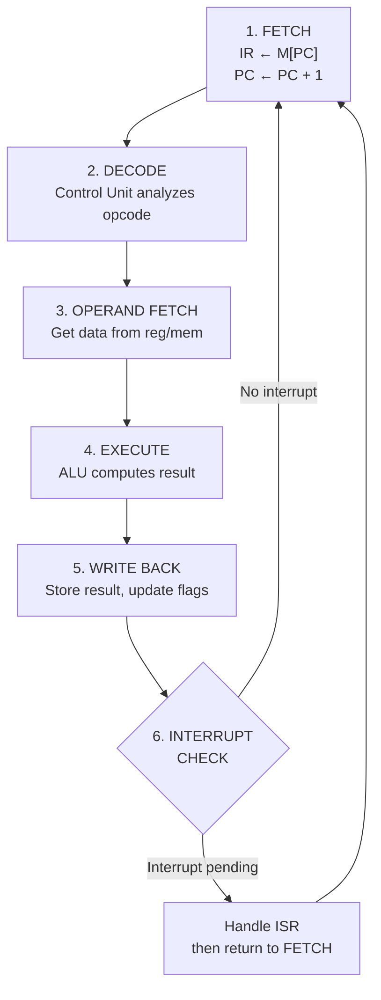

# Topic 14: 3.2 Instruction Execution

[< Prev: 3.1 Instruction Format](topic-13.md) | [Index](index.md) | [Next: 3.3 Fetch and Execution Cycles >](topic-15.md)

---

## In Simple Words

**Instruction execution** is the complete process the CPU goes through to carry out one machine instruction — from reading it out of memory, figuring out what it means, getting the data it needs, doing the actual computation, and storing the result.

---

## Detailed Explanation

### The Instruction Execution Cycle

Every instruction goes through a sequence of **phases** (also called stages or sub-cycles). The standard breakdown is:

### Phase 1: Instruction Fetch (IF)

**Goal:** Get the next instruction from memory.

```
MAR ← PC              // Put the address of the next instruction into MAR
MBR ← M[MAR]          // Read the instruction from memory
IR ← MBR              // Move the instruction to the Instruction Register
PC ← PC + 1           // Point PC to the next instruction
```

- After this phase, the instruction is sitting in the **Instruction Register (IR)**.
- PC now points to the **next** instruction (or the next byte in case of variable-length instructions).

### Phase 2: Instruction Decode (ID)

**Goal:** Figure out what the instruction wants to do.

- The **Control Unit** examines the **opcode** field of IR.
- It determines:
  - What operation to perform (add, subtract, load, store, jump, etc.)
  - How many operands are needed
  - What addressing mode is used (register, immediate, direct, indirect)
  - Which registers or memory addresses are involved
- The control unit then generates the **control signals** for subsequent phases.

### Phase 3: Operand Fetch / Address Calculation (OF)

**Goal:** Get the data the instruction needs to work with.

Depending on the addressing mode:

| Addressing Mode | What Happens |
|---|---|
| **Register** | Data already in a register — no memory access needed |
| **Immediate** | Data is part of the instruction itself — already in IR |
| **Direct** | Address is in the instruction → fetch data from memory at that address |
| **Indirect** | Address of the address is in the instruction → two memory accesses needed |

```
// Direct memory operand:
MAR ← IR(address field)
MBR ← M[MAR]          // Fetch operand from memory

// Indirect memory operand:
MAR ← IR(address field)
MAR ← M[MAR]          // Get the actual address (first memory access)
MBR ← M[MAR]          // Get the operand (second memory access)
```

### Phase 4: Execute (EX)

**Goal:** Perform the actual operation.

The operation depends on the instruction type:

| Instruction Type | What Happens |
|---|---|
| **ALU (ADD, SUB, AND, etc.)** | ALU performs the operation on operands. Result goes to a temporary register or output register. |
| **LOAD** | Data already fetched from memory in operand phase — transfer to destination register. |
| **STORE** | Source register value is written to memory. |
| **BRANCH/JUMP** | Test condition flags (if conditional). If branch taken, update PC. |
| **I/O** | Interact with input/output device port. |

### Phase 5: Write Back (WB)

**Goal:** Store the result.

- ALU result is written to the **destination register** (or memory).
- Status flags (Zero, Carry, Sign, Overflow) are updated.
- For STORE instructions, data is written to memory.

### Phase 6: Interrupt Check

**Goal:** Check if any external device needs attention before starting the next instruction.

- If an interrupt is pending and interrupts are enabled:
  - Save current PC and status to stack
  - Load PC with interrupt service routine address
  - Begin executing ISR
- If no interrupt: go back to Phase 1 for the next instruction.

### Complete Execution Flow

```
┌──────────────────────┐
│  INSTRUCTION FETCH    │  MAR←PC, IR←M[PC], PC←PC+1
└──────────┬───────────┘
           ↓
┌──────────────────────┐
│  INSTRUCTION DECODE   │  Control Unit examines opcode
└──────────┬───────────┘
           ↓
┌──────────────────────┐
│  OPERAND FETCH        │  Get data from register/memory/immediate
└──────────┬───────────┘
           ↓
┌──────────────────────┐
│  EXECUTE              │  ALU computes / Branch evaluates / I/O transfers
└──────────┬───────────┘
           ↓
┌──────────────────────┐
│  WRITE BACK           │  Store result in destination, update flags
└──────────┬───────────┘
           ↓
┌──────────────────────┐
│  INTERRUPT CHECK      │  Handle pending interrupts (if any)
└──────────┬───────────┘
           ↓
      Back to FETCH
```

### Example: Executing `ADD R1, R2, R3`

How the CPU executes R1 ← R2 + R3:

| Phase | RTL | Action |
|---|---|---|
| **Fetch** | MAR←PC, IR←M[MAR], PC←PC+1 | Read the ADD instruction from memory |
| **Decode** | Control unit reads opcode | Determines: operation = ADD, operands = R2, R3, destination = R1 |
| **Operand Fetch** | A ← R2, B ← R3 | Read R2 and R3 into ALU input latches |
| **Execute** | ALU_out ← A + B | ALU performs addition |
| **Write Back** | R1 ← ALU_out, update flags | Store result in R1, set Z, C, S, V flags |
| **Interrupt Check** | — | No interrupt → fetch next instruction |

### Example: Executing `LOAD R1, [500]`

How the CPU loads the value at memory address 500 into R1:

| Phase | RTL | Action |
|---|---|---|
| **Fetch** | MAR←PC, IR←M[MAR], PC←PC+1 | Read the LOAD instruction |
| **Decode** | Control unit reads opcode | Operation = LOAD, address = 500, destination = R1 |
| **Operand Fetch** | MAR←500, MBR←M[500] | Access memory at address 500, get the value |
| **Execute** | — | Nothing to compute (it's just a data move) |
| **Write Back** | R1 ← MBR | Place the fetched value into R1 |

### Example: Executing `BEQ label` (Branch if Zero flag = 1)

| Phase | RTL | Action |
|---|---|---|
| **Fetch** | MAR←PC, IR←M[MAR], PC←PC+1 | Read the BEQ instruction |
| **Decode** | Control unit reads opcode | Operation = Branch if Equal, target = label address |
| **Execute** | If Z=1: PC ← label_address | Check Zero flag. If set, overwrite PC with branch target. If not set, PC remains at next sequential instruction. |

---

## Real-Life Example

Executing an instruction is like a **restaurant order**:

1. **Fetch** = The waiter picks up the order slip from the counter (instruction from memory).
2. **Decode** = The waiter reads the slip — "1 pizza, extra cheese, table 5" (understand what to do).
3. **Operand Fetch** = The kitchen gets the ingredients — dough, cheese, sauce (fetch data).
4. **Execute** = The chef makes the pizza (ALU performs computation).
5. **Write Back** = The pizza is placed on table 5 (result stored in destination).
6. **Interrupt Check** = If a VIP customer just walked in (interrupt), handle them before the next regular order.

---

## Visual Flow



---

## Quick Revision

| Point | Remember |
|---|---|
| 6 phases | Fetch → Decode → Operand Fetch → Execute → Write Back → Interrupt Check |
| What does Fetch do? | Reads instruction from M[PC] into IR, increments PC |
| What does Decode do? | Control unit examines opcode, determines operation |
| Register operand | No memory access needed — data already in CPU |
| Indirect operand | TWO memory accesses (first for address, then for data) |
| Write Back | Result → destination register + flag update |
| Branch execution | Conditionally modifies PC (doesn't go through ALU typically) |
| After interrupt check | Either fetch next instruction OR handle ISR |

> **Exam Tip:** When asked to trace instruction execution, write the RTL for EACH phase separately. Always include the fetch phase RTL (it's the same for every instruction). Show different execute phase behavior for ALU, LOAD, STORE, and BRANCH instructions.

---

[< Prev: 3.1 Instruction Format](topic-13.md) | [Index](index.md) | [Next: 3.3 Fetch and Execution Cycles >](topic-15.md)

