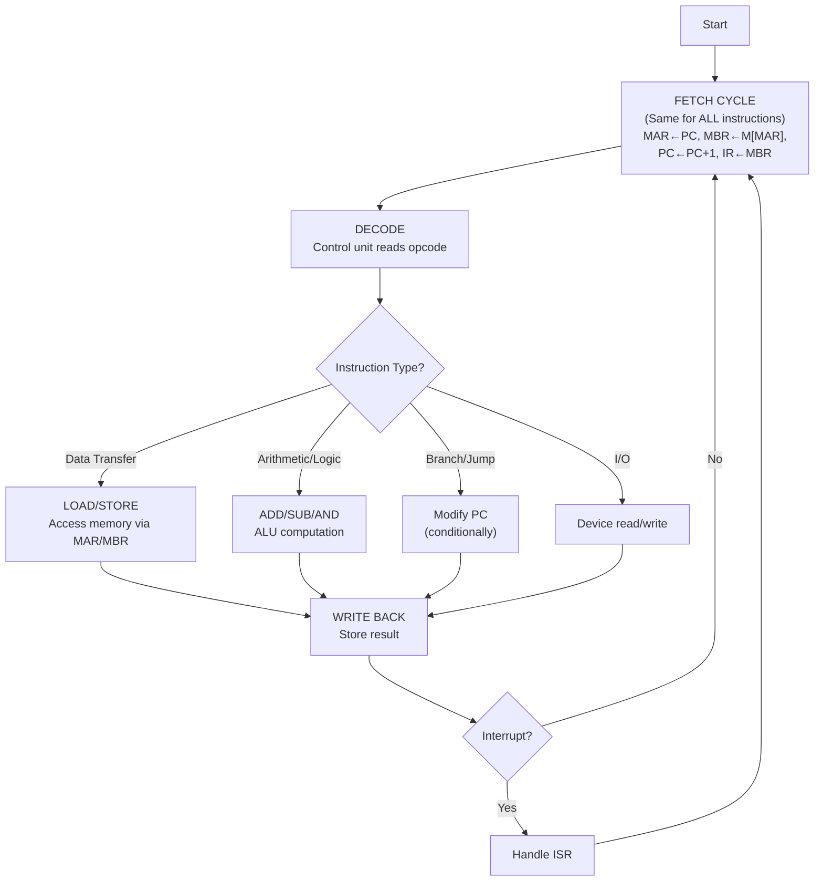

# Topic 15: 3.3 Fetch and Execution Cycles

[< Prev: 3.2 Instruction Execution](topic-14.md) | [Index](index.md) | [Next: 3.4 CPU Organization with Large Register Sets >](topic-16.md)

---

## In Simple Words

The **instruction cycle** (also called the **machine cycle**) consists of two main phases: the **fetch cycle** (same for all instructions — get the instruction from memory) and the **execution cycle** (different for each instruction type — carry out the operation). The CPU constantly alternates between these two phases.

---

## Detailed Explanation

### The Big Picture — The Instruction Cycle

```
           ┌───────────────────────────────────────────────────┐
           │              INSTRUCTION CYCLE                     │
           │                                                    │
           │   ┌─────────────┐      ┌──────────────────┐       │
           │   │ FETCH CYCLE  │ ──→  │ EXECUTION CYCLE   │       │
           │   │ (Common)     │      │ (Varies by instr) │       │
           │   └─────────────┘      └──────────────────┘       │
           │          ↑                      │                  │
           │          └──────────────────────┘                  │
           │        (Repeat for next instruction)               │
           └───────────────────────────────────────────────────┘
```

### The Fetch Cycle — Universal Phase

The fetch cycle is **identical** for every instruction. Its job: bring the next instruction from memory into the CPU.

**RTL for the Fetch Cycle:**

```
Step 1:  MAR ← PC             // Send PC value to MAR (prepare address)
Step 2:  MBR ← M[MAR]         // Read memory at that address, data goes to MBR
         PC ← PC + 1          // Simultaneously increment PC for next instruction
Step 3:  IR ← MBR             // Transfer instruction to Instruction Register
```

**After the fetch cycle:**
- The instruction is in **IR** ready for decoding.
- **PC** already points to the next sequential instruction.
- The **Control Unit** begins decoding the instruction in IR.

### The Execution Cycle — Instruction-Dependent Phase

The execution cycle varies completely depending on the **type of instruction**:

#### Type 1: Data Transfer Instructions (LOAD, STORE, MOV)

**LOAD R1, [Address]** — Read from memory:
```
MAR ← IR(address)        // Extract address from instruction
MBR ← M[MAR]             // Read memory
R1 ← MBR                 // Transfer to register
```

**STORE [Address], R1** — Write to memory:
```
MAR ← IR(address)        // Extract address
MBR ← R1                 // Move register data to MBR
M[MAR] ← MBR             // Write to memory
```

**MOV R1, R2** — Register to register:
```
R1 ← R2                  // Direct register transfer (fastest)
```

#### Type 2: Arithmetic/Logic Instructions (ADD, SUB, AND, etc.)

**ADD R1, R2, R3** — R1 ← R2 + R3:
```
A ← R2                   // ALU input A gets R2
B ← R3                   // ALU input B gets R3
R1 ← A + B               // ALU adds, result to R1
Update flags (Z, C, S, V)
```

#### Type 3: Branch/Jump Instructions

**Unconditional Jump (JMP Address):**
```
PC ← IR(address)          // Overwrite PC with target address
```

**Conditional Branch (BEQ Address — Branch if Zero flag = 1):**
```
If Z = 1: PC ← IR(address)     // Take branch
If Z = 0: (no action)           // Continue to next instruction (PC already incremented)
```

#### Type 4: I/O Instructions

**IN R1, Port** — Read from input device:
```
MAR ← Port address
R1 ← Device[MAR]          // Read data from I/O port
```

**OUT Port, R1** — Write to output device:
```
MAR ← Port address
Device[MAR] ← R1          // Send data to I/O port
```

### Duration of Each Phase

Not all phases take equal time:

| Phase | Typical Duration | Reason |
|---|---|---|
| Fetch | 2-3 clock cycles | Involves memory access (slow) |
| Decode | 1 clock cycle | Combinational logic in control unit |
| Operand Fetch | 0-3+ clock cycles | 0 if register; 1-2 if memory; 3+ if indirect |
| Execute | 1-many clock cycles | 1 for add; many for multiply/divide |
| Write Back | 1 clock cycle | Register write is fast |

**Total CPI (Cycles Per Instruction)** varies: a simple register ADD might take 3-5 cycles, while a memory-indirect multiply could take 10+ cycles.

### The Interrupt Cycle

After the execution cycle, the CPU checks for **pending interrupts**:

```
If (Interrupt pending AND Interrupts enabled):
    Push PC onto stack            // Save return address
    Push Status register onto stack // Save flags
    PC ← Interrupt Vector Address  // Jump to ISR
    Disable interrupts            // Prevent nested interrupts (optional)
Else:
    Go to Fetch Cycle             // Continue with next instruction
```

### State Diagram of the Complete Instruction Cycle

```
                    ┌──────────┐
           ┌───── │  FETCH   │ ←────────────────────────┐
           │       └────┬─────┘                          │
           │            ↓                                │
           │       ┌──────────┐                          │
           │       │  DECODE  │                          │
           │       └────┬─────┘                          │
           │            ↓                                │
           │   ┌────────────────┐                        │
           │   │ OPERAND FETCH  │                        │
           │   └───────┬────────┘                        │
           │           ↓                                 │
           │      ┌──────────┐                           │
           │      │ EXECUTE  │                           │
           │      └────┬─────┘                           │
           │           ↓                                 │
           │   ┌───────────────┐                         │
           │   │  WRITE BACK   │                         │
           │   └───────┬───────┘                         │
           │           ↓                                 │
           │   ┌───────────────┐    Yes   ┌──────────┐  │
           │   │INTERRUPT CHECK│ ───────→ │ Handle   │  │
           │   └───────┬───────┘          │ Interrupt│  │
           │           │ No               └────┬─────┘  │
           │           ↓                       │        │
           └───────────┘───────────────────────┘────────┘
```

### Micro-operations vs. Machine Instructions

| Concept | Scope | Example |
|---|---|---|
| **Micro-operation** | One register transfer in one clock cycle | MAR ← PC |
| **Machine instruction** | Complete task — may need 3-15+ micro-operations | ADD R1, R2, R3 |
| **Instruction cycle** | All micro-operations needed to fetch + execute one instruction | Fetch + Decode + Execute |

---

## Real-Life Example

Think of a **vending machine**:

- **Fetch cycle** (same every time): The machine displays "INSERT COIN" and waits for selection. No matter what you want — chips, soda, or candy — this initial step is identical.
- **Execution cycle** (depends on selection):
  - If you selected chips → the chips dispenser activates (like an ALU instruction).
  - If you selected soda → the soda pump activates (different execution path).
  - If you pressed "RETURN COINS" → the coin return mechanism activates (like a branch — changes the flow).
- **Interrupt cycle**: If the machine runs out of an item while processing, it interrupts the normal flow to display "OUT OF STOCK" before returning to the main loop.

---

## Visual Flow



---

## Quick Revision

| Point | Remember |
|---|---|
| Instruction cycle | Fetch + Execution (+ Interrupt check) |
| Fetch cycle | Same for all instructions: MAR←PC, MBR←M[MAR], PC←PC+1, IR←MBR |
| Execution cycle | Different for each instruction type |
| CPI | Cycles Per Instruction — varies by instruction complexity |
| Branch execution | Modifies PC; no ALU computation typically |
| LOAD execution | Memory → MBR → Register |
| STORE execution | Register → MBR → Memory |
| Interrupt cycle | Save context → Jump to ISR → After ISR, resume |
| Micro-operation | One RTL step (one clock cycle) |
| Machine instruction | Multiple micro-operations forming one complete task |

> **Exam Tip:** The fetch RTL (MAR←PC, MBR←M[MAR], PC←PC+1, IR←MBR) should be written for EVERY instruction trace question. Then write the specific execution phase RTL for the given instruction type. Always mention the interrupt check at the end.

---

[< Prev: 3.2 Instruction Execution](topic-14.md) | [Index](index.md) | [Next: 3.4 CPU Organization with Large Register Sets >](topic-16.md)

