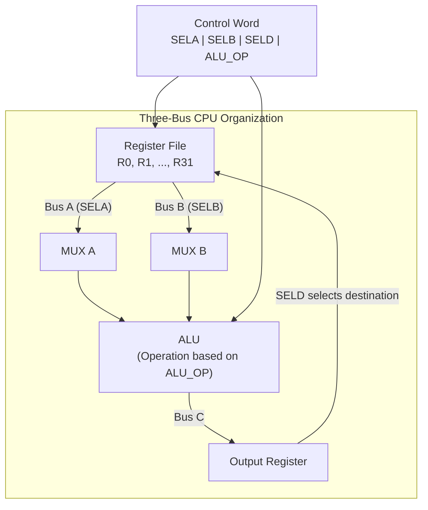

# Topic 16: 3.4 CPU Organization with Large Register Sets

[< Prev: 3.3 Fetch and Execution Cycles](topic-15.md) | [Index](index.md) | [Next: 3.5 Stacks >](topic-17.md)

---

## In Simple Words

Modern CPUs have a **large number of registers** (32, 64, or even hundreds) organized into a **register file**. Having more registers means data can stay inside the CPU longer, reducing the need for slow memory accesses and dramatically improving performance.

---

## Detailed Explanation

### Why Have Many Registers?

Every time the CPU accesses main memory, it wastes **50-100 clock cycles** waiting for the data. But register access takes only **1 clock cycle**. So the more data we can keep in registers, the faster the program runs.

| Storage | Access Time | Cost per Byte | Capacity |
|---|---|---|---|
| Registers | ~1 ns (1 cycle) | Highest | 32-256 registers |
| L1 Cache | ~1-4 ns | High | 32-128 KB |
| L2 Cache | ~5-15 ns | Medium | 256 KB - 8 MB |
| Main Memory | ~50-100 ns | Low | 4-64 GB |
| Disk/SSD | ~10,000-100,000 ns | Lowest | TB range |

### Register File Organization

A **register file** is an array of registers with:
- **Read ports:** Allow reading from one or more registers simultaneously.
- **Write port:** Allows writing to one register.
- **Address lines (register select):** Choose which register to read/write.

For a register file with **n registers** of **k bits** each:
- Need $\log_2(n)$ bits to address each register.
- Read port: MUX with n inputs of k bits each.
- Write port: Decoder to select register + load signal.

```
32-Register File (k=32 bits each):
- Register address = 5 bits (log₂32)
- Two read ports (A, B) for ALU inputs simultaneously
- One write port (C) for ALU result
- Total: 32 × 32 = 1024 flip-flops
```

### General Register Organization (Three-Bus Architecture)

The most common CPU organization with large register sets uses **three internal buses**:

```
┌─────────────────────────────────────────────────┐
│                    CPU                           │
│                                                  │
│   ┌──────────────────┐                          │
│   │  Register File    │                          │
│   │  R0, R1, ..., Rn  │                          │
│   └──┬──────┬────┬───┘                          │
│      │  A   │  B │  C                           │
│      ↓  bus ↓ bus↑ bus                          │
│   ┌─────┐ ┌─────┐                              │
│   │MUX A │ │MUX B│                              │
│   └──┬───┘ └──┬──┘                              │
│      ↓        ↓                                  │
│   ┌──────────────────┐                          │
│   │       ALU         │                          │
│   │  (Add, Sub, AND,  │                          │
│   │   OR, Shift, etc.) │                          │
│   └────────┬──────────┘                          │
│            ↓                                     │
│   ┌──────────────────┐                          │
│   │  Output Register  │ ──→ Bus C → Register File│
│   └──────────────────┘                          │
│                                                  │
│   Control Unit generates: SELA, SELB, SELD,     │
│   ALU_OP, LOAD signals                          │
└─────────────────────────────────────────────────┘
```

**How it works in one clock cycle:**
1. **SELA** (select A): MUX A selects a source register → its value goes on Bus A.
2. **SELB** (select B): MUX B selects another source register → its value goes on Bus B.
3. **ALU_OP**: ALU performs the specified operation on Bus A and Bus B values.
4. **SELD** (select destination): Decoder selects the destination register.
5. **LOAD**: The result on Bus C is loaded into the destination register at the clock edge.

**Entire operation in one cycle:** `R3 ← R1 + R2` requires only ONE clock cycle with three-bus organization.

### Control Word for Register File Operations

Each micro-operation is encoded in a **control word**:

```
┌──────┬──────┬──────┬───────┬──────┐
│ SELA │ SELB │ SELD │ ALU_OP│ LOAD │
│(3bit)│(3bit)│(3bit)│(4bit) │(1bit)│
└──────┴──────┴──────┴───────┴──────┘
```

For a system with 8 registers:
- SELA = 3 bits → selects one of 8 registers for Bus A
- SELB = 3 bits → selects one of 8 registers for Bus B
- SELD = 3 bits → selects destination register on Bus C
- ALU_OP = 4 bits → selects ALU operation (up to 16 operations)
- Total control word = 14 bits

**Example control word for R3 ← R1 + R2:**
- SELA = 001 (R1), SELB = 010 (R2), SELD = 011 (R3), ALU_OP = 0010 (ADD)

### Register Windows (Used in SPARC Architecture)

Some CPUs (notably SPARC) use **register windows** to speed up subroutine calls:

- CPU has a large physical register file (e.g., 128 registers).
- Each subroutine "sees" only a **window** of registers (e.g., 32 at a time).
- When a subroutine is called, the window **shifts** — the new subroutine gets fresh registers without saving the old ones to memory.
- Windows have **overlapping sections** for parameter passing between caller and callee.

```
┌──────────────────────────────────────────┐
│        Physical Register File (128)       │
│                                           │
│  Window A (Subroutine 1):                │
│  [Global][In][Local][Out]                │
│     8     8    8     8   = 32 visible     │
│                                           │
│  Window B (Subroutine 2):                │
│  [Global][In][Local][Out]                │
│     8     8    8     8   = 32 visible     │
│                                           │
│  Overlap: A's "Out" = B's "In"           │
│  (Parameters passed without memory!)      │
└──────────────────────────────────────────┘
```

**Advantage:** Subroutine call/return doesn't need to save/restore registers to stack (memory) — just shift the window. This is MUCH faster.

**Problem:** If nesting depth exceeds the number of windows, a **window overflow** occurs and the oldest window must be saved to memory.

### RISC vs. CISC Register Philosophy

| Aspect | RISC (e.g., ARM, MIPS) | CISC (e.g., x86) |
|---|---|---|
| Number of registers | Many (32-128+) | Few (8-16) |
| Register usage | Compiler allocates registers aggressively | More memory operations |
| Load/Store architecture | Only LOAD/STORE access memory; all ALU ops use registers | ALU can operate directly on memory |
| Instruction count | More instructions (but simpler, faster) | Fewer instructions (but complex, slower) |
| Performance | High throughput with pipelining | Complex decoding needed |

---

## Real-Life Example

Imagine you're a **chef in a kitchen**:

- **Registers** = ingredients on your **counter** (immediately accessible).
- **Cache** = ingredients in the **fridge** nearby (quick to grab).
- **Memory** = ingredients in the **pantry** down the hall (takes time to get).
- **Disk** = ingredients from the **grocery store** (takes much longer!).

The more counter space (registers) you have, the less time you spend walking to the fridge or pantry. A chef with a tiny counter (CISC — few registers) constantly goes to the fridge. A chef with a large counter (RISC — many registers) keeps everything within arm's reach and cooks much faster.

**Register windows** are like having **separate prep stations** for each dish. When you switch from making pasta to making salad, you just move to the next station — all the salad ingredients are already there. No need to clean up and re-stock.

---

## Visual Flow



---

## Quick Revision

| Point | Remember |
|---|---|
| Register access time | ~1 clock cycle (fastest storage in CPU) |
| Memory access time | ~50-100 cycles (much slower) |
| More registers → | Fewer memory accesses → faster programs |
| Register file | Array of registers with read/write ports |
| Three-bus architecture | Bus A + Bus B → ALU → Bus C → destination register |
| Control word fields | SELA, SELB, SELD, ALU_OP |
| Register windows | Overlapping windows for fast subroutine calls (SPARC) |
| Window overlap | Caller's "out" = Callee's "in" (parameter passing) |
| RISC registers | Many (32+), only LOAD/STORE access memory |
| CISC registers | Fewer, ALU can access memory directly |

> **Exam Tip:** Draw the three-bus general register organization diagram. Label MUX A, MUX B, ALU, output register, and the register file. Show the control word fields. If asked about register windows, explain the overlap concept for parameter passing.

---

[< Prev: 3.3 Fetch and Execution Cycles](topic-15.md) | [Index](index.md) | [Next: 3.5 Stacks >](topic-17.md)

