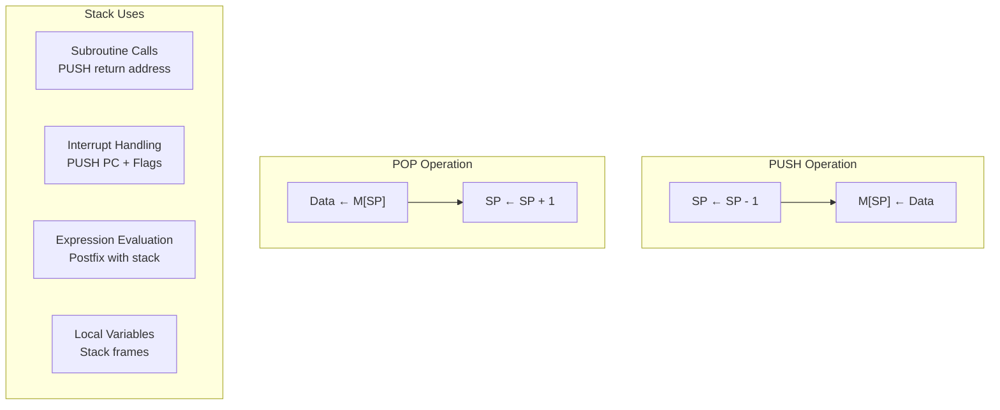

# Topic 17: 3.5 Stacks

[< Prev: 3.4 CPU Organization with Large Register Sets](topic-16.md) | [Index](index.md) | [Next: 3.6 Handling of Interrupts >](topic-18.md)

---

## In Simple Words

A **stack** is a **Last-In, First-Out (LIFO)** data structure where the most recently stored item is the first one to be retrieved. In computers, stacks are used everywhere — subroutine calls, interrupt handling, expression evaluation, and passing parameters. The **Stack Pointer (SP)** register always points to the top of the stack.

---

## Detailed Explanation

### LIFO Principle

```
PUSH 10 → Stack: [10]
PUSH 20 → Stack: [10, 20]
PUSH 30 → Stack: [10, 20, 30]  ← TOP (SP points here)

POP    → Returns 30, Stack: [10, 20]  ← 30 was last in, first out
POP    → Returns 20, Stack: [10]
POP    → Returns 10, Stack: []        ← Empty
```

### Stack Implementation

Stacks can be implemented in two ways:

#### 1. Register Stack (Hardware Stack)

- A **fixed-size** stack built from dedicated registers inside the CPU.
- Stack Pointer is a small counter.
- **Very fast** but limited in size (typically 8-64 entries).
- Used for special purposes like the **return address stack** (for branch prediction).

#### 2. Memory Stack (Software Stack)

- A portion of **main memory** reserved for the stack.
- Stack Pointer (SP) is a CPU register holding the **memory address** of the top.
- **Much larger** capacity (limited only by memory size).
- This is the stack used by programs, operating systems, and compilers.

### Stack Operations — PUSH and POP

#### PUSH Operation (Add to stack)

**Convention 1: Stack grows DOWNWARD (high address → low address)** — most common in x86, ARM.

```
SP ← SP - 1          // Decrement SP to make room
M[SP] ← Data         // Store data at the new top
```

**Convention 2: Stack grows UPWARD (low address → high address):**

```
SP ← SP + 1          // Increment SP
M[SP] ← Data         // Store data at the new top
```

#### POP Operation (Remove from stack)

**For downward-growing stack:**
```
Data ← M[SP]         // Read data from top
SP ← SP + 1          // Increment SP (free the slot)
```

**For upward-growing stack:**
```
Data ← M[SP]         // Read data from top
SP ← SP - 1          // Decrement SP
```

### Stack Conditions

| Condition | Meaning | What Happens |
|---|---|---|
| **Stack Overflow** | PUSH when stack is full | No more space — error condition |
| **Stack Underflow** | POP when stack is empty | No data to retrieve — error condition |
| **FULL flag** | SP has reached the boundary limit | PUSH would cause overflow |
| **EMPTY flag** | SP is at the initial position | POP would cause underflow |

### Memory Stack Layout (Downward Growing)

```
High Address
┌────────────────────┐
│   (Used by other    │
│    program data)    │
├────────────────────┤ ← Stack Base (initial SP)
│   First Push value  │
├────────────────────┤
│   Second Push value │
├────────────────────┤
│   Third Push value  │ ← SP (current top)
├────────────────────┤
│   (Free space)      │
│                     │
│   (Free space)      │
├────────────────────┤ ← Stack Limit (overflow boundary)
│   (Other data)      │
└────────────────────┘
Low Address
```

### Uses of Stacks in Computers

#### 1. Subroutine Calls and Returns

When a `CALL` instruction executes:
```
PUSH PC              // Save return address on stack
PC ← Subroutine address  // Jump to subroutine
```

When `RET` (return) executes:
```
POP PC               // Restore return address from stack
                     // CPU continues from where it left off
```

**Nested calls** work perfectly because each CALL pushes its return address, and each RET pops the most recent one (LIFO order).

```
Main calls A → Stack: [RetA]
  A calls B  → Stack: [RetA, RetB]
    B calls C → Stack: [RetA, RetB, RetC]
    C returns → Stack: [RetA, RetB]     (goes back to B)
  B returns   → Stack: [RetA]           (goes back to A)
A returns     → Stack: []               (goes back to Main)
```

#### 2. Interrupt Handling

When an interrupt occurs:
```
PUSH PC              // Save current instruction address
PUSH Flags           // Save status register
PC ← ISR address     // Jump to Interrupt Service Routine
```

When ISR finishes (RETI):
```
POP Flags            // Restore status register
POP PC               // Return to interrupted program
```

#### 3. Expression Evaluation (Postfix/RPN)

**Infix:** `(3 + 4) * 5`
**Postfix (RPN):** `3 4 + 5 *`

Stack evaluation of `3 4 + 5 *`:
```
Read 3  → PUSH 3      → Stack: [3]
Read 4  → PUSH 4      → Stack: [3, 4]
Read +  → POP 4, POP 3 → 3+4=7, PUSH 7 → Stack: [7]
Read 5  → PUSH 5      → Stack: [7, 5]
Read *  → POP 5, POP 7 → 7*5=35, PUSH 35 → Stack: [35]
Result = 35 ✓
```

#### 4. Stack Frame (Activation Record)

When a subroutine is called, a **stack frame** is created containing:

```
┌────────────────────────┐
│ Return Address          │  ← Pushed by CALL
├────────────────────────┤
│ Saved Frame Pointer     │  ← Old base of previous frame
├────────────────────────┤
│ Local Variables          │  ← Space for subroutine's local data
├────────────────────────┤
│ Saved Registers          │  ← Registers saved before use
├────────────────────────┤
│ Parameters (arguments)   │  ← Passed values from caller
└────────────────────────┘
```

Each subroutine call creates a new frame; return destroys it. This is how **recursion** works — each recursive call gets its own frame with its own local variables.

---

## Real-Life Example

A stack is like a **stack of plates** in a cafeteria:

- **PUSH** = Place a plate on top. The pile grows.
- **POP** = Take the top plate. You always take the one that was placed most recently.
- **Stack Pointer** = Your hand pointing at the top plate.
- **Stack Overflow** = The shelf is full — no room for more plates; they'd fall off.
- **Stack Underflow** = The shelf is empty — there's nothing to take.

For **subroutine calls**, think of it like reading a book with bookmarks:
- You're reading Chapter 5 (main program).
- You see a footnote that says "See Appendix A" → you place a **bookmark** (PUSH return address) at Chapter 5, and turn to Appendix A.
- While reading Appendix A, there's another reference to Appendix C → place a bookmark at Appendix A (PUSH), turn to Appendix C.
- Finish Appendix C → remove the top bookmark (POP) → back to Appendix A.
- Finish Appendix A → remove the top bookmark (POP) → back to Chapter 5.

---

## Visual Flow



---

## Quick Revision

| Point | Remember |
|---|---|
| LIFO | Last In, First Out |
| SP | Stack Pointer — always points to top of stack |
| PUSH (downward stack) | SP ← SP-1, then M[SP] ← data |
| POP (downward stack) | Data ← M[SP], then SP ← SP+1 |
| Overflow | PUSH when stack is full |
| Underflow | POP when stack is empty |
| Subroutine call | PUSH PC, then jump to subroutine |
| Subroutine return | POP PC, continue from saved address |
| Nested calls | LIFO order ensures correct return sequence |
| Postfix evaluation | Operands → PUSH; Operator → POP operands, compute, PUSH result |
| Stack frame | Return addr + saved regs + local vars + parameters |

> **Exam Tip:** Be ready to trace a postfix expression evaluation using a stack. Know PUSH/POP RTL for both upward and downward growing stacks. For subroutine nesting, show the stack contents step-by-step as calls and returns happen.

---

[< Prev: 3.4 CPU Organization with Large Register Sets](topic-16.md) | [Index](index.md) | [Next: 3.6 Handling of Interrupts >](topic-18.md)

