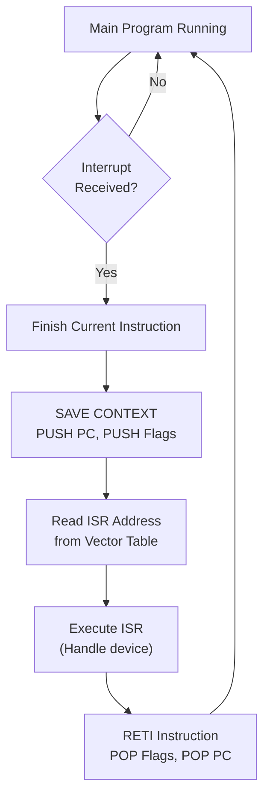

# Topic 18: 3.6 Handling of Interrupts

[< Prev: 3.5 Stacks](topic-17.md) | [Index](index.md) | [Next: 3.7 Handling of Subroutines >](topic-19.md)

---

## In Simple Words

An **interrupt** is a signal that tells the CPU to **temporarily stop** what it's doing and handle something urgent. After handling the urgent task, the CPU **resumes** the original program exactly where it left off. Interrupts are how computers handle real-time events like keyboard presses, mouse clicks, timer ticks, and hardware errors.

---

## Detailed Explanation

### Why Do We Need Interrupts?

Without interrupts, the CPU would have to constantly **check** every device to see if it needs attention (called **polling**). This wastes enormous CPU time because most checks return "nothing to do."

| Method | How It Works | Efficiency |
|---|---|---|
| **Polling** | CPU repeatedly checks each device in a loop | Wastes CPU time; device must wait for its turn |
| **Interrupt** | Device signals CPU only when it needs attention | CPU stays productive; responds immediately when needed |

### Types of Interrupts

#### 1. Hardware Interrupts (External)

Generated by **external hardware devices** through physical interrupt lines:

| Source | Example |
|---|---|
| Keyboard | Key pressed → interrupt to read keycode |
| Mouse | Movement or click → interrupt to update position |
| Timer | Clock tick → interrupt for scheduling, time-keeping |
| Disk | I/O operation complete → interrupt to notify CPU |
| Network | Packet received → interrupt to process data |

Hardware interrupts are **asynchronous** — they can occur at any time, regardless of what the CPU is currently executing.

#### 2. Software Interrupts (Internal)

Generated by **program instructions** intentionally:

| Type | Example |
|---|---|
| **System call (Trap)** | Program requests OS service (file I/O, memory allocation) |
| **INT instruction** | `INT 21h` in DOS, `SWI` in ARM — explicit interrupt instruction |

Software interrupts are **synchronous** — they happen at a specific point in the program.

#### 3. Exceptions (Internal)

Caused by **error conditions** during instruction execution:

| Exception | Cause |
|---|---|
| Division by zero | ALU divides by zero |
| Overflow | Arithmetic result too large |
| Invalid opcode | CPU encounters unrecognized instruction |
| Page fault | Accessed memory page not in physical RAM |
| Segmentation fault | Program accesses memory it shouldn't |

### Interrupt Handling — Step by Step

Here's exactly what happens when an interrupt occurs:

```
1. DEVICE raises interrupt signal (IRQ line goes active)
          ↓
2. CPU finishes the CURRENT instruction (does NOT stop mid-instruction)
          ↓
3. CPU ACKNOWLEDGES the interrupt (sends INTA signal)
          ↓
4. CPU SAVES CONTEXT onto the stack:
   - PUSH PC (return address — address of next instruction)
   - PUSH Status Register / Flags (PSW)
   - (May also push some/all general registers)
          ↓
5. CPU DISABLES further interrupts (optional — prevents nesting)
          ↓
6. CPU loads PC with the ISR ADDRESS:
   - The ISR address comes from the INTERRUPT VECTOR TABLE
          ↓
7. CPU EXECUTES the Interrupt Service Routine (ISR):
   - ISR handles the device (reads data, clears condition, etc.)
          ↓
8. ISR ends with a RETURN FROM INTERRUPT instruction (RETI/IRET):
   - POP Status Register / Flags
   - POP PC
          ↓
9. CPU RESUMES the original program from where it was interrupted
```

### RTL for Interrupt Handling

```
// Interrupt occurs after instruction completion:
SP ← SP - 1
M[SP] ← PC              // Save return address
SP ← SP - 1
M[SP] ← PSW             // Save processor status word (flags)
PC ← M[Vector_Address]  // Load ISR address from vector table
IE ← 0                  // Disable interrupts (optional)

// ... ISR executes ...

// RETI instruction:
PSW ← M[SP]             // Restore flags
SP ← SP + 1
PC ← M[SP]              // Restore return address
SP ← SP + 1
IE ← 1                  // Re-enable interrupts
```

### Interrupt Vector Table (IVT)

The IVT is a table in memory that maps each **interrupt number** to the **address of its ISR**:

```
┌─────────────┬──────────────────────────┐
│ Interrupt #  │ ISR Address (Vector)      │
├─────────────┼──────────────────────────┤
│     0        │ 0x0000 → Division by Zero │
│     1        │ 0x0004 → Debug/Trace      │
│     2        │ 0x0008 → NMI              │
│     3        │ 0x000C → Breakpoint       │
│    ...       │ ...                        │
│    33        │ 0x0084 → Keyboard ISR     │
│    ...       │ ...                        │
└─────────────┴──────────────────────────┘
```

When interrupt N occurs, the CPU reads the ISR address from entry N in the IVT and jumps to it.

### Interrupt Enable/Disable

| Control | Purpose |
|---|---|
| **IE flag (Interrupt Enable)** | Global switch — if 0, all maskable interrupts are ignored |
| **CLI** instruction | Clear Interrupt flag (disable interrupts) |
| **STI** instruction | Set Interrupt flag (enable interrupts) |
| **Interrupt Mask Register** | Individual bits to enable/disable specific interrupt lines |

### Maskable vs. Non-Maskable Interrupts

| Type | Can Be Disabled? | Example |
|---|---|---|
| **Maskable (INTR)** | Yes — can be turned off via IE flag or mask register | Keyboard, timer, disk |
| **Non-Maskable (NMI)** | **No** — always accepted, cannot be ignored | Memory parity error, power failure, watchdog timer |

NMI is for **critical hardware failures** that must be handled immediately.

### Nested Interrupts

If interrupts are kept enabled during ISR execution, a **higher-priority** interrupt can interrupt the current ISR:

```
Main program running
  ↓ Interrupt A (priority 3)
  Save context, start ISR-A
    ↓ Interrupt B (priority 5 — higher)
    Save ISR-A context, start ISR-B
    ISR-B completes → restore ISR-A context
  ISR-A completes → restore main context
Resume main program
```

This requires the stack to handle multiple levels of saved context.

### Interrupt Latency

**Interrupt latency** = Time from when the interrupt signal is raised to when the first instruction of the ISR begins executing.

It includes:
- Time to finish the current instruction
- Time to save context (PUSH operations)
- Time to fetch ISR address from IVT
- Time to fetch first ISR instruction

**Lower latency = faster response** — critical for real-time systems.

---

## Real-Life Example

Imagine you're **studying** at your desk (main program):

- Your **phone rings** (hardware interrupt) → you place a **bookmark** in your book (save PC), note which page you were on (save flags), and answer the phone (execute ISR).
- After the call, you **go back to your bookmark** (restore context) and continue studying exactly where you left off.
- If someone **knocks on your door** while you're on the phone (nested interrupt — higher priority), you put the phone on hold (save ISR context), answer the door, then go back to the phone call, then finally back to studying.
- The **fire alarm** (NMI) cannot be ignored — you MUST stop everything and evacuate, no matter what you're doing.
- **Polling** would be like checking your phone, then the door, then the window, then the phone again, every 5 seconds — even if nothing is happening. Very inefficient!

---

## Visual Flow



---

## Quick Revision

| Point | Remember |
|---|---|
| Interrupt purpose | Handle urgent events without polling |
| Polling vs Interrupt | Polling = CPU checks repeatedly; Interrupt = device signals CPU |
| Three types | Hardware (external), Software (trap/syscall), Exception (error) |
| Interrupt handling steps | Finish instruction → Save context → Load ISR address → Execute ISR → Restore context |
| Context saved | PC + Flags (PSW) minimum, sometimes registers too |
| IVT | Maps interrupt number → ISR address |
| Maskable | Can be disabled (IE flag, mask register) |
| Non-Maskable (NMI) | Cannot be disabled — critical errors only |
| Nested interrupts | Higher-priority interrupt can interrupt current ISR |
| Interrupt latency | Time from signal to first ISR instruction |
| RETI/IRET | Return from interrupt — restores context |

> **Exam Tip:** Draw the complete interrupt handling flowchart. Write the RTL for saving/restoring context. Know the difference between maskable and non-maskable interrupts. Give examples of each interrupt type (hardware, software, exception).

---

[< Prev: 3.5 Stacks](topic-17.md) | [Index](index.md) | [Next: 3.7 Handling of Subroutines >](topic-19.md)

