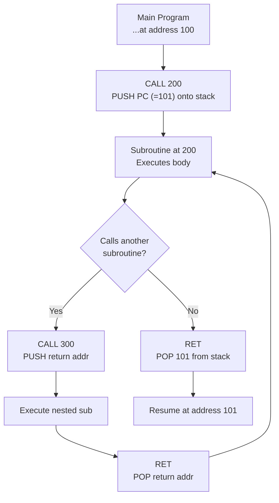

# Topic 19: 3.7 Handling of Subroutines

[< Prev: 3.6 Handling of Interrupts](topic-18.md) | [Index](index.md) | [Next: 3.8 Instruction Pipelining - Stages >](topic-20.md)

---

## In Simple Words

A **subroutine** (also called a function, procedure, or subprogram) is a reusable block of code that can be **called** from different places in a program. The CPU uses a **CALL** instruction to jump to the subroutine and a **RET** instruction to return to where it was called from. The **stack** keeps track of return addresses, making nested and recursive calls possible.

---

## Detailed Explanation

### Why Use Subroutines?

- **Code reuse:** Write a function once, use it from many places.
- **Modularity:** Break a large program into smaller, manageable pieces.
- **Reduced program size:** Common operations aren't duplicated.
- **Easier debugging:** Test each subroutine independently.

### CALL and RET — How They Work

#### CALL Instruction

When the CPU encounters `CALL SubroutineAddress`:

```
SP ← SP - 1              // Make room on stack
M[SP] ← PC               // Save return address (PC already points to NEXT instruction)
PC ← SubroutineAddress   // Jump to subroutine
```

The **return address** is the address of the instruction that comes AFTER the CALL — so when the subroutine finishes, execution continues from the right place.

#### RET (Return) Instruction

When the subroutine finishes and executes `RET`:

```
PC ← M[SP]               // Pop return address from stack into PC
SP ← SP + 1              // Adjust stack pointer
```

The CPU now continues executing from the instruction right after the CALL.

### Example: Calling a Subroutine

```
Address  Instruction
100      MOV R1, 5         // Main program
101      CALL 200           // Call subroutine at address 200
102      ADD R1, R2         // Continue here after subroutine returns
...
200      MUL R1, 3          // Subroutine starts
201      ADD R1, 1          // Subroutine body
202      RET                // Return to caller (address 102)
```

**Stack trace:**
```
Before CALL: SP = 1000, PC = 101
After CALL:  SP = 999, M[999] = 102, PC = 200 (jumped to subroutine)
At RET:      PC ← M[999] = 102, SP = 1000 (back to main program)
```

### Nested Subroutine Calls

Subroutines can call other subroutines. The stack handles this naturally:

```
Main program:
  100: CALL A             // Call subroutine A
  101: (continue here)

Subroutine A (at address 200):
  200: ...
  205: CALL B             // A calls subroutine B
  206: ...
  210: RET                // Return to main (address 101)

Subroutine B (at address 300):
  300: ...
  305: RET                // Return to A (address 206)
```

**Stack during execution:**

| Moment | Stack Top → Bottom | SP |
|---|---|---|
| Before calling A | (empty) | 1000 |
| After CALL A | [101] | 999 |
| After CALL B (inside A) | [206, 101] | 998 |
| After RET from B | [101] | 999 |
| After RET from A | (empty) | 1000 |

LIFO order ensures each RET goes back to the correct caller.

### Parameter Passing Methods

Subroutines often need input data (parameters) and return results. There are three main methods:

#### Method 1: Via Registers

```
// Caller:
MOV R1, 10         // Put parameter in R1
MOV R2, 20         // Put parameter in R2
CALL Multiply      // Subroutine uses R1, R2 as inputs
// Result in R3

// Subroutine:
Multiply:
  R3 ← R1 * R2    // Use register parameters
  RET
```

**Advantages:** Fast (registers are the fastest storage).
**Disadvantages:** Limited number of registers; caller and callee must agree on which registers.

#### Method 2: Via Stack

```
// Caller:
PUSH 10            // Push first parameter
PUSH 20            // Push second parameter
CALL Multiply      // Subroutine reads parameters from stack
ADD SP, 2          // Clean up parameters after return

// Subroutine:
Multiply:
  // Stack: [..., 10, 20, RetAddr] ← SP
  // Parameters are at M[SP+1] and M[SP+2]
  R1 ← M[SP+2]    // First parameter (10)
  R2 ← M[SP+1]    // Second parameter (20)
  R3 ← R1 * R2
  RET
```

**Advantages:** Can pass **any number** of parameters. Supports recursion.
**Disadvantages:** Slower (memory access for each parameter).

#### Method 3: Via Memory Block

- Parameters stored at a fixed memory location.
- Subroutine reads from that location.
- Simple but not suitable for recursion or re-entrant code.

### Stack Frame (Activation Record)

Each subroutine call creates a **stack frame** — a section of the stack that holds everything the subroutine needs:

```
High Address ←──── Previous Frame
┌─────────────────────────┐
│ Parameter N              │  Pushed by caller
│ ...                      │
│ Parameter 1              │
├─────────────────────────┤
│ Return Address           │  Pushed by CALL instruction
├─────────────────────────┤
│ Old Frame Pointer (FP)   │  Saved by subroutine ← FP points here
├─────────────────────────┤
│ Local Variable 1         │  Allocated by subroutine
│ Local Variable 2         │
│ ...                      │
├─────────────────────────┤
│ Saved Registers          │  Preserved by subroutine ← SP points here
└─────────────────────────┘
Low Address
```

**Frame Pointer (FP):** A dedicated register that points to a fixed location within the stack frame, making it easy to access parameters and local variables with fixed offsets, even as SP changes during computation.

### Recursion

A recursive subroutine calls itself. Each recursive call creates a **new stack frame**, so each invocation has its **own copy** of local variables and return address.

**Example: Factorial(3)**
```
Factorial(3):
  Since 3 ≠ 0, compute 3 * Factorial(2)
  PUSH return address, call Factorial(2)
  
  Factorial(2):
    Since 2 ≠ 0, compute 2 * Factorial(1)
    PUSH return address, call Factorial(1)
    
    Factorial(1):
      Since 1 ≠ 0, compute 1 * Factorial(0)
      PUSH return address, call Factorial(0)
      
      Factorial(0):
        Return 1 (base case)
      
    Return 1 * 1 = 1
  Return 2 * 1 = 2
Return 3 * 2 = 6
```

Stack at deepest point has 4 frames — one for each call.

### Subroutine vs. Interrupt — Key Differences

| Feature | Subroutine (CALL/RET) | Interrupt (ISR) |
|---|---|---|
| **Trigger** | Explicit CALL instruction in program | External signal or internal exception |
| **When** | Synchronous — at known point in code | Asynchronous — can happen anytime |
| **Context saved** | Usually just return address (PC) | PC + Flags + possibly all registers |
| **Return instruction** | RET | RETI / IRET (restores flags too) |
| **Programmer control** | Fully controlled by programmer | Device or hardware initiated |

---

## Real-Life Example

A subroutine call is like a **manager delegating a task**:

1. The manager (main program) is working on a report.
2. They need to calculate quarterly profits — instead of doing it themselves, they **call** the accounting department (subroutine).
3. Before calling, the manager makes a **note** of where they left off in the report (save return address on stack).
4. The accounting department does the calculation (subroutine executes).
5. The result is sent back (return value in register).
6. The manager picks up from their note (return address) and **continues** the report.

**Nested calls:** The accounting department might call the tax team (nested subroutine). When the tax team finishes, accounting continues, then eventually the manager gets the final answer.

**Recursion:** Counting a pile of folders: "Count this folder's contents, but if a folder contains sub-folders, count those too the same way." Each level of counting keeps its own place-marker (stack frame).

---

## Visual Flow



---

## Quick Revision

| Point | Remember |
|---|---|
| CALL instruction | PUSH PC (save return address), PC ← subroutine address |
| RET instruction | POP PC (restore return address), continue from there |
| Return address | Address of instruction AFTER the CALL |
| Nested calls | Stack naturally handles LIFO ordering of return addresses |
| Parameter passing | Via registers (fast), via stack (flexible), via memory (simple) |
| Stack frame | Return addr + saved FP + local vars + saved regs + parameters |
| Frame Pointer (FP) | Fixed reference point within stack frame for easy variable access |
| Recursion | Each call = new stack frame with separate local variables |
| CALL vs Interrupt | CALL is synchronous/programmer-initiated; Interrupt is asynchronous/device-initiated |
| RET vs RETI | RET restores only PC; RETI restores PC + flags |

> **Exam Tip:** Draw the stack before, during, and after a subroutine call. Show nested calls with multiple return addresses on the stack. Know all three parameter passing methods and when each is preferred.

---

[< Prev: 3.6 Handling of Interrupts](topic-18.md) | [Index](index.md) | [Next: 3.8 Instruction Pipelining - Stages >](topic-20.md)

