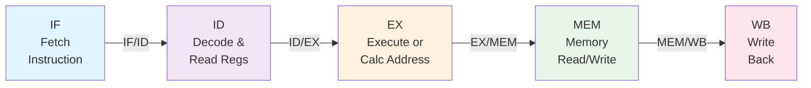

# Topic 20: 3.8 Instruction Pipelining — Stages

[< Prev: 3.7 Handling of Subroutines](topic-19.md) | [Index](index.md) | [Next: 3.9 Pipeline Hazards >](topic-21.md)

---

## In Simple Words

**Pipelining** breaks instruction execution into multiple stages so that **several instructions can be in progress at the same time** — each in a different stage. Like an assembly line in a factory, each station does one job and passes the work forward, so overall **throughput** (instructions completed per unit time) increases dramatically.

---

## Detailed Explanation

### Without Pipelining (Sequential Execution)

In a non-pipelined CPU, each instruction must fully complete before the next one begins:

```
Cycle:  1  2  3  4  5  6  7  8  9  10 11 12 13 14 15
I1:     IF ID EX ME WB
I2:                       IF ID EX ME WB
I3:                                         IF ID EX ME WB
```

**3 instructions × 5 cycles each = 15 cycles total.**

### With Pipelining (Overlapped Execution)

A pipelined CPU starts a new instruction every cycle once the pipeline is full:

```
Cycle:  1  2  3  4  5  6  7
I1:     IF ID EX ME WB
I2:        IF ID EX ME WB
I3:           IF ID EX ME WB
I4:              IF ID EX ME WB
I5:                 IF ID EX ME WB
```

**5 instructions in 7 cycles** (vs. 25 cycles without pipeline). After the initial fill-up period, one instruction completes **every cycle**.

### The Classic 5-Stage Pipeline

| Stage | Full Name | What Happens | Hardware Used |
|---|---|---|---|
| **IF** | Instruction Fetch | Read instruction from memory using PC; PC ← PC + 1 | Instruction Memory, PC, Adder |
| **ID** | Instruction Decode & Register Read | Decode opcode, read source registers from register file, generate control signals | Decoder, Register File, Sign Extender |
| **EX** | Execute / Address Calculate | ALU performs operation (arithmetic/logic) or calculates memory address (base + offset) | ALU, Multiplexers |
| **MEM** | Memory Access | Load: read from data memory; Store: write to data memory. Other instructions pass through | Data Memory |
| **WB** | Write Back | Write result back to destination register in register file | Register File (write port) |

### Stage-by-Stage RTL for `ADD R3, R1, R2`

| Stage | RTL | Description |
|---|---|---|
| IF | IR ← M[PC]; PC ← PC + 1 | Fetch the ADD instruction |
| ID | A ← R[rs1]; B ← R[rs2] | Read R1 and R2 into pipeline registers A and B |
| EX | ALUOut ← A + B | ALU adds the two values |
| MEM | (pass through) | No memory access needed for ADD |
| WB | R[rd] ← ALUOut | Write result to R3 |

### Stage-by-Stage RTL for `LOAD R1, 100(R2)`

| Stage | RTL | Description |
|---|---|---|
| IF | IR ← M[PC]; PC ← PC + 1 | Fetch the LOAD instruction |
| ID | A ← R[rs]; Imm ← sign-extend(offset) | Read base register R2, sign-extend offset 100 |
| EX | ALUOut ← A + Imm | Calculate effective address = R2 + 100 |
| MEM | MDR ← M[ALUOut] | Read data from memory at computed address |
| WB | R[rd] ← MDR | Write loaded data into R1 |

### Pipeline Registers (Inter-Stage Buffers)

Between each pair of stages, there are **pipeline registers** that hold intermediate results:

```
IF → [IF/ID] → ID → [ID/EX] → EX → [EX/MEM] → MEM → [MEM/WB] → WB
```

| Pipeline Register | Contents |
|---|---|
| **IF/ID** | Fetched instruction (IR), incremented PC |
| **ID/EX** | Decoded control signals, register values, immediate value, destination register number |
| **EX/MEM** | ALU result, data to store (for Store), branch target address, zero flag, control signals |
| **MEM/WB** | Data from memory (for Load) or ALU result, destination register number, control signals |

These registers update at the **rising edge of each clock cycle**, passing data from one stage to the next.

### Pipeline Performance

**Key formulas:**

$$\text{Speedup} = \frac{\text{Time without pipeline}}{\text{Time with pipeline}}$$

For *k* stages and *n* instructions:

$$\text{Cycles (no pipeline)} = n \times k$$
$$\text{Cycles (with pipeline)} = k + (n - 1)$$

$$\text{Speedup} = \frac{n \times k}{k + (n - 1)}$$

When *n* is very large (n → ∞):

$$\text{Maximum Speedup} \approx k$$

So a 5-stage pipeline can ideally achieve up to **5× speedup**!

### Important Pipeline Concepts

| Concept | Meaning |
|---|---|
| **Throughput** | Number of instructions completed per unit time. Pipeline increases throughput. |
| **Latency** | Time for ONE instruction to complete. Pipeline does NOT reduce latency — it stays *k* cycles. |
| **Pipeline fill** | First *k* cycles where the pipeline is being filled. Not all stages are utilized. |
| **Pipeline drain** | Last *k* cycles after the final instruction enters — earlier stages idle. |
| **Clock period** | Determined by the **slowest** stage (plus pipeline register overhead): $T_{\text{clk}} = \max(t_{\text{stage}}) + t_{\text{register}}$ |
| **CPI (ideal)** | 1 — one instruction completes per cycle in a fully utilized pipeline. |
| **Balanced pipeline** | All stages take roughly equal time → maximum efficiency. Unbalanced stages waste time. |

### Example: Throughput Calculation

**5-stage pipeline, 100 instructions:**

- Without pipeline: $100 \times 5 = 500$ cycles
- With pipeline: $5 + (100 - 1) = 104$ cycles
- Speedup: $500 / 104 ≈ 4.81 ×$ (close to the ideal 5×)

**5-stage pipeline, 10 instructions:**

- Without pipeline: $10 \times 5 = 50$ cycles
- With pipeline: $5 + (10 - 1) = 14$ cycles
- Speedup: $50 / 14 ≈ 3.57 ×$ (less than ideal due to fill/drain overhead)

### Superpipelining vs. Superscalar

| Approach | Description | Example |
|---|---|---|
| **Superpipelining** | More than 5 stages (e.g., 10–20); shorter clock period | MIPS R4000 (8 stages) |
| **Superscalar** | Multiple pipelines operating in parallel; issue 2+ instructions per cycle | Intel Pentium (dual pipeline) |

---

## Real-Life Example

**Laundry pipeline:**

| Task | Washer (30 min) | Dryer (30 min) | Folder (30 min) |
|---|---|---|---|
| Load 1 | 6:00–6:30 | 6:30–7:00 | 7:00–7:30 |
| Load 2 | 6:30–7:00 | 7:00–7:30 | 7:30–8:00 |
| Load 3 | 7:00–7:30 | 7:30–8:00 | 8:00–8:30 |
| Load 4 | 7:30–8:00 | 8:00–8:30 | 8:30–9:00 |

Without pipelining: 4 loads × 90 min = **360 min**
With pipelining: 90 + (3 × 30) = **180 min** — 2× speedup with 3 stages!

Each appliance is always busy once the pipeline fills up — just like each pipeline stage in a CPU.

---

## Visual Flow



---

## Quick Revision

| Point | Remember |
|---|---|
| 5 stages | IF → ID → EX → MEM → WB |
| Pipeline registers | IF/ID, ID/EX, EX/MEM, MEM/WB — hold data between stages |
| Throughput vs Latency | Pipeline increases throughput, NOT single-instruction latency |
| Ideal CPI | 1 (one instruction per cycle) |
| Max speedup | ≈ k (number of stages) when n is large |
| Total cycles with pipeline | k + (n − 1) for n instructions |
| Clock period | Set by slowest stage + register overhead |
| Balanced pipeline | All stages should take roughly equal time |
| Superpipelining | More stages → shorter clock → higher frequency |
| Superscalar | Multiple pipelines → multiple instructions per cycle |

> **Exam Tip:** Be ready to draw a pipeline timing diagram showing 5+ instructions over multiple cycles. Also know how to calculate speedup given n instructions and k stages. Remember: the clock period is limited by the SLOWEST stage.

---

[< Prev: 3.7 Handling of Subroutines](topic-19.md) | [Index](index.md) | [Next: 3.9 Pipeline Hazards >](topic-21.md)

[< Prev: 3.7 Handling of subroutines](topic-19.md) | [Index](index.md) | [Next: 3.9 Pipeline hazards >](topic-21.md)

