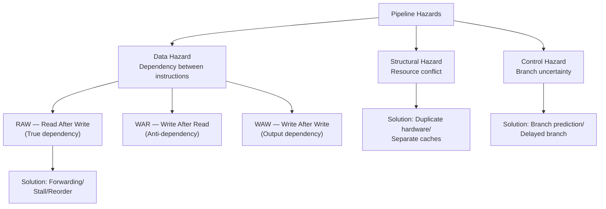

# Topic 21: 3.9 Pipeline Hazards

[< Prev: 3.8 Instruction Pipelining — Stages](topic-20.md) | [Index](index.md) | [Next: 3.10 Methods to Remove/Reduce Hazards >](topic-22.md)

---

## In Simple Words

A **pipeline hazard** is any situation that prevents the next instruction from executing in its designated pipeline stage during the next clock cycle. Hazards break the ideal "one instruction starts every cycle" flow and cause the pipeline to **stall** (insert empty bubbles). There are three types: **structural**, **data**, and **control** hazards.

---

## Detailed Explanation

### 1. Structural Hazards

A structural hazard occurs when **two or more instructions need the same hardware resource at the same time**.

**Classic example — Single memory for both instructions and data:**

```
Cycle:     1    2    3    4    5    6
I1:        IF   ID   EX   MEM  WB
I2:             IF   ID   EX   MEM  WB
I3:                  IF   ID   EX   MEM  WB
I4:                       IF   ID   EX   MEM  ← needs memory
                          ↑
                       IF also needs memory!
```

In cycle 4, I4 is in the IF stage (needs memory to fetch instruction), while I1 is in the MEM stage (needs memory to access data). If there is only one memory port, both cannot access memory simultaneously → **conflict!**

**Other structural hazard examples:**
- Single ALU shared between address calculation and arithmetic operation
- Single register file port when one instruction reads and another writes simultaneously

**Effect:** The pipeline must **stall** — the newer instruction waits, inserting a **bubble** (NOP) into the pipeline.

### 2. Data Hazards

A data hazard occurs when an instruction **depends on the result of a previous instruction** that hasn't finished yet.

**Example:**
```
I1: ADD R1, R2, R3    // R1 ← R2 + R3 (result written in WB stage, cycle 5)
I2: SUB R4, R1, R5    // Reads R1 in ID stage (cycle 3) ← R1 not ready yet!
```

```
Cycle:    1    2    3    4    5
I1:       IF   ID   EX   MEM  WB ← R1 written here
I2:            IF   ID ← tries to read R1 here (old value!)
```

I2 reads R1 in cycle 3, but I1 doesn't write the new value of R1 until cycle 5. I2 would get the **stale/old** value.

#### Three Types of Data Hazards

| Type | Full Name | Meaning | Example | Frequency |
|---|---|---|---|---|
| **RAW** | Read After Write | I2 reads a register BEFORE I1 writes it | I1: `ADD R1,...` → I2: `SUB ..,R1,..` | **Most common** |
| **WAR** | Write After Read | I2 writes a register BEFORE I1 reads it | I1: `SUB ..,R1,..` → I2: `ADD R1,...` | Rare in simple pipelines; common in out-of-order |
| **WAW** | Write After Write | I2 writes a register BEFORE I1 writes to same register | I1: `ADD R1,...` → I2: `MUL R1,...` | Rare in simple pipelines; common in out-of-order |

**RAW is the TRUE dependency** — the data genuinely must flow from one instruction to the next. WAR and WAW are **name dependencies** (also called false/anti dependencies) that can be solved by register renaming.

#### RAW Hazard Distance

The severity of a RAW hazard depends on how far apart the dependent instructions are:

```
I1: ADD R1, R2, R3      // Writes R1
I2: SUB R4, R1, R5      // Distance = 1 → HAZARD (R1 not ready)
I3: AND R6, R1, R7      // Distance = 2 → HAZARD (R1 still not ready without forwarding)
I4: OR  R8, R1, R9      // Distance = 3 → May or may not be hazard (depends on pipeline)
I5: XOR R10, R1, R11    // Distance = 4 → No hazard (R1 written by now)
```

### 3. Control Hazards (Branch Hazards)

A control hazard occurs when the pipeline has already **fetched the wrong instructions** because a **branch** outcome wasn't known yet.

**Example:**
```
100: BEQ R1, R2, 200    // If R1 == R2, jump to address 200
104: ADD R3, R4, R5     // Fetched in next cycle (assume not taken)
108: SUB R6, R7, R8     // Also fetched
...
200: MUL R9, R10, R11   // Actual branch target
```

The pipeline doesn't know whether to fetch instruction at 104 or 200 until the branch condition is evaluated (typically in EX or ID stage):

```
Cycle:     1     2     3     4     5
BEQ:       IF    ID    EX ← branch outcome known here
ADD (104): ----  IF    ID    ← wrong instruction if branch taken!
SUB (108): ----  ----  IF    ← also wrong!
```

If the branch is taken, instructions at 104 and 108 were fetched uselessly and must be **flushed** (discarded), wasting 2 cycles.

**Branch penalty:** The number of wasted cycles when a branch is taken. In a 5-stage pipeline where branch resolves in EX:

$$\text{Branch penalty} = 2 \text{ cycles (IF and ID stages wasted)}$$

If the branch resolves in ID stage (with hardware comparator): penalty = 1 cycle.

### Summary: All Three Hazards

| Hazard Type | Cause | Example | Penalty |
|---|---|---|---|
| **Structural** | Two instructions need same hardware | Both need memory or ALU | 1+ stall cycles |
| **Data (RAW)** | Read before prior write completes | ADD R1 → SUB uses R1 | 1–2 stall cycles |
| **Data (WAR)** | Write before prior read | Out-of-order issue | Register renaming |
| **Data (WAW)** | Double write order disrupted | Out-of-order issue | Register renaming |
| **Control** | Branch outcome unknown | BEQ followed by wrong path | 1–3 stall cycles |

### Impact on CPI

Without hazards, ideal CPI = 1. With hazards:

$$\text{Actual CPI} = 1 + \text{stall cycles per instruction}$$

$$\text{stalls per instruction} = (\text{structural stall freq} \times \text{penalty}) + (\text{data stall freq} \times \text{penalty}) + (\text{branch freq} \times \text{penalty} \times \text{taken rate})$$

**Example:** If 20% of instructions are branches with 2-cycle penalty and 60% taken rate:

$$\text{Branch stalls} = 0.20 \times 2 \times 0.60 = 0.24$$
$$\text{Actual CPI} = 1 + 0.24 = 1.24$$

---

## Real-Life Example

**Assembly line in a car factory:**

- **Structural hazard:** Two stations both need the single paint booth at the same time → one car waits.
- **Data hazard (RAW):** The wheel mounting station can't start until the axle installation station finishes — the wheels depend on the axle being in place.
- **Control hazard:** A quality inspector decides "reject this car model, switch to the SUV line." But 3 cars already started on the sedan line → those partially-built sedans are wasted work (pipeline flush).

---

## Visual Flow



---

## Quick Revision

| Point | Remember |
|---|---|
| Structural hazard | Two instructions need same hardware in same cycle |
| Data hazard | Instruction needs result not yet produced |
| Control hazard | Wrong instructions fetched due to branch |
| RAW (Read After Write) | Most common — true dependency; I2 reads before I1 writes |
| WAR (Write After Read) | Anti-dependency; affects out-of-order pipelines |
| WAW (Write After Write) | Output dependency; affects out-of-order pipelines |
| Pipeline stall/bubble | NOP inserted to wait for hazard resolution |
| Branch penalty | Cycles wasted when a branch is taken (typically 1–3) |
| Effect on CPI | Actual CPI = 1 + stall cycles per instruction |
| Pipeline flush | Discard incorrectly fetched instructions after mispredicted branch |

> **Exam Tip:** Draw the pipeline timing diagram to show exactly WHERE and WHY a hazard occurs. For data hazards, highlight the stage where data is needed vs. the stage where it becomes available. Know RAW vs WAR vs WAW with examples.

---

[< Prev: 3.8 Instruction Pipelining — Stages](topic-20.md) | [Index](index.md) | [Next: 3.10 Methods to Remove/Reduce Hazards >](topic-22.md)

