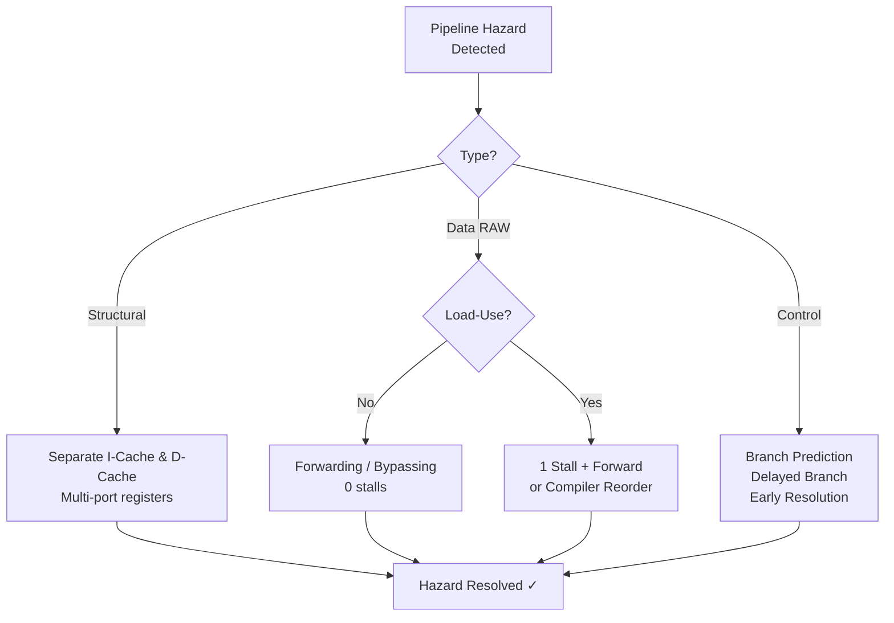

# Topic 22: 3.10 Methods to Remove/Reduce Hazards

[< Prev: 3.9 Pipeline Hazards](topic-21.md) | [Index](index.md) | [Next: 4.1 Basic Organization of Micro-Programmed Controller >](topic-23.md)

---

## In Simple Words

Since pipeline hazards reduce performance by inserting stall cycles, CPUs use several techniques to **eliminate or reduce** them. The main strategies are: **stalling** (wait), **forwarding/bypassing** (shortcut the data), **separate caches** (remove resource conflicts), **branch prediction** (guess correctly), and **instruction reordering** (rearrange to avoid hazards altogether).

---

## Detailed Explanation

### Solutions for Structural Hazards

#### 1. Separate Instruction and Data Caches (Harvard-style)

The most common structural hazard: IF and MEM stages both need memory in the same cycle.

**Solution:** Use **separate caches** — one for instructions (I-cache) and one for data (D-cache):

```
IF stage  →  I-Cache (instruction memory)
MEM stage →  D-Cache (data memory)
```

Both stages access different hardware simultaneously → **no conflict**.

#### 2. Duplicate Hardware Resources

- **Multiple ALUs** — if both EX and address-calculation need an ALU, provide two.
- **Multi-port register file** — allow simultaneous reads (ID stage) and writes (WB stage) by having separate read/write ports operating in different half-cycles.

### Solutions for Data Hazards

#### 1. Stalling (Pipeline Bubbles)

The simplest solution: **freeze the pipeline** until the data is ready.

**Example without forwarding:**
```
I1: ADD R1, R2, R3    // R1 result available after WB (cycle 5)
I2: SUB R4, R1, R5    // Needs R1 in ID (cycle 3)
```

```
Cycle:     1    2    3    4    5    6    7
I1:        IF   ID   EX   MEM  WB
I2:             IF   stall stall ID   EX   ...
           (bubbles inserted for 2 cycles)
```

**Disadvantage:** Stalling wastes cycles and reduces throughput. Here, 2 bubble cycles are added.

**Hardware implementation:** The **hazard detection unit** compares source registers of the instruction in ID with the destination register of instructions in EX and MEM stages. If a match is found, it:
- Holds the IF/ID register (prevent new fetch)
- Inserts NOPs into the ID/EX register (create bubble)

#### 2. Data Forwarding (Bypassing) ⭐

Instead of waiting for the result to be written to the register file (WB), **forward** the result directly from where it's computed to where it's needed.

**Example with forwarding:**
```
I1: ADD R1, R2, R3    // ALU computes R1 at end of EX (cycle 3)
I2: SUB R4, R1, R5    // Needs R1 at start of EX (cycle 4)
```

```
Without forwarding:
Cycle:     1    2    3    4    5    6    7
I1:        IF   ID   EX   MEM  WB
I2:             IF   stall stall ID   EX   (2 stalls)

With forwarding:
Cycle:     1    2    3    4    5
I1:        IF   ID   EX   MEM  WB
I2:             IF   ID   EX   MEM  (0 stalls!)
                          ↑
              Forward from I1's EX/MEM register to I2's EX input
```

**Forwarding paths (multiplexer at ALU input):**

| From Stage | Forward To | When |
|---|---|---|
| EX/MEM register (ALU output) | EX stage ALU input | 1-instruction distance |
| MEM/WB register (ALU output or memory data) | EX stage ALU input | 2-instruction distance |

**Hardware:** Multiplexers are added before ALU inputs. A **forwarding unit** compares register numbers and selects the forwarded value instead of the normal register file value.

#### 3. Load-Use Hazard — Stall Even With Forwarding

**Forwarding cannot always avoid stalls.** A LOAD instruction's data is available only after the MEM stage, but the next instruction needs it in EX:

```
I1: LOAD R1, 0(R2)    // R1 available after MEM (cycle 4)
I2: ADD R4, R1, R5    // Needs R1 at start of EX (cycle 4)
```

```
Cycle:     1    2    3    4    5    6
I1 LOAD:   IF   ID   EX   MEM  WB
I2 ADD:         IF   ID   stall EX   MEM
                            ↑         ↑
              1 bubble    Forward from MEM/WB to EX
```

**One stall cycle is unavoidable.** The data literally isn't computed until end of MEM — can't be forwarded to EX of the same cycle. After the 1-cycle stall, the data CAN be forwarded from MEM/WB to EX.

#### 4. Instruction Reordering (Compiler Optimization)

The **compiler** rearranges instructions to fill the stall slot with a useful independent instruction:

```
// Original code (has load-use hazard):
LOAD R1, 0(R2)       // Load
ADD  R4, R1, R5      // Uses R1 immediately → 1 stall

// After reordering:
LOAD R1, 0(R2)       // Load
SUB  R7, R8, R9      // Independent instruction moved here (fills delay)
ADD  R4, R1, R5      // By now, R1 is ready → no stall!
```

The compiler finds an independent instruction from elsewhere in the program and moves it between the load and its use.

#### 5. Register Renaming (for WAR and WAW)

WAR and WAW hazards involve the same register **name** but not the same **data**. Using different physical registers eliminates the conflict:

```
// WAR hazard:
I1: ADD R3, R1, R2    // Reads R1
I2: SUB R1, R4, R5    // Writes R1 (conflicts with I1's read)

// After renaming:
I1: ADD R3, R1, R2    // Reads R1
I2: SUB T1, R4, R5    // Writes to temporary register T1 (no conflict)
```

### Solutions for Control Hazards

#### 1. Stall on Branch (Pipeline Freeze)

Simplest: when a branch is detected, **stop fetching** until the branch outcome is known.

```
Cycle:     1    2    3    4    5
BEQ:       IF   ID   EX
Next:                      IF   ID   (waits 2 cycles)
```

**Penalty:** 2 cycles every branch (if resolved in EX). Very wasteful — 15–20% of instructions are branches.

#### 2. Branch Prediction

**Predict** whether the branch will be taken or not, and fetch accordingly. If the prediction is correct → no penalty. If wrong → flush and re-fetch (penalty).

| Strategy | How It Works | Accuracy |
|---|---|---|
| **Predict Never Taken** | Always fetch the next sequential instruction | ~30–40% (works for forward branches) |
| **Predict Always Taken** | Always fetch from branch target | ~60–70% (works for loops) |
| **1-bit Predictor** | Remember last outcome; predict same next time | ~80–85% |
| **2-bit Predictor** | Need two wrong predictions to change; state machine with 4 states | ~90–95% |

**2-bit predictor state machine:**

```
                 Taken                      Taken
     ┌──────────────────┐      ┌──────────────────┐
     │                  ▼      │                  ▼
  Strongly         Weakly   Weakly          Strongly
  Not Taken    Not Taken     Taken            Taken
     ▲                  │      ▲                  │
     └──────────────────┘      └──────────────────┘
            Not Taken                  Not Taken
```

States: **Strongly Taken → Weakly Taken → Weakly Not Taken → Strongly Not Taken**

The prediction changes only after **two consecutive** mispredictions.

#### 3. Delayed Branch

The instruction(s) **after the branch** are **always executed** regardless of the branch outcome. The compiler fills these "delay slots" with useful instructions:

```
BEQ R1, R2, target     // Branch instruction
ADD R3, R4, R5          // Delay slot — this ALWAYS executes
// (Next instruction fetched depends on branch outcome)
```

The compiler tries to find an instruction that is useful on **both** paths (taken and not-taken). This is a technique used in MIPS architecture.

**Filling strategies:**
- **From before:** Move an instruction from before the branch into the delay slot (always safe).
- **From target:** Move first instruction of branch target into delay slot (safe only if branch is usually taken).
- **From fall-through:** Move instruction from the not-taken path (safe only if branch is usually not taken).

#### 4. Early Branch Resolution

Move branch comparison hardware to the **ID stage** instead of waiting for EX:

```
Without early resolution (resolved in EX): penalty = 2 cycles
With early resolution (resolved in ID):    penalty = 1 cycle
```

Requires adding a comparator in the ID stage.

### Summary of All Solutions

| Hazard | Solution | Penalty Reduction | Hardware Cost |
|---|---|---|---|
| Structural | Separate I/D caches | Eliminates memory conflict | Moderate (dual caches) |
| Structural | Multi-port register file | Eliminates R/W conflict | Low |
| Data (RAW) | Stalling | Doesn't reduce; just waits | Low (hazard detection) |
| Data (RAW) | Forwarding/Bypassing | Eliminates most RAW stalls | Moderate (MUXes, forwarding unit) |
| Data (Load-Use) | Stall + Forward | 1 stall still needed | Moderate |
| Data (Load-Use) | Compiler reordering | Fills stall with useful work | Zero (compiler does it) |
| Data (WAR/WAW) | Register renaming | Eliminates false deps | High (rename table) |
| Control | Stall on branch | None; penalty every branch | Low |
| Control | Branch prediction | Penalty only on mispredict | Low to Moderate |
| Control | Delayed branch | Fills delay slot usefully | Zero (compiler + ISA support) |
| Control | Early branch resolution | Reduces penalty from 2 to 1 | Low (comparator in ID) |

---

## Real-Life Example

**Highway traffic analogy:**

- **Stalling** = Red traffic light — everyone stops and waits. Simple but slow.
- **Forwarding** = Flyover/bypass road — cars skip the bottleneck and get to their destination faster without waiting.
- **Branch prediction** = GPS navigation predicting "most people turn left here" — if correct, you save time. If wrong, you take a U-turn (penalty).
- **Delayed branch** = Doing something useful while waiting at the signal (like making a phone call in the delay slot).
- **Instruction reordering** = Rearranging your errand order so you don't waste time backtracking.
- **Separate caches** = Two separate lanes for cars and trucks — no fighting over the same road.

---

## Visual Flow



---

## Quick Revision

| Point | Remember |
|---|---|
| Structural fix | Separate I-cache/D-cache; multi-port register file |
| Data hazard (RAW) — Stalling | Insert bubbles until data ready; simplest but slowest |
| Data hazard (RAW) — Forwarding | Bypass ALU output directly to next instruction's input; eliminates most RAW stalls |
| Load-Use hazard | 1 stall STILL needed even with forwarding (data available after MEM, not EX) |
| Compiler reordering | Move independent instruction into stall slot; zero hardware cost |
| Register renaming | Eliminates WAR/WAW by using different physical registers |
| Branch — Predict not taken | Always fetch next sequential instruction; simple; 30–40% accurate |
| Branch — 2-bit predictor | 4-state machine; changes prediction only after 2 consecutive mispredictions; ~90% |
| Delayed branch | Instruction in delay slot ALWAYS executes; compiler fills it usefully |
| Early branch resolution | Move comparator to ID stage; reduces penalty from 2 to 1 cycle |

> **Exam Tip:** The most important combination for exams: **RAW hazard + forwarding**. Be ready to draw a pipeline diagram showing forwarding paths. Also know when forwarding CANNOT help (load-use hazard) and how the compiler can reorder instructions to avoid the stall.

---

[< Prev: 3.9 Pipeline Hazards](topic-21.md) | [Index](index.md) | [Next: 4.1 Basic Organization of Micro-Programmed Controller >](topic-23.md)

