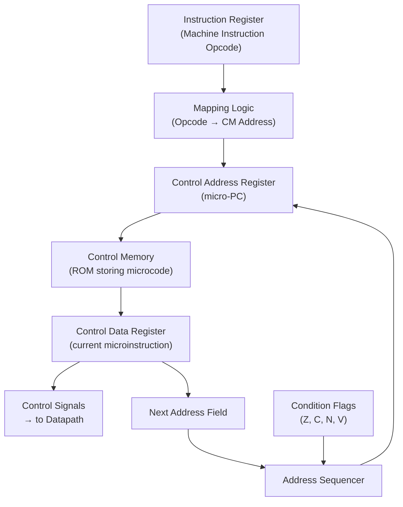

# Topic 23: 4.1 Basic Organization of Micro-Programmed Controller

[< Prev: 3.10 Methods to Remove/Reduce Hazards](topic-22.md) | [Index](index.md) | [Next: 4.2 Horizontal vs Vertical Microinstruction Formats >](topic-24.md)

---

## In Simple Words

A **micro-programmed controller** generates control signals by reading them from a **control memory (ROM)** rather than using fixed logic gates. Each machine-level instruction (like ADD, LOAD) is actually executed by a small **sequence of micro-instructions** stored in the control memory. This makes the control unit **flexible** — changing CPU behavior means updating the micro-program, not redesigning hardware.

---

## Detailed Explanation

### Two Types of Control Unit Design

| Feature | Hardwired Control | Micro-Programmed Control |
|---|---|---|
| **Implementation** | Combinational logic circuits (gates, decoders, flip-flops) | Micro-instructions stored in control memory (ROM/PROM) |
| **Speed** | **Faster** — signals generated by logic gates | Slower — requires memory read each cycle |
| **Flexibility** | Difficult to modify (rewire circuits) | **Easy to modify** (update microcode) |
| **Design complexity** | Complex for large instruction sets | Simpler, systematic design |
| **Cost** | Cheaper for simple ISAs | Cheaper for complex ISAs (CISC) |
| **Used in** | RISC processors (MIPS, ARM) | CISC processors (x86, VAX, IBM 370) |

### Terminology

| Term | Meaning |
|---|---|
| **Microinstruction** | A single word in control memory. Its bits specify which control signals to activate during one micro-step. |
| **Micro-program (Microcode)** | A sequence of microinstructions that implements one machine instruction. |
| **Micro-routine** | Same as micro-program — the routine for one machine-level instruction. |
| **Control Memory (CM)** | A special ROM/PROM that stores all microinstructions. |
| **Control Address Register (CAR)** | Holds the address of the current microinstruction in control memory (also called micro-PC or μPC). |
| **Control Data Register (CDR)** | Holds the microinstruction currently being executed. Its output bits are the control signals. |

### Block Diagram of Micro-Programmed Control Unit

```
┌──────────────────────────────────────────────────┐
│               CONTROL UNIT                        │
│                                                   │
│  ┌──────────┐              ┌─────────────────┐   │
│  │ Instruction              │  Control Memory  │   │
│  │ Register  │──────┐      │  (ROM/PROM)      │   │
│  │ (IR)      │      │      │                   │   │
│  └──────────┘      │      │  Micro-           │   │
│                     ▼      │  instructions     │   │      Control Signals
│             ┌──────────┐   │                   │──────────────────────►
│             │ Address   │   └────────▲──────────┘   │     to Datapath
│             │ Sequencer │            │              │
│             │ (Next     │   ┌────────┴──────────┐   │
│             │  Address  │   │ Control Address   │   │
│             │  Logic)   │──►│ Register (CAR)    │   │
│             └──────────┘   │ (micro-PC)        │   │
│                  ▲         └────────────────────┘   │
│                  │                                   │
│            ┌─────┴─────┐                            │
│            │ Condition  │                            │
│            │ Flags      │                            │
│            │ (Z,C,N,V)  │                            │
│            └───────────┘                            │
└──────────────────────────────────────────────────┘
```

### How It Works — Step by Step

**Phase 1: Fetch machine instruction (using a micro-routine for FETCH)**

1. CAR is loaded with the starting address of the FETCH micro-routine.
2. Microinstructions execute in sequence:
   - μ1: MAR ← PC
   - μ2: MBR ← M[MAR], PC ← PC + 1
   - μ3: IR ← MBR

**Phase 2: Decode — Map opcode to micro-routine start address**

3. The **opcode** from the IR is sent to the **address sequencer**.
4. The address sequencer uses a **mapping logic** (or mapping ROM) to convert the opcode into the **starting address** of the corresponding micro-routine in control memory.

$$\text{Starting address} = f(\text{opcode})$$

A simple mapping example: if opcode is 5 bits, multiply by 4 (shift left 2) to get starting address, leaving room for up to 4 microinstructions per macro-instruction.

**Phase 3: Execute — Run the micro-routine**

5. The CAR is loaded with the mapped starting address.
6. Microinstructions are read one by one from control memory.
7. Each microinstruction's bits activate the appropriate control signals (ALU operation, register select, memory read/write, etc.).
8. The address sequencer determines the next microinstruction address.
9. After the last microinstruction of the current routine, control returns to the FETCH micro-routine.

### Microinstruction Format (General)

A microinstruction word typically contains:

```
┌───────────────────────┬────────────────────┬───────────────┐
│  Control Signal Field │  Condition Select  │  Next Address │
│  (which signals       │  (which flag to    │  (branch      │
│   to activate)        │   test for branch) │   target)     │
└───────────────────────┴────────────────────┴───────────────┘
```

| Field | Purpose |
|---|---|
| **Control signal bits** | Each bit enables a specific control signal (ALU op, register load, memory R/W, etc.) |
| **Condition select** | Selects which status flag (Z, C, N, V) or external condition to check |
| **Next address field** | Address of the next microinstruction (for branching); if no branch, CAR is simply incremented |

### Micro-Programmed vs Hardwired — Detailed Comparison

| Criterion | Hardwired | Micro-Programmed |
|---|---|---|
| Control signals generated by | Logic gates | Reading from control memory |
| Design method | State machine/Boolean equations | Writing micro-programs |
| Adding new instruction | Redesign entire control logic | Add new micro-routine to CM |
| Bug fix | Redesign and re-fabricate | Update microcode in ROM/PROM |
| Speed | Faster (no memory access) | Slower (1 memory read per micro-step) |
| Instruction set size | Best for small/simple ISA (RISC) | Best for large/complex ISA (CISC) |
| Power consumption | Lower | Higher (memory access) |
| Area (chip space) | May be large for complex ISA | Compact (just ROM + sequencer) |

### Advantages of Micro-Programmed Control

1. **Flexibility:** Easy to add/modify/fix instructions — just update microcode.
2. **Systematic design:** Writing micro-programs is more structured than designing logic circuits.
3. **Complex instructions supported:** CISC instructions with many steps are easy to implement.
4. **Bug patching:** Microcode updates can fix CPU bugs after manufacturing (Intel does this!).
5. **Emulation:** Can emulate other CPUs' instruction sets by writing appropriate micro-programs.

### Disadvantages

1. **Slower:** Each micro-step requires a control memory read.
2. **Extra hardware:** Control memory, CAR, CDR, address sequencer needed.
3. **Control memory size:** Can be large for complex ISAs.

---

## Real-Life Example

**Hardwired control = A vending machine with fixed mechanical buttons.** Each button directly triggers a specific mechanism. Fast but any change requires rebuilding the entire machine.

**Micro-programmed control = A vending machine controlled by a software menu on a screen.** Each button press runs a small software routine that controls the dispensing mechanism. Slower (a computer processes the request), but you can easily update the menu, add new products, or fix pricing by just updating the software — no mechanical changes needed.

Intel CPUs use **microcode updates** to fix hardware bugs. When the famous Spectre/Meltdown vulnerabilities were discovered, a microcode update was deployed as a software patch — the logic gates didn't change, but the micro-programs were modified to add security checks.

---

## Visual Flow



---

## Quick Revision

| Point | Remember |
|---|---|
| Micro-programmed control | Control signals stored as micro-instructions in ROM (control memory) |
| Microinstruction | One word in CM; its bits = control signals for one micro-step |
| Micro-program | Sequence of microinstructions implementing one machine instruction |
| Control Memory (CM) | ROM/PROM storing all micro-programs |
| CAR (micro-PC) | Holds current microinstruction address in CM |
| CDR | Holds current microinstruction; outputs = control signals |
| Address Sequencer | Determines next microinstruction address (increment, branch, or opcode map) |
| Mapping logic | Converts opcode → starting address of corresponding micro-routine |
| vs. Hardwired | Micro-programmed = flexible, slower; Hardwired = fast, inflexible |
| Used in | CISC processors (x86, VAX); Intel still uses microcode updates |

> **Exam Tip:** Draw the block diagram showing IR → Mapping → CAR → CM → CDR → Control Signals, with address sequencer and condition flags feeding back. Know the 3 fields of a microinstruction: control signals, condition select, next address.

---

[< Prev: 3.10 Methods to Remove/Reduce Hazards](topic-22.md) | [Index](index.md) | [Next: 4.2 Horizontal vs Vertical Microinstruction Formats >](topic-24.md)

