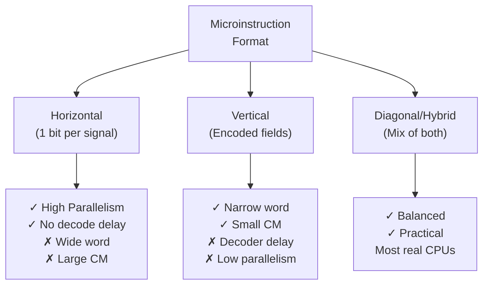

# Topic 24: 4.2 Horizontal vs Vertical Microinstruction Formats

[< Prev: 4.1 Basic Organization of Micro-Programmed Controller](topic-23.md) | [Index](index.md) | [Next: 4.3 Address Sequencer >](topic-25.md)

---

## In Simple Words

A **microinstruction** is a binary word stored in control memory whose bits generate control signals. The two main formats differ in **how** those control signals are encoded:

- **Horizontal:** Each control signal has its **own dedicated bit** — wide word, no decoding needed, high parallelism.
- **Vertical:** Control signals are **encoded** into short fields — narrow word, needs a decoder, lower parallelism.

---

## Detailed Explanation

### Horizontal Microinstruction Format

In a horizontal format, each bit in the microinstruction corresponds directly to **one control line**:

```
┌──┬──┬──┬──┬──┬──┬──┬──┬──┬──┬──┬──┬───────────────┬──────────┐
│ 1│ 0│ 1│ 0│ 0│ 1│ 1│ 0│ 1│ 0│ 0│ 1│  Condition    │ Next Addr│
│  │  │  │  │  │  │  │  │  │  │  │  │  Select       │          │
└──┴──┴──┴──┴──┴──┴──┴──┴──┴──┴──┴──┴───────────────┴──────────┘
 ↑  ↑  ↑  ↑  ↑  ↑  ↑  ↑  ↑  ↑  ↑  ↑
 │  │  │  │  │  │  │  │  │  │  │  └─ Load MAR
 │  │  │  │  │  │  │  │  │  │  └──── Load MBR
 │  │  │  │  │  │  │  │  │  └─────── Memory Read
 │  │  │  │  │  │  │  │  └────────── Memory Write
 │  │  │  │  │  │  │  └───────────── ALU Add
 │  │  │  │  │  │  └──────────────── ALU Sub
 │  │  │  │  │  └─────────────────── Load R1
 ...  (one bit per control signal)
```

**If there are 50 control signals** →  50-bit control field + condition select + next address = maybe **64–100+ bits wide**.

**Key property:** Multiple control signals can be activated **simultaneously** — just set multiple bits to 1. This enables maximum parallelism.

**Example microinstruction:**
```
Micro-op: R1 ← R2 + R3
Bits:     ALU_Add=1, Sel_R2=1, Sel_R3=1, Load_R1=1, all others=0
```

### Vertical Microinstruction Format

In a vertical format, control signals are **encoded** into compact fields. Each field uses fewer bits but needs a **decoder** to generate the actual control signals:

```
┌─────────────┬──────────┬──────────┬──────────┬──────────┬──────────┐
│  ALU Op     │  Src Reg │  Dst Reg │  Mem Op  │ Condition│ Next Addr│
│  (3 bits)   │ (3 bits) │ (3 bits) │ (2 bits) │ (2 bits) │ (6 bits) │
└─────────────┴──────────┴──────────┴──────────┴──────────┴──────────┘
   ↓               ↓          ↓          ↓
 3-to-8         3-to-8     3-to-8     2-to-4
 Decoder        Decoder    Decoder    Decoder
   ↓               ↓          ↓          ↓
 8 ALU          8 source   8 dest     4 memory
 control        enables    enables    signals
 lines
```

**If there are 50 control signals**, encoding might need only **~20 bits total** (much narrower).

**Key limitation:** Each field selects only **one** option. For example, the ALU op field can specify ADD *or* SUB, but **not both simultaneously** — only one ALU operation per micro-step.

**Example microinstruction:**
```
ALU_Op = 001 (ADD), Src = 010 (R2), Dst = 001 (R1), Mem = 00 (No op)
Total: ~20 bits
Decoder converts: 001 → ALU Add signal active
```

### Head-to-Head Comparison

| Feature | Horizontal | Vertical |
|---|---|---|
| **Word width** | Wide (50–200+ bits) | Narrow (16–40 bits) |
| **Control memory size** | Large (wide × deep) | Small (narrow × deep) |
| **Parallelism** | High — multiple signals active simultaneously | Low — only one per encoded field |
| **Decoding** | None — direct bit mapping | Required — field decoders needed |
| **Speed** | Faster — no decode delay | Slower — decoder adds delay |
| **Signal encoding** | Unencoded (1 bit = 1 signal) | Encoded (field code → decoder → signal) |
| **Flexibility** | Can activate any combination of signals | Limited by field groupings |
| **Design effort** | More complex to program (many bits to manage) | Easier to write microcode (fewer fields) |
| **When to use** | When speed and parallelism are critical | When control memory cost must be minimized |

### Numerical Example

Suppose a CPU has:
- 8 ALU operations
- 16 registers (source and destination)
- 4 memory operations
- 8 miscellaneous control signals

**Horizontal format:**
```
ALU signals:   8 bits  (one per operation)
Source select: 16 bits (one per register)
Dest select:   16 bits (one per register)
Memory:        4 bits  (one per operation)
Misc:          8 bits
Next address:  8 bits
Condition:     3 bits
──────────────────────
Total:         63 bits per microinstruction
```

**Vertical format:**
```
ALU field:     3 bits  (log₂8 = 3)
Source field:  4 bits  (log₂16 = 4)
Dest field:    4 bits  (log₂16 = 4)
Memory field:  2 bits  (log₂4 = 2)
Misc field:    3 bits  (log₂8 = 3)
Next address:  8 bits
Condition:     3 bits
──────────────────────
Total:         27 bits per microinstruction
```

**Memory savings:** 63 → 27 bits = **57% reduction** in control memory width.

But the horizontal format can activate source R2 AND R5 simultaneously (for instructions needing two sources), while the vertical format's single source field can only specify one.

### Diagonal (Hybrid) Microinstruction Format

In practice, most designs use a **combination** of horizontal and vertical:

- **Frequently used together signals** → Separate individual bits (horizontal-style) for parallelism.
- **Mutually exclusive signals** → Encode into fields (vertical-style) for compactness.

```
┌────────────────┬────────────────┬────────────┬──────────┬──────────┐
│ ALU Op (encoded│ Reg Sel (encoded│ Individual │ Condition│ Next Addr│
│  3 bits)       │  4+4 bits)     │ control    │  (2 bits)│ (8 bits) │
│                │                 │ bits (5)   │          │          │
└────────────────┴────────────────┴────────────┴──────────┴──────────┘
                                    ↑
                          Load_PC, Load_IR,
                          Mem_Read, Mem_Write, Inc_PC
                          (these are kept as direct bits
                           because they can be needed
                           in any combination)
```

**Example:** The ALU can only do one operation at a time → encode it. But Memory_Read and Inc_PC might both be needed in the same micro-step → keep as direct bits.

### Microinstruction Encoding Summary

| Encoding | Bits | Decoder | Parallelism | CM Size |
|---|---|---|---|---|
| Fully horizontal | 1 bit/signal | None | Maximum | Largest |
| Partially encoded (diagonal) | Mix | Some fields | Moderate | Medium |
| Fully vertical | log₂(n) per group | All fields | Minimum | Smallest |

---

## Real-Life Example

**Horizontal = Remote with one button per function:**

A universal remote with 50 buttons — one for each function (volume up, volume down, channel 1, channel 2, ...). You can press multiple buttons simultaneously. But the remote is huge.

**Vertical = Remote with a display menu:**

A slim remote with a small screen and a number pad. To change channel, you type the channel number (encoded) and press Enter. The TV decodes the number. Remote is compact, but you can only enter one command at a time.

**Diagonal = Smart remote:**

Has direct buttons for the most common actions (volume, power, mute) and a menu system for less common features. Balance of speed and size.

---

## Visual Flow



---

## Quick Revision

| Point | Remember |
|---|---|
| Horizontal | 1 bit per control signal; wide word; no decoder; max parallelism |
| Vertical | Encoded fields; narrow word; needs decoder; limited parallelism |
| Diagonal/Hybrid | Mix: encode mutually exclusive signals, keep frequently-combined signals as direct bits |
| Word width | Horizontal >> Vertical (e.g., 63 vs 27 bits) |
| Control memory size | Horizontal needs much more memory |
| Decoding delay | Vertical has extra decoder delay; horizontal is faster |
| Parallelism | Horizontal: any combination of signals; Vertical: one per field |
| Formula (vertical) | Bits per field = $\lceil \log_2 n \rceil$ where n = number of options in that group |
| Real CPUs | Most use diagonal (hybrid) approach |

> **Exam Tip:** Be ready to calculate the microinstruction width for both formats given the number of control signals. Know the tradeoff: horizontal = faster + parallel but wider; vertical = compact but slower + sequential. Draw examples of both formats.

---

[< Prev: 4.1 Basic Organization of Micro-Programmed Controller](topic-23.md) | [Index](index.md) | [Next: 4.3 Address Sequencer >](topic-25.md)

