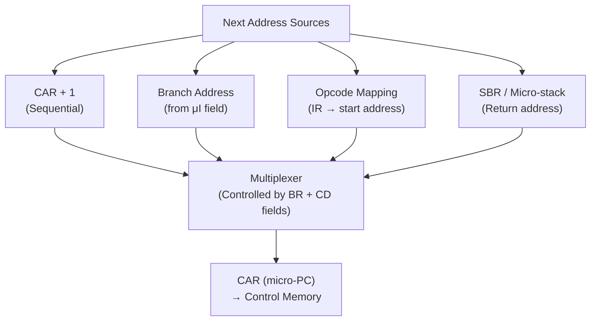

# Topic 25: 4.3 Address Sequencer

[< Prev: 4.2 Horizontal vs Vertical Microinstruction Formats](topic-24.md) | [Index](index.md) | [Next: 5.1 Strobe-Based Communication >](topic-26.md)

---

## In Simple Words

The **address sequencer** (also called the **microprogram sequencer**) determines the address of the **next microinstruction** to be read from control memory. It decides: should we go to the next address in sequence? Branch somewhere else? Start a new micro-routine for a different opcode? It is the "program counter" of the microprogram world.

---

## Detailed Explanation

### Why Is the Address Sequencer Needed?

Microinstructions don't always execute in simple sequential order. The sequencer must handle:

1. **Sequential execution:** Go to next address (CAR + 1)
2. **Unconditional branch:** Jump to a specific microinstruction address  
3. **Conditional branch:** Jump only if a condition flag is true  
4. **Opcode mapping:** Map the machine instruction's opcode to the start of its micro-routine  
5. **Return from micro-subroutine:** Return to the micro-instruction after a micro-CALL  
6. **Loop back to FETCH:** After executing a micro-routine, go back to the fetch cycle

### Block Diagram

```
                      ┌─────────────────────────────┐
                      │        Address Sequencer      │
 ┌──────────┐        │                               │
 │  Opcode  │───────►│  ┌──────────┐                 │
 │ (from IR)│        │  │ Mapping   │                 │
 └──────────┘        │  │ Logic/ROM │                 │
                      │  └─────┬────┘                 │
 ┌──────────┐        │        │                       │
 │ Next Addr│───────►│        ▼                       │
 │ Field    │        │  ┌──────────┐    ┌──────────┐  │
 │ (from μI)│───────►│  │   MUX    │───►│   CAR    │──┼──► To Control
 └──────────┘        │  │(4-to-1)  │    │(micro-PC)│  │    Memory Address
                      │  └──────────┘    └──────────┘  │
 ┌──────────┐        │        ▲                       │
 │ Condition │───────►│  ┌─────┴────┐                 │
 │ Flags     │        │  │ Control  │                 │
 │ (Z,C,N,V) │        │  │ Logic    │                 │
 └──────────┘        │  └──────────┘                 │
                      │        ▲                       │
 ┌──────────┐        │        │                       │
 │Incrementer│◄──────│  CAR + 1                       │
 │ (CAR + 1) │───────►│                               │
 └──────────┘        └─────────────────────────────┘
```

### Four Sources of Next Address

The address sequencer selects one of these for the next CAR value:

| Source | When Used | How It Generates Address |
|---|---|---|
| **CAR + 1 (Increment)** | Sequential execution — most common | Incrementer adds 1 to current CAR |
| **Address field of microinstruction** | Unconditional or conditional branch | Next-address field from current microinstruction is loaded into CAR |
| **Opcode mapping** | Start of a new machine instruction's micro-routine | Opcode bits from IR are transformed into a CM address via mapping logic |
| **Micro-subroutine return** | Returning from a shared micro-subroutine | Return address popped from micro-stack (SBR register) |

### Selection Logic

A **multiplexer** controlled by the **select bits** in the microinstruction chooses among these sources:

```
Select bits (2 bits):
  00 → CAR + 1         (increment — next sequential)
  01 → Address field    (branch target)
  10 → Opcode map       (start new macro-instruction)
  11 → SBR              (return from micro-subroutine)
```

The condition flags can further modify the behavior: if the condition select field says "branch if Zero" and Z=0, the branch is not taken and the sequencer defaults to CAR + 1.

### Opcode Mapping — How It Works

When a new machine instruction is fetched, its opcode must be converted to the starting address of the corresponding micro-routine. Common mapping methods:

#### Method 1: Direct Mapping (Bit Manipulation)

The opcode bits are placed directly into specific bit positions of the CAR:

```
If opcode = 5 bits (00000 to 11111):
CAR = 0 | opcode | 00    (shift left by 2, prepend 0)

Example: opcode = 01010
CAR = 0 | 01010 | 00 = 0_01010_00 = address 40

Each micro-routine has space for 4 microinstructions (2^2 = 4).
```

**Advantage:** Very fast — just wire the bits.
**Disadvantage:** Fixed spacing; wastes memory if some routines are short.

#### Method 2: Mapping ROM (Lookup Table)

A small ROM indexed by the opcode, containing the starting address:

| Opcode | ROM Output (Start Address) |
|---|---|
| 00000 (NOP) | 0000_0000 |
| 00001 (ADD) | 0000_0100 |
| 00010 (SUB) | 0000_1000 |
| 00011 (LOAD) | 0001_0000 |
| 00100 (STORE) | 0001_1000 |
| ... | ... |

**Advantage:** Flexible — each micro-routine can be any length and placed anywhere.
**Disadvantage:** Requires extra ROM; slightly slower.

### Conditional Branching in Microcode

The microinstruction contains a **condition select** field that chooses which flag to test:

| Condition Select | Meaning |
|---|---|
| 00 | Always (unconditional branch) |
| 01 | Branch if Zero (Z = 1) |
| 10 | Branch if Carry (C = 1) |
| 11 | Branch if Negative (N = 1) |

**Logic:**
```
If (condition is true) then
    CAR ← branch address (from address field)
Else
    CAR ← CAR + 1 (continue sequential)
```

### Micro-Subroutine Support

Some microinstruction sequences are shared across multiple machine instructions (e.g., the indirect address calculation). Instead of duplicating them, the sequencer supports **micro-subroutines**:

- **Micro-CALL:** Save CAR + 1 in the **Subroutine Register (SBR)**, then CAR ← subroutine address
- **Micro-RET:** CAR ← SBR (return to saved address)

For deeper nesting, a small **micro-stack** (typically 4–8 entries) replaces the single SBR register.

### Complete Microinstruction Format with Sequencer Fields

```
┌─────────────────────────┬────────┬────────────┬───────────┬───────────┐
│   Control Signal Bits    │  CD    │    BR      │   AD      │           │
│   (datapath control)     │ (Cond  │ (Branch    │ (Address  │  ...      │
│                          │ Select)│  type)     │  field)   │           │
└─────────────────────────┴────────┴────────────┴───────────┴───────────┘
```

| Field | Bits | Purpose |
|---|---|---|
| **Control signals** | Variable | Activate datapath control lines |
| **CD (Condition select)** | 2 | Which flag to test (Z, C, N, or unconditional) |
| **BR (Branch type)** | 2 | 00=JMP, 01=CALL, 10=RET, 11=MAP |
| **AD (Address)** | 7–8 | Branch target / next address in CM |

**BR field values:**

| BR | Meaning | Action |
|---|---|---|
| 00 | JMP (Jump) | If CD condition met: CAR ← AD; else CAR ← CAR + 1 |
| 01 | CALL | If CD condition met: SBR ← CAR + 1, CAR ← AD |
| 10 | RET | CAR ← SBR (return from micro-subroutine) |
| 11 | MAP | CAR ← mapping(opcode) — start new macro instruction |

### Timing of Address Sequencer

```
Clock cycle N:
  ┌─ Read microinstruction from CM[CAR]
  │
  ├─ Microinstruction bits → activate control signals (datapath does work)
  │
  ├─ Simultaneously: Address sequencer computes next CAR
  │    • Evaluates condition
  │    • Selects source (increment/branch/map/return)
  │
  └─ At clock edge: CAR ← next address

Clock cycle N+1:
  Read next microinstruction from CM[new CAR]
```

The address sequencing happens **in parallel** with control signal execution — no extra cycle needed.

---

## Real-Life Example

Think of a **GPS navigation system** guiding you through a city:

- **Sequential (CAR+1):** "Continue straight to the next block" — the default.
- **Conditional branch:** "IF there's traffic on Main Street, THEN take Oak Street instead."
- **Opcode mapping:** You say "Take me to the airport" — the GPS looks up "airport" in its database to find the starting point of the route (like mapping an opcode to a micro-routine start address).
- **Micro-subroutine:** There's a common detour procedure around construction. Multiple routes share this same detour. The GPS "calls" the detour procedure, completes it, and "returns" to the original route.

---

## Visual Flow



---

## Quick Revision

| Point | Remember |
|---|---|
| Address sequencer | Determines next microinstruction address in control memory |
| 4 sources of next address | CAR+1 (sequential), address field (branch), opcode mapping, SBR (return) |
| MUX selects | BR field (2 bits) + condition evaluation controls the MUX |
| Opcode mapping | Direct mapping (shift opcode bits) or mapping ROM (lookup table) |
| Conditional branch | CD field selects which flag to test; if true, branch; else increment |
| BR field | 00=JMP, 01=CALL, 10=RET, 11=MAP |
| SBR register | Stores return address for micro-subroutine calls |
| Timing | Next address computed in parallel with current microinstruction execution |
| Direct mapping | Fast, fixed spacing; wastes CM if routines vary in length |
| Mapping ROM | Flexible, any length; needs extra ROM |

> **Exam Tip:** Draw the address sequencer block diagram with MUX, CAR, incrementer, mapping logic, and SBR. Know all 4 next-address sources and how the BR field selects among them. Be able to trace through a micro-routine showing how CAR changes each cycle.

---

[< Prev: 4.2 Horizontal vs Vertical Microinstruction Formats](topic-24.md) | [Index](index.md) | [Next: 5.1 Strobe-Based Communication >](topic-26.md)

