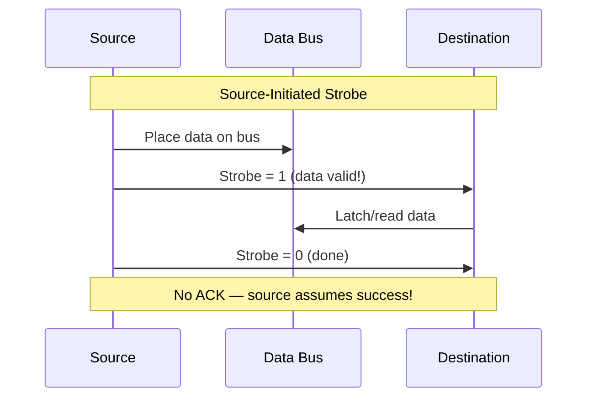

# Topic 26: 5.1 Strobe-Based Communication

[< Prev: 4.3 Address Sequencer](topic-25.md) | [Index](index.md) | [Next: 5.2 Handshake-Based Communication >](topic-27.md)

---

## In Simple Words

**Strobe communication** is the simplest method for transferring data between two devices. One device generates a single **timing pulse** (the strobe) that tells the other device: "the data is valid NOW — read it." It's fast and simple but **unreliable** if the two devices have different speeds, because there's no confirmation that the data was actually received.

---

## Detailed Explanation

### Why Do We Need Communication Protocols?

When the CPU communicates with I/O devices or memory, the two may operate at **different speeds**. A protocol defines:
1. **When** is the data valid on the bus?
2. **How** does the receiver know it can safely read?
3. **How** does the sender know the receiver got it?

The two basic approaches:
- **Synchronous (Strobe):** A single timing signal controls transfer.
- **Asynchronous (Handshake):** Two signals coordinate in a back-and-forth protocol.

### Strobe Communication

A **strobe** is a single control signal (pulse) generated by either the source or the destination to indicate the **valid data window**.

### Source-Initiated Strobe

The **source** (sender) places data on the bus AND generates the strobe pulse.

**Timing:**

```
Data Bus:  ────╱ Valid Data ╲────────────────
                ┌──────────┐
Strobe:   ─────┘          └─────────────────
                     ↑
          Destination latches data on
          falling edge (or during HIGH)
```

**Steps:**
1. Source places data on the data bus.
2. After a small setup time (to let signals stabilize), source activates the **strobe** (HIGH).
3. Destination detects the strobe and reads/latches the data.
4. Source deactivates the strobe (LOW) and may remove data.

**RTL sequence:**
```
1. Data Bus ← Source data
2. Strobe ← 1               (source signals "data is valid")
3. Destination latches data  (destination reads on strobe edge)
4. Strobe ← 0               (transfer done)
```

### Destination-Initiated Strobe

The **destination** (receiver) generates the strobe to tell the source: "I'm ready, give me data."

**Timing:**

```
                     ┌──────────┐
Strobe:   ──────────┘          └────────────
                          ↑
                Source places data upon
                seeing strobe HIGH
                    
Data Bus:  ──────────────╱ Valid Data ╲─────
```

**Steps:**
1. Destination activates the strobe (HIGH) — "I'm ready for data."
2. Source detects the strobe and places data on the bus.
3. Destination reads/latches the data.
4. Destination deactivates the strobe (LOW) — transfer complete.

### Comparison: Source vs Destination Initiated

| Feature | Source-Initiated | Destination-Initiated |
|---|---|---|
| **Who generates strobe** | Source (sender) | Destination (receiver) |
| **Data placed** | Before strobe | After strobe |
| **Who controls timing** | Source | Destination |
| **Use case** | Source is faster (e.g., CPU sending to device) | Destination is faster (e.g., CPU reading from device) |
| **Risk** | Destination may not be ready when strobe arrives | Source may not have data ready when strobe arrives |

### Timing Requirements and Problems

For reliable transfer, the strobe pulse must satisfy:

| Requirement | Meaning |
|---|---|
| **Setup time (t_su)** | Data must be stable for this duration BEFORE the strobe edge that triggers latching |
| **Hold time (t_h)** | Data must remain stable for this duration AFTER the strobe edge |
| **Strobe width** | Must be wide enough for the receiver to detect and latch |

**Problem: No acknowledgment!**

The biggest limitation of strobe communication:

```
Source:      "Data is on the bus!" (sends strobe)
Destination: (was busy / not ready / missed the pulse)
Source:      (assumes transfer succeeded — WRONG!)
```

There is **no feedback** from the receiver. If the destination wasn't ready, the data is lost, and the source doesn't know.

### When Strobe Works Well and When It Doesn't

| Scenario | Strobe Works? | Why? |
|---|---|---|
| Same-speed devices (synchronous system) | ✅ Yes | Both operate on same clock; timing is guaranteed |
| CPU ↔ fast memory (RAM) | ✅ Yes | Memory response is predictable |
| CPU ↔ slow I/O device (printer) | ❌ No | I/O may not be ready; needs handshake |
| Devices with variable speed | ❌ No | Cannot guarantee timing alignment |

---

## Real-Life Example

**Source-initiated strobe = A teacher distributing handouts:**

The teacher walks past each desk and drops a handout — that's the "strobe." If a student is paying attention, they pick it up. If a student was distracted and missed it, the handout falls to the floor — the teacher doesn't check. Fast but unreliable.

**Destination-initiated strobe = A student raising their hand:**

The student raises their hand (strobe), and the teacher hands them the paper. Works well because the student is definitely ready. But the teacher might not have the paper ready at that exact moment.

**Contrast with handshake (next topic):** The teacher drops the handout, waits until the student picks it up and nods (acknowledgment), and only then moves to the next desk. Reliable but slower.

---

## Visual Flow



---

## Quick Revision

| Point | Remember |
|---|---|
| Strobe | Single timing pulse indicating "data is valid now" |
| Source-initiated | Source places data, then sends strobe; destination must catch it |
| Destination-initiated | Destination sends strobe ("I'm ready"), then source places data |
| No acknowledgment | Biggest weakness — sender doesn't know if receiver got the data |
| Setup / hold time | Data must be stable before and after the strobe edge |
| When it works | Synchronous systems, same-speed devices, predictable timing |
| When it fails | Different-speed devices, slow I/O, unpredictable response |
| Advantage | Simple — only one control signal needed |
| Disadvantage | Unreliable for asynchronous communication |
| Better alternative | Handshake protocol (two-way signaling) |

> **Exam Tip:** Draw timing diagrams for both source-initiated and destination-initiated strobe. Label the data setup time, strobe pulse, and latching edge. Know WHY strobe is unreliable and when to use handshake instead.

---

[< Prev: 4.3 Address Sequencer](topic-25.md) | [Index](index.md) | [Next: 5.2 Handshake-Based Communication >](topic-27.md)

