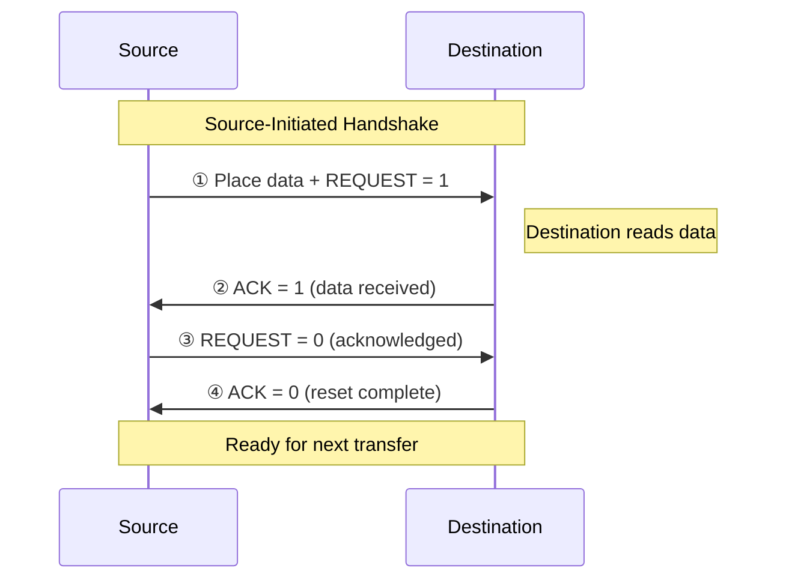

# Topic 27: 5.2 Handshake-Based Communication

[< Prev: 5.1 Strobe-Based Communication](topic-26.md) | [Index](index.md) | [Next: 5.3 Vector Interrupt >](topic-28.md)

---

## In Simple Words

**Handshake communication** uses **two control signals** — one from each side — to ensure both sender and receiver are properly synchronized before and after data transfer. Neither side proceeds until the other confirms. This makes it **reliable for devices of different speeds** but slightly slower than strobe due to the back-and-forth signaling.

---

## Detailed Explanation

### The Two Control Signals

| Signal | Generated By | Purpose |
|---|---|---|
| **Data Valid / Request** | Source | "I have placed valid data on the bus" |
| **Data Accepted / Acknowledge (ACK)** | Destination | "I have successfully read the data" |

Both signals start LOW (inactive) and return to LOW after the transfer — a complete **four-phase handshake**.

### Source-Initiated Handshake (Full Protocol)

```
Phase 1: Source places data and asserts REQUEST
Phase 2: Destination reads data and asserts ACK
Phase 3: Source sees ACK, deasserts REQUEST
Phase 4: Destination sees REQUEST gone, deasserts ACK
→ Both signals back to 0. Ready for next transfer.
```

**Timing diagram:**

```
Data Bus:  ────╱ Valid Data ╲──────────────────────
                ┌───────────────────┐
REQUEST:  ─────┘                   └───────────────
                          ┌────────────────┐
ACK:      ───────────────┘                └────────
              ①         ②          ③          ④
         Data placed  Dest reads  Src removes  Dest removes
         Req=1        Ack=1       Req=0        Ack=0
```

**Step-by-step:**

| Phase | Action | Who | Result |
|---|---|---|---|
| ① | Place data on bus, set REQUEST = 1 | Source | "Data is valid, read it" |
| ② | Read data from bus, set ACK = 1 | Destination | "Got it, thank you" |
| ③ | See ACK = 1, set REQUEST = 0, may remove data | Source | "Acknowledged, clearing" |
| ④ | See REQUEST = 0, set ACK = 0 | Destination | "Ready for next transfer" |

### Destination-Initiated Handshake

Here the **destination** starts the transfer by saying "I'm ready for data":

```
Phase 1: Destination asserts READY (I want data)
Phase 2: Source places data and asserts DATA_VALID
Phase 3: Destination reads data, deasserts READY
Phase 4: Source sees READY gone, deasserts DATA_VALID
```

**Timing diagram:**

```
                ┌───────────────────┐
READY:    ─────┘                   └───────────────
                          ┌────────────────┐
DATA_VALID:──────────────┘                └────────

Data Bus:  ──────────────╱ Valid Data ╲────────────
              ①         ②          ③          ④
         Dest ready  Src places  Dest reads  Src removes
         Ready=1     data+DV=1   Ready=0     DV=0
```

### Why Handshake Is Reliable

The key insight: **each signal transition is a response to the other signal's transition.** No device proceeds to the next step without confirmation from the other:

```
Source: "Here's the data" (REQUEST = 1)
  └──→ Destination: "Got it" (ACK = 1)
        └──→ Source: "Clearing" (REQUEST = 0)
              └──→ Destination: "Ready for next" (ACK = 0)
```

Even if the destination is **very slow**, the source **waits** at Phase 1 until ACK arrives. Even if the source is slow, the destination waits at Phase 2 until REQUEST clears. Speed difference doesn't matter!

### Handshake vs Strobe Comparison

| Feature | Strobe | Handshake |
|---|---|---|
| **Control signals** | 1 (strobe only) | 2 (request + acknowledge) |
| **Feedback** | None — fire and forget | Full — each step confirmed |
| **Reliability** | Low (data can be missed) | High (guaranteed delivery) |
| **Speed** | Faster (fewer transitions) | Slower (4 transitions per transfer) |
| **Different-speed devices** | Fails | Works perfectly |
| **Hardware complexity** | Simple | Moderate |
| **Timing dependency** | Tight (master clock-based) | Loose (self-timed) |
| **Bus type** | Synchronous bus | Asynchronous bus |

### Asynchronous vs Synchronous Bus

| Bus Type | Timing Method | Communication | Example |
|---|---|---|---|
| **Synchronous** | Shared master clock | Strobe-like; transfers happen on clock edges | Memory bus (same speed) |
| **Asynchronous** | Handshake signals | Request-ACK protocol; no shared clock | I/O bus (different speeds) |
| **Semi-synchronous** | Clock + wait states | Clock-based but slow device can insert wait cycles | PCI (early) |

### Practical Applications

| Protocol | Where Used | Type |
|---|---|---|
| **AXI (ARM)** | VALID + READY handshake on each channel | Source-initiated |
| **Wishbone bus** | STB + ACK signals | Handshake |
| **USB** | Token → Data → Handshake packets | Multi-phase handshake |
| **I²C** | SDA + SCL with ACK bit | Clock + handshake hybrid |
| **UART** | Start/stop bits (no handshake) | Asynchronous without handshake |

### Interlocking Property

The handshake is **fully interlocked** — the four transitions must happen **in strict sequence**:

```
REQUEST↑ → ACK↑ → REQUEST↓ → ACK↓ → (next transfer: REQUEST↑ → ...)
```

If any signal gets stuck (device failure), the protocol **halts** — which is safer than continuing with potentially corrupt data (fail-safe behavior). A timeout mechanism can detect this condition.

---

## Real-Life Example

**Package delivery with signature:**

1. **Courier arrives** at the door with the package and rings the bell (REQUEST = 1, data on bus).
2. **Recipient opens door**, takes the package, and **signs** the receipt (ACK = 1, data read).
3. Courier sees the signature, **puts away the receipt pad** (REQUEST = 0).
4. Recipient goes back inside, **closes the door** (ACK = 0). Ready for next delivery.

**Contrast with strobe:** A courier who throws the package over the fence and drives away — faster, but the package might land in the pool!

**Speed mismatch handled:** If the recipient takes 5 minutes to come to the door, the courier waits patiently. If the courier arrives late, the recipient simply waits. Both adjust automatically — this is the power of handshake.

---

## Visual Flow



---

## Quick Revision

| Point | Remember |
|---|---|
| Handshake | Two-way signaling: REQUEST/VALID from source + ACK from destination |
| 4 phases | ①Req↑ ②Ack↑ ③Req↓ ④Ack↓ — strict sequence |
| Source-initiated | Source places data first, then requests |
| Destination-initiated | Destination signals ready first, then source places data |
| Reliable | Every step waits for the other side's confirmation |
| Speed-independent | Works with any speed mismatch — self-timed |
| Interlocked | Each transition is caused by the previous one |
| vs Strobe | Strobe = 1 signal, no feedback, fast but risky; Handshake = 2 signals, feedback, slower but safe |
| Synchronous bus | Uses shared clock (strobe-like) |
| Asynchronous bus | Uses handshake (no shared clock) |

> **Exam Tip:** Draw the timing diagram with all 4 phases labeled. Show both REQUEST and ACK signals with data bus. Be able to explain WHY the handshake works for different-speed devices. Compare source-initiated with destination-initiated handshake.

---

[< Prev: 5.1 Strobe-Based Communication](topic-26.md) | [Index](index.md) | [Next: 5.3 Vector Interrupt >](topic-28.md)

