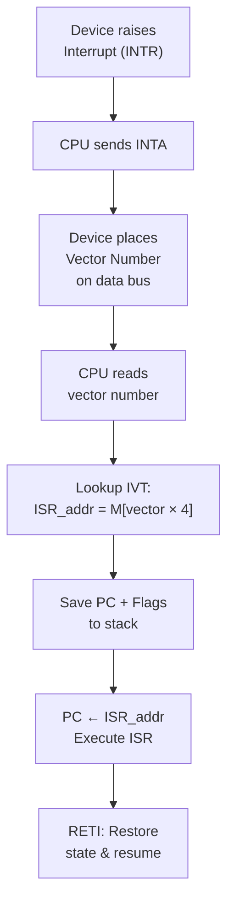

# Topic 28: 5.3 Vector Interrupt

[< Prev: 5.2 Handshake-Based Communication](topic-27.md) | [Index](index.md) | [Next: 5.4 Priority Interrupt >](topic-29.md)

---

## In Simple Words

In a **vectored interrupt** system, each I/O device provides a unique **interrupt vector** (a number or address) that tells the CPU **exactly which ISR to run**. The CPU doesn't need to check every device to find out who interrupted — the vector points directly to the correct handler. This is much faster than polling.

---

## Detailed Explanation

### The Problem: Non-Vectored (Polled) Interrupts

In a simple system, all devices share a single interrupt line. When an interrupt occurs, the CPU doesn't know which device caused it and must **poll** (check) every device:

```
Interrupt received!
→ Check device 1: "Did you interrupt?" → No
→ Check device 2: "Did you interrupt?" → No
→ Check device 3: "Did you interrupt?" → YES → Jump to ISR_3
```

**Problems with polling:**
- Slow — must check many devices sequentially
- Higher priority devices may not be checked first
- Wastes CPU time on every interrupt

### The Solution: Vectored Interrupts

Each device provides a **vector** — a unique identifier that maps directly to the address of its ISR:

```
Device 3 interrupts → sends vector 0x0C
CPU reads vector 0x0C
CPU looks up IVT[0x0C] = address of ISR_3
CPU jumps directly to ISR_3
```

**No polling needed!** The CPU knows instantly which device interrupted and where to go.

### Interrupt Vector Table (IVT)

The **IVT** is a table in memory, typically at a fixed location (e.g., starting at address 0), that maps each vector number to the starting address of the corresponding ISR:

| Vector Number | Memory Address | ISR Starting Address |
|---|---|---|
| 0 | 0x0000 | Timer ISR (0x1000) |
| 1 | 0x0004 | Keyboard ISR (0x2000) |
| 2 | 0x0008 | Disk ISR (0x3000) |
| 3 | 0x000C | Network ISR (0x4000) |
| 4 | 0x0010 | Mouse ISR (0x4800) |
| ... | ... | ... |

Each entry is typically 4 bytes (32-bit address), so vector *n* is at address $n \times 4$.

### How Vectored Interrupt Works — Step by Step

```
1. Device raises interrupt request (INTR line)
2. CPU finishes current instruction
3. CPU sends interrupt acknowledge (INTA)
4. Device places VECTOR NUMBER on data bus
5. CPU reads vector from data bus
6. CPU saves state (PC, flags) → push to stack
7. CPU looks up IVT: ISR_address = M[vector × 4]
8. PC ← ISR_address (jump to correct ISR)
9. ISR executes
10. ISR ends with RETI → CPU restores state, resumes
```

### Vectored vs Non-Vectored (Polled) Comparison

| Feature | Non-Vectored (Polled) | Vectored |
|---|---|---|
| **How CPU finds ISR** | Polls every device sequentially | Device provides vector → direct IVT lookup |
| **Speed** | Slow (proportional to # of devices) | Fast (constant time lookup) |
| **Hardware complexity** | Simple (one shared interrupt line) | More complex (devices must provide vector) |
| **Latency** | High (many checks before finding source) | Low (immediate identification) |
| **Multiple devices** | Difficult to manage | Each device has unique vector |
| **CPU involvement** | Polls every device | Only handles the interrupting device |

### Types of Interrupt Vectors

**1. Fixed vector:** Each device has a permanently assigned vector number. Simple but inflexible.

**2. Configurable vector:** The vector number can be programmed (e.g., via DIP switches or software configuration). Flexible — allows remapping.

### The INTA (Interrupt Acknowledge) Cycle

The CPU uses the INTA signal to coordinate with the interrupting device:

```
Cycle 1 (INTA pulse 1): CPU acknowledges the interrupt; device prepares vector.
Cycle 2 (INTA pulse 2): Device places vector on data bus; CPU reads it.
```

On Intel 8086/x86:
- Two consecutive INTA pulses are generated
- On the second pulse, the interrupting device (or interrupt controller like 8259A PIC) places the 8-bit vector on the data bus
- CPU uses this as index into the IVT

### Intel 8259A Programmable Interrupt Controller (PIC)

In real systems, a dedicated hardware chip manages vectored interrupts:

```
             ┌──────────────┐
  IR0 ──────►│              │
  IR1 ──────►│    8259A     │
  IR2 ──────►│     PIC      │──── INT ────► CPU
  IR3 ──────►│ (Programmable│
  IR4 ──────►│  Interrupt   │◄─── INTA ─── CPU
  IR5 ──────►│  Controller) │
  IR6 ──────►│              │════ DATA ═══► CPU
  IR7 ──────►│              │   (vector)
             └──────────────┘
```

- 8 interrupt request inputs (IR0 - IR7)
- Manages priorities (see next topic)
- Provides the correct vector number on the data bus during INTA
- Two PICs can be cascaded for up to 15 interrupts (master + slave)

### Vectored Interrupt in x86 Systems

| Vector Range | Purpose |
|---|---|
| 0–31 | CPU exceptions (divide by zero, page fault, etc.) |
| 32–47 | Hardware interrupts (via PIC: timer, keyboard, disk) |
| 48–255 | Software interrupts (INT n instruction) and user-defined |

The x86 IVT (Real Mode) starts at address 0x0000 and has 256 entries × 4 bytes = 1024 bytes.

---

## Real-Life Example

**Non-vectored (polling) = Hospital reception with one phone line:**

A call comes in. The receptionist doesn't know which department it's for. They must ask: "Is it for cardiology?" No. "Orthopedics?" No. "Neurology?" Yes! Finally route the call. Slow when there are many departments.

**Vectored interrupt = Hospital with extension numbers:**

Each department has its own extension number. When a call comes in, the caller dials the extension (the vector): "Ext. 305" → the phone system immediately routes to Neurology. No need to check every department. Fast and direct!

**IVT = The hospital phone directory:** Extension 301 = Cardiology, 302 = Orthopedics, 303 = Pediatrics, 305 = Neurology, etc.

---

## Visual Flow



---

## Quick Revision

| Point | Remember |
|---|---|
| Vectored interrupt | Device provides a vector number that maps directly to ISR address |
| IVT (Interrupt Vector Table) | Table in memory: vector_num × 4 = address of ISR pointer |
| INTA cycle | CPU acknowledges; device places vector on data bus |
| vs Non-vectored | Polled = slow, check all devices; Vectored = fast, direct lookup |
| Vector sources | Fixed (hardwired) or configurable (programmable) |
| 8259A PIC | Hardware interrupt controller; manages 8 inputs; provides vector |
| Cascaded PICs | Master + slave = up to 15 interrupt sources |
| x86 IVT | 256 entries at address 0; vectors 0–31 = exceptions, 32–47 = hardware IRQs |
| Advantage | Fast ISR identification; constant-time dispatch |
| Key hardware signal | INTA (Interrupt Acknowledge) — tells device to put vector on bus |

> **Exam Tip:** Draw the complete vectored interrupt sequence: device → INTR → CPU → INTA → vector on bus → IVT lookup → jump to ISR. Know the difference between vectored and non-vectored. Be able to calculate IVT entry address given a vector number.

---

[< Prev: 5.2 Handshake-Based Communication](topic-27.md) | [Index](index.md) | [Next: 5.4 Priority Interrupt >](topic-29.md)

