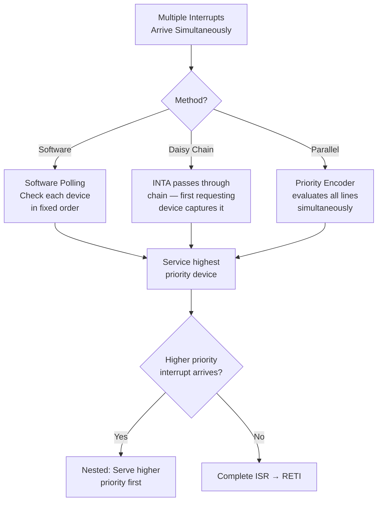

# Topic 29: 5.4 Priority Interrupt

[< Prev: 5.3 Vector Interrupt](topic-28.md) | [Index](index.md) | [Next: 5.5 DMA-Based Transfer >](topic-30.md)

---

## In Simple Words

When **multiple devices request interrupts simultaneously**, the CPU must decide **which one to service first**. A **priority interrupt** system assigns importance levels to each device so that the most critical request is always handled first. There are three main approaches: **software polling** (cheapest), **daisy chaining** (hardware serial priority), and **parallel priority** (hardware priority encoder).

---

## Detailed Explanation

### The Problem: Multiple Simultaneous Interrupts

```
Device A (Keyboard) ─── INTR ──┐
Device B (Disk)     ─── INTR ──┼──► CPU: "Which one should I serve first?"
Device C (Timer)    ─── INTR ──┘
```

Without a priority scheme, the CPU has no way to determine which device is more urgent. A timer interrupt (critical for OS scheduling) should take precedence over a keyboard interrupt (user can wait a few milliseconds).

### Method 1: Software Polling (Cheapest, Slowest)

The CPU checks (polls) each device in a **fixed order**. The first device found requesting service gets served — and that order defines the priority.

```
Interrupt received → Jump to common ISR:

ISR:
    Check Device 0 status register → IF requesting → Service Device 0
    Check Device 1 status register → IF requesting → Service Device 1
    Check Device 2 status register → IF requesting → Service Device 2
    ...
    Check Device N status register → IF requesting → Service Device N
    RETI
```

**Priority:** Device 0 > Device 1 > Device 2 > ... > Device N (checking order = priority order).

| Advantage | Disadvantage |
|---|---|
| No extra hardware needed | Slow — must poll all higher-priority devices first |
| Easy to change priority (reorder checks) | High interrupt latency for low-priority devices |
| Flexible | CPU wastes time checking non-interrupting devices |

### Method 2: Daisy Chain (Hardware Serial Priority)

Devices are connected in a **chain**. The interrupt acknowledge (INTA) signal passes through each device in sequence. The first device in the chain that has a pending interrupt **captures** the INTA and provides its vector. Devices further down the chain never see the INTA.

```
        INTA from CPU
              │
              ▼
    ┌──────────────┐    INTA    ┌──────────────┐    INTA    ┌──────────────┐
    │  Device 0    │──────────►│  Device 1    │──────────►│  Device 2    │
    │  (Highest    │           │  (Medium     │           │  (Lowest     │
    │   Priority)  │           │   Priority)  │           │   Priority)  │
    └──────┬───────┘           └──────┬───────┘           └──────┬───────┘
           │ INTR                     │ INTR                     │ INTR
           └──────────┬───────────────┘──────────────────────────┘
                      │ (all wired-OR to single INTR line)
                      ▼
                     CPU
```

**How it works:**

1. Any device with a pending interrupt drives the shared INTR line HIGH.
2. CPU sends INTA.
3. INTA enters Device 0 first.
   - If Device 0 is requesting → it **blocks** INTA from passing through, places its vector on the bus.
   - If Device 0 is NOT requesting → it passes INTA to Device 1.
4. Device 1 checks the same way; if not requesting, passes INTA to Device 2, and so on.

**Priority:** Physical position in the chain = priority. Device closest to CPU = highest.

| Advantage | Disadvantage |
|---|---|
| Simple hardware — just pass INTA through | Priority is fixed (hardware wiring) |
| Scalable — easy to add devices | Slow: INTA must propagate through the chain |
| Minimal extra logic per device | Low-priority devices can **starve** if high-priority devices keep interrupting |
| Cheap | Single point of failure — if one device breaks, chain breaks |

### Method 3: Parallel Priority (Priority Encoder)

Each device has **its own interrupt request line**. A **priority encoder** examines all requests simultaneously and outputs the highest-priority one:

```
    IR0 (Highest) ──────────┐
    IR1            ──────────┤
    IR2            ──────────┤  ┌────────────────┐
    IR3            ──────────┼─►│ Priority Encoder│──► Vector to CPU
    IR4            ──────────┤  │ (Combinational  │──► INT signal
    IR5            ──────────┤  │  Logic)         │
    IR6            ──────────┤  └────────────────┘
    IR7 (Lowest)  ──────────┘
```

The priority encoder outputs the **binary code** of the highest-priority active input:

| Active Inputs | Encoder Output (Highest) | Vector |
|---|---|---|
| IR0 = 1, others don't matter | 000 | 0 |
| IR0 = 0, IR1 = 1 | 001 | 1 |
| IR0 = 0, IR1 = 0, IR2 = 1 | 010 | 2 |
| ... | ... | ... |

**Priority:** IR0 > IR1 > IR2 > ... > IR7

| Advantage | Disadvantage |
|---|---|
| Fast — all requests evaluated simultaneously | Needs separate wire per device (expensive for many devices) |
| No propagation delay (parallel) | Fixed priority (but can be made programmable) |
| No chain failure risk | More complex hardware than daisy chain |

### Comparison of All Three Methods

| Feature | Software Polling | Daisy Chain | Parallel Priority |
|---|---|---|---|
| **Speed** | Slowest | Medium | Fastest |
| **Hardware cost** | None | Low | High |
| **Priority type** | Fixed (checking order) | Fixed (chain position) | Fixed (can be programmable) |
| **Flexibility** | Easy to change (reorder code) | Hard (rewire chain) | Moderate (use mask/priority registers) |
| **Scalability** | Poor (polling time grows) | Good (add to chain) | Limited by encoder inputs |
| **Starvation risk** | Yes | Yes | Yes (needs rotation scheme) |

### Interrupt Priority and Masking

A **mask register** allows the CPU to selectively **disable** certain interrupts:

```
Interrupt Mask Register: [1][1][0][1][1][0][1][1]
                          IR0 IR1 IR2 IR3 IR4 IR5 IR6 IR7
                                   ↑                 ↑
                            IR2 masked (disabled)  IR5 masked
```

Only **unmasked** (bit = 1) interrupts can reach the priority logic. This lets the CPU:
- Disable non-critical interrupts during important operations
- Implement **priority levels**: when serving a priority-3 interrupt, mask all interrupts ≤ 3

### Nested Interrupts with Priority

A higher-priority interrupt can **interrupt** a lower-priority ISR:

```
Main Program running (priority 0)
← Timer interrupt (priority 5)
     Executing Timer ISR...
     ← Disk interrupt (priority 3) — IGNORED (lower priority)
     ← Hardware error (priority 7) — ACCEPTED (higher priority)
          Executing Error ISR...
          RETI → back to Timer ISR
     ...
     RETI → back to Main Program
```

**Implementation:** When entering an ISR of priority *p*, set the mask to disable all interrupts with priority ≤ *p*. On RETI, restore the previous mask.

### Starvation and Solutions

**Starvation:** A low-priority device **never** gets served because higher-priority devices keep generating interrupts.

**Solutions:**
- **Rotating priority:** After serving a device, its priority drops to the lowest. All others shift up. Ensures fairness.
- **Rate limiting:** Hardware or software limits how frequently a device can interrupt.
- **Aging:** A device's priority increases the longer it waits.

---

## Real-Life Example

**Hospital Emergency Room (ER) triage:**

- **Software polling:** One nurse checks every patient in order: "Are you having a heart attack?" No. "Broken arm?" No. "Headache?" No. One by one. Slow.
- **Daisy chain:** Patients line up. The first in line gets treated first regardless of condition. The sickest person at the back waits forever.
- **Parallel priority:** A triage nurse sees all patients simultaneously and assigns priority codes — Code Red (life-threatening) gets immediate attention, Code Yellow (serious) waits briefly, Code Green (minor) waits longest. Fastest and fairest.
- **Masking:** ER is full, so a sign says "No Code Green patients today" — minor cases are redirected (masked).
- **Nested:** While treating a broken arm (medium priority), a cardiac arrest patient arrives (critical priority) → doctor leaves the arm case temporarily to handle the cardiac arrest, then returns.

---

## Visual Flow



---

## Quick Revision

| Point | Remember |
|---|---|
| Software polling | CPU checks each device in order; first requesting one gets served; cheapest but slowest |
| Daisy chain | INTA passes through devices in chain; first requesting device captures it; fixed priority by position |
| Parallel priority | Priority encoder evaluates all lines simultaneously; fastest but needs most hardware |
| Mask register | Bit per device; 0 = masked (disabled); enables priority levels |
| Nested interrupts | Higher priority can interrupt lower priority ISR |
| Starvation | Low-priority device never served; fix with rotating priority or aging |
| Daisy chain risk | Chain breaks if one device fails; slow INTA propagation |
| Priority encoder | Combinational circuit; outputs binary code of highest active input |
| INTA handshake | CPU sends INTA → device provides vector (in daisy chain, first device captures INTA) |
| Real example | ER triage — Code Red > Code Yellow > Code Green |

> **Exam Tip:** Be able to draw daisy chain and parallel priority diagrams. Know how the mask register implements priority levels in nested interrupts. Compare all three methods by speed, cost, and flexibility. Know what starvation is and how to prevent it.

---

[< Prev: 5.3 Vector Interrupt](topic-28.md) | [Index](index.md) | [Next: 5.5 DMA-Based Transfer >](topic-30.md)

