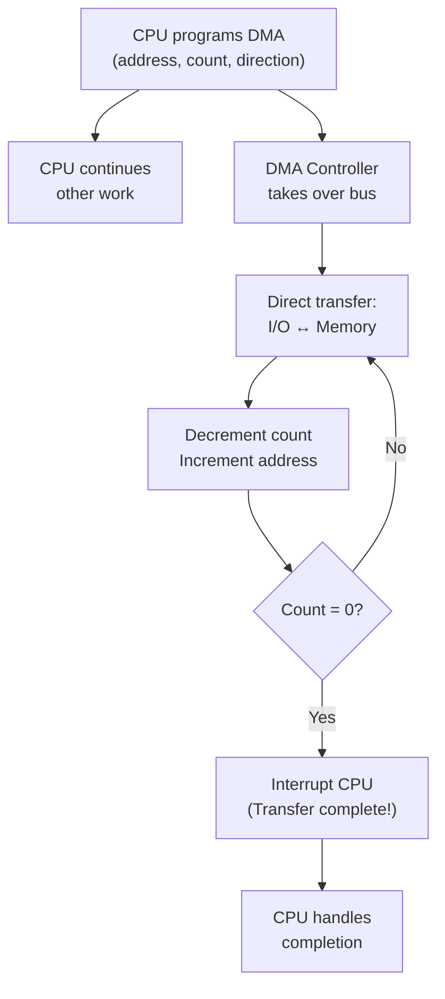

# Topic 30: 5.5 DMA-Based Transfer

[< Prev: 5.4 Priority Interrupt](topic-29.md) | [Index](index.md) | [Next: 6.1 Instruction Formats (Basic Computer) >](topic-31.md)

---

## In Simple Words

**Direct Memory Access (DMA)** allows an I/O device to transfer data **directly to/from main memory** without the CPU being involved in every byte transfer. The CPU only sets up the transfer (start address, byte count, direction), then the **DMA controller** takes over the bus and moves the data. The CPU is interrupted only when the entire transfer is complete. This dramatically reduces CPU overhead for large data transfers like disk reads or network packets.

---

## Detailed Explanation

### The Problem: CPU-Controlled I/O Transfer

In **programmed I/O** and **interrupt-driven I/O**, the CPU handles **every data transfer** between memory and the I/O device:

```
For each byte/word:
  CPU reads data from I/O device register  → stores in CPU register
  CPU writes data to memory address        → stores in memory
  CPU increments memory address
  CPU decrements byte count
  CPU checks if count = 0
```

For a 1 MB file transfer with 1-byte-at-a-time handling: **1,048,576 iterations** of this cycle! The CPU is completely occupied and cannot do any other work.

### Three I/O Transfer Methods — Comparison

| Feature | Programmed I/O | Interrupt-Driven I/O | DMA |
|---|---|---|---|
| **CPU involvement** | Busy for entire transfer | Per-byte interrupt handling | Only setup + completion interrupt |
| **CPU available?** | No — stuck in polling loop | Partially — handles interrupts | Yes — free during transfer |
| **Speed** | Slowest | Medium | Fastest |
| **Hardware cost** | None extra | Interrupt controller | DMA controller (most expensive) |
| **Use case** | Simple, slow devices | Moderate-speed devices (keyboard) | High-speed bulk transfer (disk, network) |

### DMA Controller — Internal Registers

The DMA controller has its own set of registers:

| Register | Purpose |
|---|---|
| **Starting Address Register (SAR)** | Memory address where transfer begins |
| **Byte/Word Count Register (WCR)** | Number of bytes/words to transfer |
| **Control Register** | Transfer direction (read/write), enable, mode selection |
| **Status Register** | Transfer complete, error flags |

### How DMA Works — Step by Step

```
┌─────┐    ①Setup     ┌──────────┐    ③Bus Request    ┌──────┐
│ CPU │──────────────►│   DMA    │◄───────────────────│  I/O │
│     │◄──────────────│Controller│────────────────────►│Device│
│     │  ⑤Interrupt   │          │    ④Data Transfer   │      │
└─────┘    (done!)    └─────┬────┘                     └──────┘
                            │ ③④
                            ▼
                      ┌──────────┐
                      │  Main    │
                      │  Memory  │
                      └──────────┘
```

**Step-by-step process:**

| Step | Action | Who Does It |
|---|---|---|
| ① | CPU programs DMA: writes start address, byte count, direction, and enables DMA | CPU |
| ② | CPU goes back to its other work (executing program) | CPU |
| ③ | When I/O device has data ready, DMA requests the bus from CPU via **Bus Request (BR)** signal | DMA Controller |
| ④ | CPU finishes current bus cycle and releases bus via **Bus Grant (BG)** signal | CPU |
| ⑤ | DMA controller takes over the bus and transfers data directly between I/O device and memory | DMA Controller |
| ⑥ | DMA increments address, decrements count for each word transferred | DMA Controller |
| ⑦ | When count reaches 0, DMA releases bus and interrupts CPU ("transfer complete") | DMA Controller |
| ⑧ | CPU handles the completion interrupt and checks status | CPU |

### DMA Transfer Modes

#### Mode 1: Burst Mode (Block Transfer)

The DMA controller takes the bus and transfers the **entire block** of data without releasing the bus until done.

```
CPU: ──work──│ BUS BLOCKED │──work continues──
DMA:         │═══TRANSFER══│
```

| Advantage | Disadvantage |
|---|---|
| Fastest transfer (continuous) | CPU is blocked from bus for the entire transfer duration |

#### Mode 2: Cycle Stealing

The DMA controller transfers **one word at a time**, then releases the bus. It steals one bus cycle from the CPU, then gives it back:

```
CPU: ─work─│steal│─work─│steal│─work─│steal│─work─
DMA:       │  1  │      │  1  │      │  1  │
           word       word       word
```

| Advantage | Disadvantage |
|---|---|
| CPU is only briefly delayed | Slower overall transfer (bus switching overhead) |

#### Mode 3: Transparent (Interleaved)

DMA transfers data only when the CPU is **not using the bus** (e.g., during internal ALU operations):

```
CPU: ─ALU op─│ ─ALU op─│ ─fetch─│ ─ALU op─│
DMA:         │transfer │       │transfer │
         (bus idle)           (bus idle)
```

| Advantage | Disadvantage |
|---|---|
| Zero CPU delay (completely transparent) | Slowest transfer (must wait for idle bus) |
| CPU performance unaffected | Complex detection of bus-idle periods |

### DMA Modes Comparison

| Mode | Transfer Unit | Bus Blocking | CPU Impact | Speed |
|---|---|---|---|---|
| **Burst** | Entire block | Entire transfer | Blocked during transfer | Fastest |
| **Cycle Stealing** | One word | One cycle at a time | Brief delays (stolen cycles) | Medium |
| **Transparent** | One word (when bus idle) | None | None | Slowest |

### Bus Arbitration for DMA

The DMA controller and CPU share the same bus, so a **bus arbiter** decides who gets control:

```
DMA Controller ──── BR (Bus Request) ────► Bus Arbiter
DMA Controller ◄─── BG (Bus Grant) ──────  Bus Arbiter
CPU            ──── BR ────────────────►  Bus Arbiter
CPU            ◄─── BG ──────────────────  Bus Arbiter
```

The DMA controller typically has **higher bus priority** than the CPU because I/O devices can lose data if not serviced quickly (buffer overflow).

### DMA with Multiple Channels

Modern DMA controllers handle multiple I/O devices with **separate channels**:

```
┌──────────────────────────┐
│      DMA Controller       │
│  ┌────────┐  ┌────────┐  │
│  │Channel 0│  │Channel 1│  │  ┌──────────┐
│  │SAR, WCR │  │SAR, WCR │  │──│ Main     │
│  │(Disk)   │  │(Network)│  │  │ Memory   │
│  └────────┘  └────────┘  │  └──────────┘
│  ┌────────┐  ┌────────┐  │
│  │Channel 2│  │Channel 3│  │
│  │(Audio)  │  │(USB)   │  │
│  └────────┘  └────────┘  │
└──────────────────────────┘
```

Each channel has its own SAR, WCR, and control register. The DMA controller arbitrates between channels.

### Performance Calculation

**Example:** Transfer 1000 words from disk to memory.

| Method | CPU Bus Cycles Used |
|---|---|
| Programmed I/O | ~5000 (5 cycles per word: read I/O, write memory, update address, compare count, branch) |
| Interrupt-Driven | ~2000 (2 cycles per word for data transfer + interrupt overhead) |
| DMA (burst) | ~10 (setup + 1 completion interrupt handling) |

The CPU saves approximately **4990 bus cycles** that can be used for computation!

---

## Real-Life Example

**Moving boxes into a warehouse:**

- **Programmed I/O:** The manager (CPU) personally carries each box from the truck to the shelf. One box at a time, fully occupied. Cannot do paperwork until all boxes are moved.

- **Interrupt-driven I/O:** The manager sits at their desk doing paperwork. Each time a worker brings a box, they tap the manager's shoulder (interrupt). The manager stops work, tells the worker where to put it, and goes back to paperwork. Better, but constant interruptions.

- **DMA:** The manager gives a **list** to the forklift driver (DMA controller): "Take boxes from Truck Bay 3 to Shelf Row C, Positions 1–100." The forklift driver does the entire job independently. The manager is notified only when all 100 boxes are moved. The manager works uninterrupted the whole time!

- **Burst mode:** Forklift blocks the warehouse aisle until all boxes are moved. Fast, but nobody else can use the aisle.
- **Cycle stealing:** Forklift moves one box, lets others use the aisle briefly, moves another box, etc.
- **Transparent:** Forklift only moves boxes when the aisle is empty anyway.

---

## Visual Flow



---

## Quick Revision

| Point | Remember |
|---|---|
| DMA | Direct data transfer between I/O and memory; CPU only does setup and completion |
| DMA registers | Starting Address Register (SAR), Word Count Register (WCR), Control, Status |
| Setup | CPU writes SAR + WCR + direction + enable to DMA controller |
| Bus request/grant | DMA requests bus (BR), CPU grants (BG), DMA takes over |
| Burst mode | Transfer entire block without releasing bus; fastest; CPU blocked |
| Cycle stealing | Transfer one word, release bus, repeat; CPU briefly delayed |
| Transparent mode | Transfer only during CPU bus-idle periods; zero CPU impact; slowest |
| Completion | DMA sets count to 0, releases bus, interrupts CPU |
| vs Programmed I/O | DMA frees the CPU; programmed I/O ties up CPU for every byte |
| Multi-channel DMA | Each channel has own registers; handles multiple devices |

> **Exam Tip:** Draw the DMA controller block diagram with all registers. Know the 3 transfer modes (burst, cycle-stealing, transparent) and compare them. Be ready to explain the bus request/grant handshake. Calculate CPU cycle savings of DMA vs programmed I/O.

---

[< Prev: 5.4 Priority Interrupt](topic-29.md) | [Index](index.md) | [Next: 6.1 Instruction Formats (Basic Computer) >](topic-31.md)

