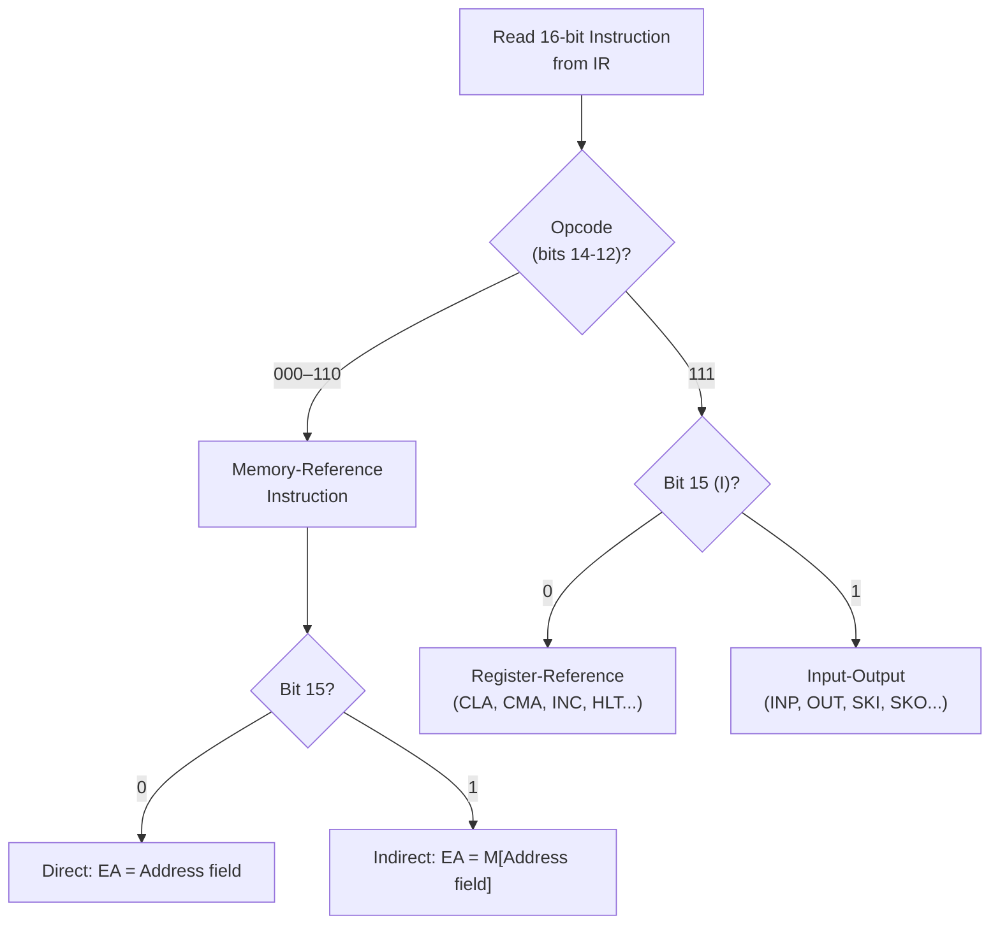

# Topic 31: 6.1 Instruction Formats (Basic Computer)

[< Prev: 5.5 DMA-Based Transfer](topic-30.md) | [Index](index.md) | [Next: 6.2 Addressing Modes >](topic-32.md)

---

## In Simple Words

An **instruction format** defines how the bits of a machine instruction are organized — which bits represent the **opcode** (operation), which represent the **operand address**, and which hold addressing mode or other control information. The **Mano Basic Computer** uses a 16-bit instruction word with a specific layout that depends on the instruction type.

---

## Detailed Explanation

### Mano Basic Computer — Key Specs

| Feature | Value |
|---|---|
| Word size | 16 bits |
| Memory size | 4096 words (12-bit addresses: 2¹² = 4096) |
| Instruction word | 16 bits |
| Registers | AC (Accumulator), DR (Data Register), AR (Address Register), PC (Program Counter), IR (Instruction Register), TR, INPR, OUTR |

### Three Instruction Types

The Mano Basic Computer has three types of instructions:

#### Type 1: Memory-Reference Instructions (MRI)

These instructions reference a memory address.

```
┌────┬──────────────────────┐
│ 15 │ 14  13  12 │ 11 ... 0 │
│ I  │  Opcode    │ Address  │
│(1) │  (3 bits)  │ (12 bits)│
└────┴────────────┴──────────┘
```

| Bit(s) | Field | Purpose |
|---|---|---|
| 15 | **I** (Indirect bit) | 0 = Direct addressing; 1 = Indirect addressing |
| 14–12 | **Opcode** | Operation code (000 to 110 for MRI) |
| 11–0 | **Address** | 12-bit memory address (0 to 4095) |

**The 7 memory-reference instructions (opcode 000–110):**

| Opcode (3 bits) | Hex | Mnemonic | RTL | Meaning |
|---|---|---|---|---|
| 000 | 0xxx / 8xxx | AND | AC ← AC ∧ M[address] | AND memory word with AC |
| 001 | 1xxx / 9xxx | ADD | AC ← AC + M[address] | Add memory word to AC |
| 010 | 2xxx / Axxx | LDA | AC ← M[address] | Load AC from memory |
| 011 | 3xxx / Bxxx | STA | M[address] ← AC | Store AC into memory |
| 100 | 4xxx / Cxxx | BUN | PC ← address | Branch unconditionally |
| 101 | 5xxx / Dxxx | BSA | M[address] ← PC; PC ← address + 1 | Branch and save return address |
| 110 | 6xxx / Exxx | ISZ | M[address] ← M[address] + 1; if M[address] = 0 then PC ← PC + 1 | Increment and skip if zero |

**Direct vs Indirect addressing:**

```
Direct (I = 0):     Effective Address = Address field value
    Hex: 1xxx (e.g., 1050 → ADD with direct address 050)

Indirect (I = 1):   Effective Address = M[Address field value]
    Hex: 9xxx (e.g., 9050 → ADD with indirect: go to M[050], read the actual address there)
```

**Example:**
```
Instruction: 9050 (hex)
Binary: 1 001 000001010000
I = 1 (Indirect), Opcode = 001 (ADD), Address = 050

Step 1: Go to memory location 050, read its contents → suppose M[050] = 300
Step 2: Effective address = 300
Step 3: AC ← AC + M[300]
```

#### Type 2: Register-Reference Instructions

When opcode = 111 and I = 0, the instruction is a **register-reference** instruction. The remaining 12 bits specify which register operation to perform:

```
┌────┬───────────┬──────────────────────┐
│ 0  │  1 1 1    │  12-bit operation    │
│(I) │ (Opcode)  │  (one-hot encoded)   │
└────┴───────────┴──────────────────────┘
Bit 15 = 0, Bits 14-12 = 111
```

**Register-reference instructions (hex 7xxx):**

| Hex | Binary (bits 11-0) | Mnemonic | Operation |
|---|---|---|---|
| 7800 | 100000000000 | CLA | AC ← 0 (Clear AC) |
| 7400 | 010000000000 | CLE | E ← 0 (Clear E flag) |
| 7200 | 001000000000 | CMA | AC ← AC' (Complement AC) |
| 7100 | 000100000000 | CME | E ← E' (Complement E) |
| 7080 | 000010000000 | CIR | Circular right shift (AC, E) |
| 7040 | 000001000000 | CIL | Circular left shift (AC, E) |
| 7020 | 000000100000 | INC | AC ← AC + 1 |
| 7010 | 000000010000 | SPA | If AC > 0: PC ← PC + 1 (Skip if positive) |
| 7008 | 000000001000 | SNA | If AC < 0: PC ← PC + 1 (Skip if negative) |
| 7004 | 000000000100 | SZA | If AC = 0: PC ← PC + 1 (Skip if zero) |
| 7002 | 000000000010 | SZE | If E = 0: PC ← PC + 1 (Skip if E zero) |
| 7001 | 000000000001 | HLT | Halt computer |

#### Type 3: Input-Output Instructions

When opcode = 111 and I = 1, the instruction is an **I/O instruction**:

```
┌────┬───────────┬──────────────────────┐
│ 1  │  1 1 1    │  12-bit operation    │
│(I) │ (Opcode)  │  (one-hot encoded)   │
└────┴───────────┴──────────────────────┘
Bit 15 = 1, Bits 14-12 = 111
```

**I/O instructions (hex Fxxx):**

| Hex | Mnemonic | Operation |
|---|---|---|
| F800 | INP | AC(0-7) ← INPR; FGI ← 0 (Input character) |
| F400 | OUT | OUTR ← AC(0-7); FGO ← 0 (Output character) |
| F200 | SKI | If FGI = 1: PC ← PC + 1 (Skip if input flag set) |
| F100 | SKO | If FGO = 1: PC ← PC + 1 (Skip if output flag set) |
| F080 | ION | IEN ← 1 (Enable interrupt) |
| F040 | IOF | IEN ← 0 (Disable interrupt) |

### Instruction Type Identification

```
Read IR (16 bits)
  │
  ├─ Check bits 14-12 (Opcode)
  │   ├─ If Opcode ≠ 111 → Memory-Reference Instruction
  │   │    └─ Check bit 15 (I): 0 = Direct, 1 = Indirect
  │   │
  │   └─ If Opcode = 111:
  │        ├─ Check bit 15 (I):
  │        │    ├─ I = 0 → Register-Reference Instruction
  │        │    └─ I = 1 → Input-Output Instruction
```

### Summary Table

| Instruction Type | Bit 15 (I) | Opcode (14-12) | Bits 11-0 | Hex Range |
|---|---|---|---|---|
| Memory-Reference (Direct) | 0 | 000–110 | Address | 0xxx–6xxx |
| Memory-Reference (Indirect) | 1 | 000–110 | Address | 8xxx–Exxx |
| Register-Reference | 0 | 111 | Operation code | 7xxx |
| Input-Output | 1 | 111 | Operation code | Fxxx |

### Computing X = (A + B) in Mano Basic Computer

```assembly
        LDA A       / Load A into AC         → 2004 (if A at address 004)
        ADD B       / Add B to AC            → 1005 (if B at address 005)
        STA X       / Store AC into X        → 3006 (if X at address 006)
        HLT         / Stop                   → 7001
A,      DEC 83      / Data: A = 83
B,      DEC -23     / Data: B = -23
X,      DEC 0       / Result stored here
```

---

## Real-Life Example

Think of instruction format like a **standardized form**:

- The **opcode** is the form title: "Deposit," "Withdraw," "Transfer" — tells the bank what type of operation.
- The **address** field is the account number — which account to work with.
- The **I bit** (indirect) is like having a "reference letter" — instead of going directly to account #050, you go to a reference that says "the actual account is #300."
- **Register-reference** instructions are like internal bank operations that don't involve any external account — "Clear the register," "Check the balance sign."
- **I/O instructions** are like ATM operations — interacting with external devices (keyboard, screen).

---

## Visual Flow



---

## Quick Revision

| Point | Remember |
|---|---|
| Instruction word | 16 bits total |
| Bit 15 (I) | Indirect addressing flag (0=direct, 1=indirect) |
| Bits 14-12 | 3-bit opcode |
| Bits 11-0 | 12-bit address (MRI) or operation code (Reg-ref / I/O) |
| Memory-Reference | 7 instructions: AND, ADD, LDA, STA, BUN, BSA, ISZ |
| Register-Reference | I=0, Opcode=111: CLA, CLE, CMA, CME, CIR, CIL, INC, SPA, SNA, SZA, SZE, HLT |
| Input-Output | I=1, Opcode=111: INP, OUT, SKI, SKO, ION, IOF |
| Direct addressing | Effective address = address field value |
| Indirect addressing | Effective address = contents of M[address field] |
| BSA | Branch and save return address (subroutine call) |

> **Exam Tip:** Be able to decode a hex instruction into its type, opcode, and address. Know all 7 MRI instructions with their RTL. Understand the difference between direct and indirect by tracing through an example.

---

[< Prev: 5.5 DMA-Based Transfer](topic-30.md) | [Index](index.md) | [Next: 6.2 Addressing Modes >](topic-32.md)

