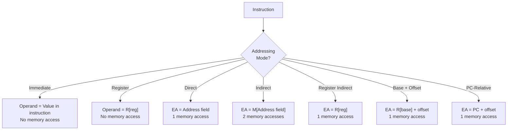

# Topic 32: 6.2 Addressing Modes

[< Prev: 6.1 Instruction Formats (Basic Computer)](topic-31.md) | [Index](index.md) | [Next: 6.3 Instruction Codes >](topic-33.md)

---

## In Simple Words

An **addressing mode** specifies **how the CPU interprets the address/operand field** of an instruction to find the actual data (the **effective address** or the operand itself). Different addressing modes exist because programs need different kinds of access: sometimes the data is stored right inside the instruction, sometimes it's in a register, sometimes at a memory location pointed to by another location.

---

## Detailed Explanation

### Why Multiple Addressing Modes?

- **Flexibility:** Access data in registers, memory, or directly from instruction
- **Efficiency:** Use the shortest representation for each access pattern
- **Data structures:** Support arrays, pointers, stacks, linked lists
- **Code density:** Reduce program size by choosing optimal modes

### The 10 Key Addressing Modes

#### 1. Immediate Addressing

The operand itself is **embedded in the instruction**. No memory access needed.

```
Instruction: MOV R1, #25     (# means immediate)
Effect:      R1 ← 25
```

| Advantage | Disadvantage |
|---|---|
| Fastest — no memory access for operand | Operand size limited by instruction field width |
| Useful for constants | Cannot modify the constant at runtime |

**Effective Address:** Not applicable (no address — the value is in the instruction).

#### 2. Register Addressing

The operand is stored in a **CPU register** specified by the instruction.

```
Instruction: ADD R1, R2
Effect:      R1 ← R1 + R2
```

| Advantage | Disadvantage |
|---|---|
| Very fast (register access) | Limited number of registers |
| Short encoding (3–5 bits for register number) | Requires prior loading of values into registers |

**Effective Address:** The register number itself.

#### 3. Direct (Absolute) Addressing

The instruction contains the **full memory address** of the operand.

```
Instruction: LOAD R1, [500]
Effect:      R1 ← M[500]
EA = 500
```

| Advantage | Disadvantage |
|---|---|
| Simple to understand and implement | Address field must be wide enough for entire memory space |
| Single memory access | Not suitable for relocatable programs |

**Effective Address:** EA = Address field value.

#### 4. Indirect Addressing

The instruction contains the address of a **memory location that holds the actual address** of the operand. Pointer-like behavior.

```
Instruction: LOAD R1, @500
Effect:      R1 ← M[M[500]]

Step 1: Go to M[500], read contents → suppose M[500] = 800
Step 2: Go to M[800], read contents → that's the operand
EA = M[500] = 800
```

| Advantage | Disadvantage |
|---|---|
| Supports pointers and dynamic addressing | **Two memory accesses** needed (slower) |
| Can address larger memory space | More complex |

**Effective Address:** EA = M[Address field].

#### 5. Register Indirect Addressing

A **register** contains the memory address of the operand (like a pointer in C).

```
Instruction: LOAD R1, (R2)
Effect:      R1 ← M[R2]

If R2 = 500: R1 ← M[500]
EA = R2 = 500
```

| Advantage | Disadvantage |
|---|---|
| Supports pointers without two memory accesses | One memory access needed |
| Short encoding (just register number) | Must load address into register first |

**Effective Address:** EA = Contents of the specified register.

#### 6. Displacement (Base + Offset) Addressing

The effective address is computed by **adding a constant offset to a base register**. Three sub-types:

##### 6a. Base Register Addressing
```
Instruction: LOAD R1, 100(R2)
Effect:      R1 ← M[R2 + 100]
EA = R2 + 100
```
Used for: Accessing fields within a data structure. R2 = base address, 100 = field offset.

##### 6b. Indexed Addressing
```
Instruction: LOAD R1, A(Ri)
Effect:      R1 ← M[A + Ri]
EA = A + Ri
```
Used for: Array access. A = base address of array, Ri = index register (incremented to traverse array).

##### 6c. Relative (PC-Relative) Addressing
```
Instruction: BEQ +5
Effect:      If condition: PC ← PC + 5
EA = PC + offset
```
Used for: Branch/jump to nearby locations. Makes code position-independent (relocatable).

| Advantage | Disadvantage |
|---|---|
| Flexible — supports structs, arrays, branches | Requires addition (ALU computation for EA) |
| Shorter offset field than full address | Offset range limited by field width |

#### 7. Stack (Implied) Addressing

The operand is implicitly on the **top of the stack**. No address field needed.

```
Instruction: PUSH R1     → M[SP] ← R1; SP ← SP - 1
Instruction: POP R1      → SP ← SP + 1; R1 ← M[SP]
Instruction: ADD          → Pop two, add, push result (zero-address)
```

| Advantage | Disadvantage |
|---|---|
| Very compact instructions (no address field) | Only accesses stack top |
| Good for expression evaluation | Not random-access; slower for general computation |

#### 8. Auto-Increment / Auto-Decrement

The register is **automatically incremented or decremented** after/before use. Useful for stepping through arrays:

```
Auto-increment:
    LOAD R1, (R2)+
    Effect: R1 ← M[R2]; R2 ← R2 + 1
    EA = R2 (then R2 is incremented)

Auto-decrement:
    LOAD R1, -(R2)
    Effect: R2 ← R2 - 1; R1 ← M[R2]
    EA = R2 - 1 (R2 is decremented first)
```

| Advantage | Disadvantage |
|---|---|
| Eliminates separate increment instruction | More complex hardware |
| Efficient for loops/arrays | Fixed increment size |

### Complete Comparison Table

| # | Mode | EA Formula | Memory Accesses (for operand) | Use Case |
|---|---|---|---|---|
| 1 | Immediate | Operand = value in instruction | 0 | Constants |
| 2 | Register | Operand = R[reg] | 0 | Fast computation |
| 3 | Direct | EA = Address | 1 | Global variables |
| 4 | Indirect | EA = M[Address] | 2 | Pointers |
| 5 | Register Indirect | EA = R[reg] | 1 | Pointer in register |
| 6a | Base+Offset | EA = R[base] + offset | 1 | Struct fields |
| 6b | Indexed | EA = Address + R[index] | 1 | Array elements |
| 6c | PC-Relative | EA = PC + offset | 1 | Branches, relocatable code |
| 7 | Stack/Implied | EA = Stack pointer | 1 | Expression evaluation |
| 8 | Auto-increment | EA = R[reg]; then R++ | 1 | Array traversal |

### Addressing in Mano Basic Computer

The Mano Basic Computer supports only two modes:

| I bit | Mode | EA |
|---|---|---|
| I = 0 | **Direct** | EA = Address field (bits 11-0) |
| I = 1 | **Indirect** | EA = M[Address field] |

All register-reference and I/O instructions use **implied** addressing (the operand is implicitly the AC or E flag).

---

## Real-Life Example

| Addressing Mode | Real-Life Analogy |
|---|---|
| **Immediate** | "Your balance is ₹5000" — the amount is stated directly |
| **Register** | "Check drawer #3" — the value is right there in a known drawer |
| **Direct** | "Your package is in Locker 42" — go to the specific locker |
| **Indirect** | "Your locker number is written on the note in Locker 10" — go to Locker 10, read "42", then go to Locker 42 |
| **Register Indirect** | "The address is in your phone's GPS — go there" — the register (phone) holds the address |
| **Base + Offset** | "Go to Building B (base), Room 205 (offset)" — base + room number |
| **Indexed** | "Book array starts at shelf A; your book is at position 7" — base + index |
| **PC-Relative** | "Walk 5 steps forward from where you are now" — relative to current position |
| **Stack** | "Take the top file from the pile" — always work with the top |
| **Auto-increment** | "Take the next item in line, then move the pointer forward" — automatic stepping |

---

## Visual Flow



---

## Quick Revision

| Point | Remember |
|---|---|
| Immediate | Operand is in the instruction itself; fastest; for constants |
| Register | Operand in a register; very fast; limited registers |
| Direct | Full memory address in instruction; 1 memory access |
| Indirect | Address of address in instruction; 2 memory accesses; for pointers |
| Register Indirect | Register holds memory address; 1 memory access; for pointers in registers |
| Base + Offset | EA = base register + displacement; for structs |
| Indexed | EA = base address + index register; for arrays |
| PC-Relative | EA = PC + offset; for branches; enables position-independent code |
| Stack | Implied TOS operand; for expression evaluation |
| Auto-increment/decrement | Register modified automatically; for array traversal/stack operations |
| Mano modes | Only Direct (I=0) and Indirect (I=1) |
| Memory accesses | Immediate=0, Register=0, Direct=1, Register Indirect=1, Indirect=2 |

> **Exam Tip:** For each addressing mode, know: (1) how EA is calculated, (2) how many memory accesses are needed, (3) what it's used for, and (4) a real example instruction. The most commonly tested: Immediate vs Direct vs Indirect vs Register Indirect.

---

[< Prev: 6.1 Instruction Formats (Basic Computer)](topic-31.md) | [Index](index.md) | [Next: 6.3 Instruction Codes >](topic-33.md)

