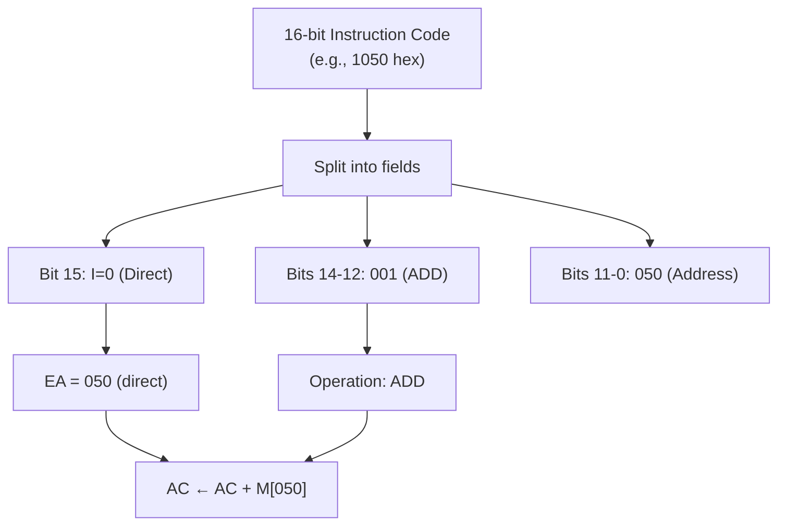

# Topic 33: 6.3 Instruction Codes

[< Prev: 6.2 Addressing Modes](topic-32.md) | [Index](index.md) | [Next: 6.4 Machine Language >](topic-34.md)

---

## In Simple Words

An **instruction code** is the **binary representation** of a machine instruction. It's the actual sequence of 0s and 1s that the CPU reads, decodes, and executes. The instruction code encodes **what operation to perform** (opcode) and **what data to use** (operand/address). In the Mano Basic Computer, every instruction code is a 16-bit word.

---

## Detailed Explanation

### Structure of an Instruction Code

Every instruction code has at least an **opcode** (operation code). Most also have an **operand** or **address**:

```
Instruction Code = Opcode + [Addressing Mode] + [Operand/Address]
```

In the Mano Basic Computer:

```
┌─────┬───────────┬─────────────────────┐
│ Bit │  Field     │  Purpose             │
├─────┼───────────┼─────────────────────┤
│  15 │  I         │  Addressing mode     │
│14-12│  Opcode    │  Operation type      │
│ 11-0│  Address   │  Memory location     │
│     │  /Operand  │  or register op code │
└─────┴───────────┴─────────────────────┘
```

### How to Read an Instruction Code (Hex to Meaning)

**Example 1:** Instruction = `1050` (hex)

```
Hex:    1    0    5    0
Binary: 0001 0000 0101 0000

Bit 15 (I):     0          → Direct addressing
Bits 14-12:     001        → Opcode = ADD
Bits 11-0:      000001010000 → Address = 050 (hex)

Meaning: ADD M[050] to AC (direct mode)
RTL:     AC ← AC + M[050]
```

**Example 2:** Instruction = `B400` (hex)

```
Hex:    B    4    0    0
Binary: 1011 0100 0000 0000

Bit 15 (I):     1          → Indirect addressing
Bits 14-12:     011        → Opcode = STA
Bits 11-0:      010000000000 → Address = 400 (hex)

Meaning: Store AC into memory using indirect addressing
Step 1:  Read M[400] → suppose it contains 700
Step 2:  M[700] ← AC
RTL:     M[M[400]] ← AC
```

**Example 3:** Instruction = `7200` (hex)

```
Hex:    7    2    0    0
Binary: 0111 0010 0000 0000

Bit 15 (I):     0          → Not indirect (I=0)
Bits 14-12:     111        → Special: since opcode=111 and I=0 → Register-Reference
Bits 11-0:      001000000000 → Bit 9 = 1 → CMA

Meaning: Complement AC
RTL:     AC ← AC'
```

**Example 4:** Instruction = `F800` (hex)

```
Hex:    F    8    0    0
Binary: 1111 1000 0000 0000

Bit 15 (I):     1          → I=1
Bits 14-12:     111        → Special: since opcode=111 and I=1 → Input-Output
Bits 11-0:      100000000000 → Bit 11 = 1 → INP

Meaning: Input a character from keyboard
RTL:     AC(0-7) ← INPR; FGI ← 0
```

### Complete Instruction Code Table (Mano Basic Computer)

**Memory-Reference Instructions:**

| Mnemonic | Opcode | I=0 (Direct) Hex | I=1 (Indirect) Hex | RTL |
|---|---|---|---|---|
| AND | 000 | 0xxx | 8xxx | AC ← AC ∧ M[EA] |
| ADD | 001 | 1xxx | 9xxx | AC ← AC + M[EA], E ← Cout |
| LDA | 010 | 2xxx | Axxx | AC ← M[EA] |
| STA | 011 | 3xxx | Bxxx | M[EA] ← AC |
| BUN | 100 | 4xxx | Cxxx | PC ← EA |
| BSA | 101 | 5xxx | Dxxx | M[EA] ← PC, PC ← EA + 1 |
| ISZ | 110 | 6xxx | Exxx | M[EA] ← M[EA]+1; skip if zero |

*where xxx = 12-bit address and EA = effective address*

**Register-Reference Instructions (I=0, Opcode=111, Hex = 7xxx):**

| Mnemonic | Hex | RTL |
|---|---|---|
| CLA | 7800 | AC ← 0 |
| CLE | 7400 | E ← 0 |
| CMA | 7200 | AC ← ~AC |
| CME | 7100 | E ← ~E |
| CIR | 7080 | shr(AC, E) circular |
| CIL | 7040 | shl(AC, E) circular |
| INC | 7020 | AC ← AC + 1 |
| SPA | 7010 | If AC(15) = 0: skip |
| SNA | 7008 | If AC(15) = 1: skip |
| SZA | 7004 | If AC = 0: skip |
| SZE | 7002 | If E = 0: skip |
| HLT | 7001 | S ← 0 (halt) |

**I/O Instructions (I=1, Opcode=111, Hex = Fxxx):**

| Mnemonic | Hex | RTL |
|---|---|---|
| INP | F800 | AC(0-7) ← INPR |
| OUT | F400 | OUTR ← AC(0-7) |
| SKI | F200 | If FGI=1: skip |
| SKO | F100 | If FGO=1: skip |
| ION | F080 | IEN ← 1 |
| IOF | F040 | IEN ← 0 |

### Encoding a Program into Instruction Codes

**Problem:** Compute X = A - B and store in X.

**Assembly:**
```
        ORG 0         / Program starts at address 0
        LDA A         / AC ← A
        CMA           / AC ← ~A (complement)
        INC           / AC ← AC + 1 (now AC = -A in 2's complement)
        ADD B         / AC ← AC + B = B - A... wait, that's B - A
```

Actually, for X = A - B:
```
        ORG 0
        LDA A         / AC ← A
        ADD NEGB      / AC ← A + (-B) = A - B
        STA X         / M[X] ← AC
        HLT           / Halt
A,      DEC 83        / A = 83
NEGB,   DEC -23       / -B stored as -23
X,      DEC 0         / Result location
```

**OR using complement method:**
```
Address  Assembly      Hex Code    Explanation
000      LDA A         2004        Load A (at addr 004)
001      CMA           7200        Complement AC
002      INC           7020        AC = -A (2's complement)
003      ADD B         1005        AC = -A + B = B - A... 
```

**Correct approach for A - B:**
```
Address  Assembly      Hex Code    Explanation
000      LDA B         2005        Load B into AC
001      CMA           7200        Complement: AC = ~B
002      INC           7020        AC = -B (2's complement of B)
003      ADD A         1004        AC = A + (-B) = A - B
004      STA X         3006        Store result in X
005      HLT           7001        Halt
004      DEC 83        0053        A = 83
005      DEC 23        0017        B = 23
006      DEC 0         0000        X (result)
```

### Opcode Encoding — Why 3-Bit Opcode Is Enough

- 3 bits → 8 possible opcodes (000 to 111)
- 7 used for memory-reference instructions (000 to 110)
- 1 code (111) reserved for register and I/O instructions (distinguished by I bit)
- Register and I/O use **one-hot encoding** in the 12-bit address field → 12 different operations each

**Total instructions:** 7 (MRI) + 12 (register) + 6 (I/O) = **25 instructions**

---

## Real-Life Example

Think of an instruction code like a **product barcode**:

```
Barcode: 8901234567890
         ↑   ↑        ↑
     Country  Maker   Product ID
```

- Just as a barcode scanner reads the barcode and knows exactly which product it is, the CPU reads the instruction code and knows exactly what operation to perform on which data.
- The **opcode** is like the country/maker prefix — it groups the instruction type.
- The **address** is like the product ID — it identifies the specific data.
- The **I bit** is like a "redirected-to" flag — sometimes the barcode points to another barcode instead of the product directly.

---

## Visual Flow



---

## Quick Revision

| Point | Remember |
|---|---|
| Instruction code | Binary representation of a machine instruction |
| Components | I bit (1) + Opcode (3) + Address/Operand (12) = 16 bits |
| I = 0, opcode ≠ 111 | Memory-reference, direct addressing |
| I = 1, opcode ≠ 111 | Memory-reference, indirect addressing |
| I = 0, opcode = 111 | Register-reference instruction (7xxx) |
| I = 1, opcode = 111 | Input-output instruction (Fxxx) |
| Hex decoding | Convert hex → binary → extract I, opcode, address fields |
| 7 MRI instructions | AND(000), ADD(001), LDA(010), STA(011), BUN(100), BSA(101), ISZ(110) |
| One-hot encoding | Register-ref and I/O instructions use one-hot in bits 11-0 |
| Total instructions | 25 (7 MRI + 12 register-ref + 6 I/O) |

> **Exam Tip:** Practice converting hex instruction codes to their assembly mnemonic by hand. Be able to decode 1050, 9050, 7200, 7001, F800 etc. Know the complete opcode table by heart.

---

[< Prev: 6.2 Addressing Modes](topic-32.md) | [Index](index.md) | [Next: 6.4 Machine Language >](topic-34.md)

