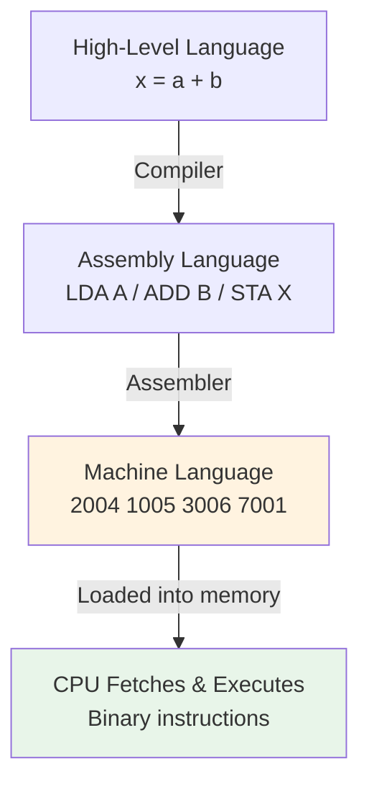

# Topic 34: 6.4 Machine Language

[< Prev: 6.3 Instruction Codes](topic-33.md) | [Index](index.md) | [Next: 6.5 Assembly Language >](topic-35.md)

---

## In Simple Words

**Machine language** is the lowest-level programming language — it consists entirely of **binary numbers** (0s and 1s) that the CPU directly understands and executes. It is the only language the hardware actually "speaks." Every other language (assembly, C, Python) must eventually be converted to machine language before execution.

---

## Detailed Explanation

### What Machine Language Looks Like

In the Mano Basic Computer, a machine language program is a sequence of 16-bit binary words stored in memory:

```
Address   Binary (Machine Code)        Hex    Meaning
000       0010 0000 0000 0100          2004   LDA 004
001       0001 0000 0000 0101          1005   ADD 005
002       0011 0000 0000 0110          3006   STA 006
003       0111 0000 0000 0001          7001   HLT
004       0000 0000 0101 0011          0053   Data: 83
005       1111 1111 1110 1001          FFE9   Data: -23
006       0000 0000 0000 0000          0000   Data: 0 (result)
```

This is a complete program that computes M[006] = 83 + (-23) = 60.

### Machine Language vs Other Levels

| Level | Language | Example | Who Understands |
|---|---|---|---|
| 5 | High-Level (Python, C) | `x = a + b` | Humans |
| 4 | Assembly | `LDA A / ADD B / STA X` | Programmers who know the ISA |
| 3 | **Machine Language** | `0010000000000100` | **CPU hardware** |
| 2 | Microcode | Control memory microinstructions | Control unit |
| 1 | Hardware signals | Voltage levels on wires | Transistors |

### How to Write in Machine Language (Manual Process)

**Step 1:** Write the algorithm in pseudo-code
```
X = A + B
```

**Step 2:** Convert to assembly mnemonics
```
LDA A      / Load A into AC
ADD B      / Add B to AC  
STA X      / Store result in X
HLT        / Stop
```

**Step 3:** Assign memory addresses
```
Address 000: LDA A    (A is at address 004)
Address 001: ADD B    (B is at address 005)
Address 002: STA X    (X is at address 006)
Address 003: HLT
Address 004: 83       (value of A)
Address 005: -23      (value of B)
Address 006: 0        (result location)
```

**Step 4:** Encode each instruction into binary
```
LDA 004 → opcode=010, I=0, addr=000000000100 → 0 010 000000000100 → 2004 hex
ADD 005 → opcode=001, I=0, addr=000000000101 → 0 001 000000000101 → 1005 hex
STA 006 → opcode=011, I=0, addr=000000000110 → 0 011 000000000110 → 3006 hex
HLT     → register-ref: 0 111 000000000001 → 7001 hex
```

**Step 5:** Encode data values
```
83      → 0000 0000 0101 0011 → 0053 hex
-23     → 1111 1111 1110 1001 → FFE9 hex (16-bit 2's complement)
0       → 0000 0000 0000 0000 → 0000 hex
```

### Representation Formats

Machine language can be written (for human readability) in three formats:

| Format | Example | Use |
|---|---|---|
| **Binary** | 0010 0000 0000 0100 | Actual bits in memory |
| **Hexadecimal** | 2004 | Compact human-readable representation |
| **Octal** | 020004 | Used in some older systems |

The CPU always operates on binary. Hex and octal are just convenient shorthand for humans.

### Machine Language Characteristics

| Property | Description |
|---|---|
| **CPU-dependent** | Each CPU architecture has its own machine language (x86 ≠ ARM ≠ MIPS) |
| **Not portable** | Machine code for one CPU won't run on a different CPU |
| **No symbols** | No variable names, no labels — just raw binary addresses |
| **No error messages** | A wrong instruction executes silently (might crash or produce wrong result) |
| **Fastest execution** | No translation needed — CPU reads and runs directly |
| **Most compact** | No overhead from labels, comments, or high-level abstractions |

### Example: A Loop in Machine Language

**Task:** Add numbers from memory 010 to 013 (four numbers).

**Assembly:**
```assembly
        ORG 000
        CLA           / Clear AC (AC = 0)
        ADD 010       / AC = AC + M[010]
        ADD 011       / AC = AC + M[011]
        ADD 012       / AC = AC + M[012]
        ADD 013       / AC = AC + M[013]
        STA 014       / Store sum in M[014]
        HLT           / Halt
```

**Machine Language:**
```
Address  Hex Code  Binary
000      7800      0111100000000000    CLA
001      1010      0001000000010000    ADD 010
002      1011      0001000000010001    ADD 011
003      1012      0001000000010010    ADD 012
004      1013      0001000000010011    ADD 013
005      3014      0011000000010100    STA 014
006      7001      0111000000000001    HLT
```

### Example: Using Indirect Addressing in Machine Language

**Task:** Load the value whose address is stored in location 020.

```
Address  Hex Code  Meaning
000      A020      LDA I 020    (Load indirect: AC ← M[M[020]])
001      7001      HLT
...
020      0050      Contains address 050
...
050      00FF      Contains the actual value (255)
```

**Execution trace:**
1. Fetch instruction A020 → opcode=010 (LDA), I=1 (indirect), address=020
2. Indirect: read M[020] = 050
3. Effective address = 050
4. AC ← M[050] = 00FF = 255

### Machine Code Loading

Machine language programs must be placed in memory before execution. Methods:

| Method | How | Era |
|---|---|---|
| **Toggle switches** | Flip switches on front panel for each bit | 1950s–1960s |
| **Punch cards/tape** | Read binary patterns from punched holes | 1960s–1970s |
| **Bootstrap loader** | Small ROM program loads the rest from disk | 1970s+ |
| **Operating system** | OS loader reads executable file into memory | Modern |

### Why We Rarely Write Machine Language Today

1. **Error-prone:** One wrong bit changes the entire instruction meaning
2. **No readability:** `2004 1005 3006 7001` tells you nothing without a reference table
3. **No symbols:** Must manually track which address holds which variable
4. **Maintenance nightmare:** Inserting one instruction shifts all addresses
5. **Assembly** solves all these problems while mapping 1-to-1 to machine instructions

---

## Real-Life Example

Machine language is like **Morse code**:

- Morse: `... --- ...` = "SOS" 
- Machine: `0010 0000 0000 0100` = "Load from address 4"

Both are efficient for transmission/execution, but humans prefer English words over dots and dashes, just as programmers prefer assembly mnemonics over binary strings.

**Another analogy — cooking:**
- **Recipe in English** (high-level language): "Sauté onions until golden"
- **Step-by-step instructions** (assembly): "1. Heat pan. 2. Add oil. 3. Add onions. 4. Stir for 5 minutes."
- **Binary control signals to a robot chef** (machine language): `01001010 00110101 10110001` — only the robot understands, but it executes the fastest.

---

## Visual Flow



---

## Quick Revision

| Point | Remember |
|---|---|
| Machine language | Binary instructions directly executed by CPU |
| Format | Sequence of 0s and 1s; often written in hex for readability |
| CPU-specific | Not portable — different ISA = different machine language |
| No symbols | Only raw numeric addresses and opcodes |
| Fastest | No translation overhead — CPU reads and runs directly |
| Error-prone | One wrong bit = completely different instruction |
| Representation | Binary (actual), Hex (shorthand), Octal (legacy) |
| Encoding process | Mnemonic → opcode bits + I bit + address bits → binary |
| Why not used today | Unreadable, error-prone, unmaintainable; use assembly instead |
| Loading | Bootstrap loader or OS loads machine code into memory |

> **Exam Tip:** Be able to hand-encode a short assembly program into hex machine code. Also decode hex machine code back to assembly. Practice with LDA, ADD, STA, HLT, and indirect addressing. Know why machine language is architecture-dependent.

---

[< Prev: 6.3 Instruction Codes](topic-33.md) | [Index](index.md) | [Next: 6.5 Assembly Language >](topic-35.md)

