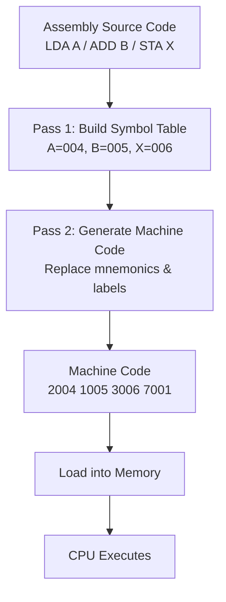

# Topic 35: 6.5 Assembly Language

[< Prev: 6.4 Machine Language](topic-34.md) | [Index](index.md) | [Next: 6.6 Input-Output Programming >](topic-36.md)

---

## In Simple Words

**Assembly language** is a human-readable version of machine language where binary opcodes are replaced by **mnemonics** (short meaningful names like ADD, LDA, STA) and memory addresses are replaced by **labels** (symbolic names like LOOP, SUM, A). An **assembler** program translates assembly code into machine code (binary).

---

## Detailed Explanation

### Assembly vs Machine Language

| Feature | Machine Language | Assembly Language |
|---|---|---|
| Format | Binary (0010000000000100) | Mnemonics (LDA A) |
| Readability | Very difficult | Human-readable |
| Addresses | Raw numbers (004, 005) | Symbolic labels (A, B, SUM) |
| Comments | Not possible | Supported (/ comment) |
| Translation | Directly executed by CPU | Assembler converts to machine code |
| Relationship | 1:1 | Each assembly instruction maps to one machine instruction |

### Assembly Language Components

#### 1. Mnemonics (Operation Codes)

Short alphabetic names for machine instructions:

| Mnemonic | Meaning | Machine Opcode |
|---|---|---|
| LDA | Load to AC | 010 |
| ADD | Add to AC | 001 |
| STA | Store AC | 011 |
| AND | AND with AC | 000 |
| BUN | Branch unconditionally | 100 |
| BSA | Branch and save return address | 101 |
| ISZ | Increment and skip if zero | 110 |
| CLA | Clear AC | (register-ref) |
| HLT | Halt | (register-ref) |

#### 2. Labels (Symbolic Addresses)

Labels give meaningful names to memory locations:

```assembly
LOOP,   LDA COUNT     / "LOOP" labels this address
        ADD ONE       / "COUNT" and "ONE" are data labels
        STA COUNT
        ...
COUNT,  DEC 0         / "COUNT" labels this data location
ONE,    DEC 1         / "ONE" labels value 1
```

The assembler replaces each label with its actual memory address.

#### 3. Pseudo-Instructions (Assembler Directives)

These are **not CPU instructions** — they are commands to the assembler itself:

| Directive | Meaning | Example |
|---|---|---|
| **ORG** | Set the starting address for the following code | `ORG 100` → next instruction placed at address 100 |
| **END** | Mark the end of assembly source code | `END` |
| **DEC** | Define a decimal constant | `DEC 83` → store 83 in this location |
| **HEX** | Define a hexadecimal constant | `HEX 0053` → store 0053 (hex) |

These produce data in memory but NOT machine instructions (except for allocating space).

#### 4. Comments

Text after `/` is ignored by the assembler:

```assembly
LDA A       / Load the value of A into the accumulator
```

### Assembly Line Format

Each assembly line has up to 4 fields:

```
Label,    Mnemonic    Operand    / Comment
```

| Field | Required? | Example |
|---|---|---|
| **Label** | Optional (followed by comma) | `LOOP,` |
| **Mnemonic** | Required | `ADD` |
| **Operand** | Depends on instruction | `B` or `I B` (indirect) |
| **Comment** | Optional (after /) | `/ Add B to AC` |

**Examples:**
```assembly
        LDA A           / No label; load A into AC
LOOP,   ADD B           / Labeled LOOP; add B to AC
        STA X I         / Store AC using indirect addressing
        BUN LOOP        / Branch to LOOP
```

### Indirect Addressing in Assembly

The suffix `I` after the operand specifies indirect addressing:

```assembly
LDA A           / Direct:   AC ← M[addr_of_A]
LDA A I         / Indirect: AC ← M[M[addr_of_A]]
```

### The Assembler — How It Works

The assembler translates assembly source code into machine code in **two passes**:

#### Pass 1: Build the Symbol Table

Scan through the source code and record every label with its memory address:

```assembly
        ORG 0                   Address
        LDA A         → 000    ← starts at 0
        ADD B         → 001
        STA X         → 002
        HLT           → 003
A,      DEC 83        → 004    ← Symbol table: A = 004
B,      DEC -23       → 005    ← Symbol table: B = 005
X,      DEC 0         → 006    ← Symbol table: X = 006
        END
```

**Symbol Table after Pass 1:**

| Symbol | Address |
|---|---|
| A | 004 |
| B | 005 |
| X | 006 |

#### Pass 2: Generate Machine Code

Go through the source again, replacing mnemonics with opcodes and labels with addresses:

| Address | Assembly | Symbol Lookup | Machine Code (Hex) |
|---|---|---|---|
| 000 | LDA A | A=004; LDA=010; I=0 | 2004 |
| 001 | ADD B | B=005; ADD=001; I=0 | 1005 |
| 002 | STA X | X=006; STA=011; I=0 | 3006 |
| 003 | HLT | register-ref | 7001 |
| 004 | DEC 83 | decimal to binary | 0053 |
| 005 | DEC -23 | 2's complement | FFE9 |
| 006 | DEC 0 | - | 0000 |

### Complete Example: Multiplication by Repeated Addition

Compute P = A × B (where B is a small positive number) using repeated addition:

```assembly
        ORG 100
        CLA             / Clear AC (P = 0)
        STA P           / P ← 0
LOOP,   LDA P           / Load current product
        ADD A           / P = P + A
        STA P           / Store updated product
        ISZ CTR         / Increment counter; skip if zero
        BUN LOOP        / Repeat loop
        LDA P           / Load final result
        STA RESULT      / Store result
        HLT             / Stop
A,      DEC 5           / Multiplicand = 5
CTR,    DEC -3          / Counter = -3 (loop 3 times: -3→-2→-1→0→skip)
P,      DEC 0           / Running product
RESULT, DEC 0           / Final result
        END
```

**How it works:** The counter starts at -3. ISZ increments it: -3→-2→-1→0. When it reaches 0, ISZ skips the BUN instruction, exiting the loop. At that point, P = 5 + 5 + 5 = 15.

**Symbol Table:**

| Symbol | Address |
|---|---|
| LOOP | 102 |
| A | 109 |
| CTR | 10A |
| P | 10B |
| RESULT | 10C |

**Machine Code Output:**

| Address | Hex | Assembly |
|---|---|---|
| 100 | 7800 | CLA |
| 101 | 310B | STA P |
| 102 | 210B | LDA P |
| 103 | 1109 | ADD A |
| 104 | 310B | STA P |
| 105 | 610A | ISZ CTR |
| 106 | 4102 | BUN LOOP |
| 107 | 210B | LDA P |
| 108 | 310C | STA RESULT |
| 109 | 7001 | HLT |
| 10A | 0005 | Data: 5 |
| 10B | FFFD | Data: -3 (2's complement of 3) |
| 10C | 0000 | Data: 0 |
| 10D | 0000 | Data: 0 |

### Assembly vs High-Level Languages

| Feature | Assembly | High-Level (C/Python) |
|---|---|---|
| Abstraction | Low — directly maps to machine instructions | High — abstract constructs (loops, functions, objects) |
| Portability | Not portable (CPU-specific) | Portable (compiled for each platform) |
| Speed | Potentially fastest (programmer controls everything) | Slightly slower (compiler may not be optimal) |
| Productivity | Low (many lines for simple tasks) | High (few lines for complex tasks) |
| Use today | OS kernels, device drivers, embedded systems, performance-critical code | General application programming |
| Translation | Assembler (1:1 mapping) | Compiler (1:many mapping) |

---

## Real-Life Example

**Assembly language is like shorthand notation:**

- **Machine language** = Full chemical formula: `C₆H₁₂O₆` → exact but hard to talk about
- **Assembly** = Common abbreviation: "Glucose" → a human-friendly name that maps directly to the formula
- **High-level language** = Plain English: "Sugar" → even simpler but doesn't distinguish glucose from fructose from sucrose

**The assembler is like a translator** who knows both the abbreviation system and the chemical formulas. Given "Glucose + Water → Ethanol + CO₂", the translator converts each word to its exact formula.

**Labels are like naming locations on a map:** Instead of "Go to coordinates 28.6139°N, 77.2090°E", you say "Go to New Delhi." The assembler's symbol table is the map that converts names to coordinates.

---

## Visual Flow



---

## Quick Revision

| Point | Remember |
|---|---|
| Assembly language | Human-readable mnemonics replacing binary opcodes |
| 1:1 mapping | Each assembly instruction → one machine instruction |
| Mnemonic | Short name for operation (LDA, ADD, STA, BUN, HLT) |
| Label | Symbolic name for a memory address (LOOP, SUM, A) |
| Pseudo-instruction | Directive to assembler, not CPU (ORG, END, DEC, HEX) |
| Indirect syntax | Add `I` after operand: `LDA A I` |
| Two-pass assembler | Pass 1: build symbol table; Pass 2: generate machine code |
| Symbol table | Maps each label to its memory address |
| Comments | After `/` — ignored by assembler |
| vs Machine language | Assembly is readable; machine is binary; both are CPU-specific |
| vs High-level | Assembly is low-level, fast, not portable; HLL is abstract, portable, productive |

> **Exam Tip:** Be able to write a complete assembly program for the Mano Basic Computer, including ORG, labels, DEC data, and END. Then hand-assemble it: build the symbol table (Pass 1) and generate hex machine code (Pass 2). Practice with loops using ISZ and BUN.

---

[< Prev: 6.4 Machine Language](topic-34.md) | [Index](index.md) | [Next: 6.6 Input-Output Programming >](topic-36.md)

