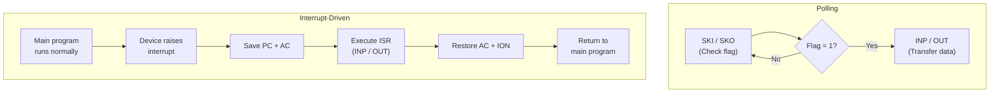

# Topic 36: 6.6 Input-Output Programming

[< Prev: 6.5 Assembly Language](topic-35.md) | [Index](index.md)

---

## In Simple Words

**I/O programming** is about how the CPU communicates with external devices (keyboard, display, printer, disk). The two fundamental approaches are **programmed I/O (polling)** — the CPU repeatedly checks if a device is ready — and **interrupt-driven I/O** — the device notifies the CPU when it's ready. In the Mano Basic Computer, I/O is done one character at a time using special instructions (INP, OUT, SKI, SKO) and flag bits (FGI, FGO).

---

## Detailed Explanation

### I/O Interface in the Mano Basic Computer

The basic computer has two I/O devices:

```
┌──────────┐         ┌──────────┐         ┌──────────┐
│ Keyboard │─INPR───►│   CPU    │─OUTR───►│ Display  │
│          │  FGI    │   (AC)   │  FGO    │ (Screen) │
└──────────┘         └──────────┘         └──────────┘
```

| Component | Size | Purpose |
|---|---|---|
| **INPR** (Input Register) | 8 bits | Holds character from keyboard |
| **OUTR** (Output Register) | 8 bits | Holds character to be displayed |
| **FGI** (Input Flag) | 1 bit | 1 = new character available in INPR; 0 = no new input |
| **FGO** (Output Flag) | 1 bit | 1 = display ready for new character; 0 = still busy |
| **AC(0-7)** | 8 bits | Lower 8 bits of accumulator used for I/O data |

### I/O Instructions

| Mnemonic | Hex | Operation | Purpose |
|---|---|---|---|
| **INP** | F800 | AC(0-7) ← INPR; FGI ← 0 | Read character from keyboard |
| **OUT** | F400 | OUTR ← AC(0-7); FGO ← 0 | Send character to display |
| **SKI** | F200 | If FGI = 1: PC ← PC + 1 | Skip next instruction if input ready |
| **SKO** | F100 | If FGO = 1: PC ← PC + 1 | Skip next instruction if output ready |
| **ION** | F080 | IEN ← 1 | Enable interrupts |
| **IOF** | F040 | IEN ← 0 | Disable interrupts |

### Method 1: Programmed I/O (Polling)

The CPU continuously checks the flag bit in a tight loop until the device is ready.

#### Input: Read One Character from Keyboard

```assembly
        ORG 100
INPUT,  SKI             / Check: is FGI = 1? (keyboard has character?)
        BUN INPUT       / No → loop back and check again
        INP             / Yes → read character into AC(0-7); FGI ← 0
        STA CHAR        / Store character in memory
        HLT
CHAR,   HEX 0
        END
```

**How it works:**

```
Cycle 1: SKI → FGI = 0? → Don't skip → execute next (BUN INPUT)
Cycle 2: BUN INPUT → go back to SKI
...repeat until user presses a key...
Cycle N: SKI → FGI = 1! → Skip next instruction (BUN INPUT is skipped)
Cycle N+1: INP → AC(0-7) ← INPR; FGI ← 0
```

#### Output: Write One Character to Display

```assembly
        ORG 200
        LDA CHAR        / Load character to display
OUTPUT, SKO             / Check: is FGO = 1? (display ready?)
        BUN OUTPUT      / No → loop back and check again
        OUT             / Yes → send AC(0-7) to OUTR; FGO ← 0
        HLT
CHAR,   HEX 0041       / ASCII code for 'A'
        END
```

#### Polling Loop for Both Input and Output (Echo Program)

Read a character from keyboard and echo it to the display:

```assembly
        ORG 100
/ --- Read character ---
RLOOP,  SKI             / Wait for keyboard
        BUN RLOOP       
        INP             / Read character into AC
/ --- Write character ---
WLOOP,  SKO             / Wait for display
        BUN WLOOP       
        OUT             / Send to display
        BUN RLOOP       / Go back for next character
        END
```

This creates an **echo loop** — everything typed on the keyboard appears on the display.

### Problem with Polling

The CPU is **stuck in a loop** doing nothing but checking the flag:

```
Time spent useful work: almost 0%
Time spent checking flag: ~99.99%
```

If the keyboard sends one character per second and the CPU runs at 1 MHz, the CPU executes ~1,000,000 cycles, but only ~3 of them (SKI → INP → STA) do actual work. The rest are wasted polling the flag.

### Method 2: Interrupt-Driven I/O

Instead of polling, the CPU does other work and the **device interrupts** when ready:

```
Main program runs normally
    ↑
    │ (Interrupt from keyboard when character ready)
    │
    ▼
CPU saves state → jumps to ISR
ISR reads character (INP) → stores it → RETI
CPU resumes main program
```

#### Enabling Interrupts in Mano Basic Computer

```assembly
        ORG 100
        ION             / Enable interrupts (IEN ← 1)
        / ... main program continues doing useful work ...
```

#### Interrupt Cycle (Hardware Behavior)

When an interrupt occurs and IEN = 1:

```
1. R ← 1                              (Interrupt flip-flop set)
2. IEN ← 0                            (Disable further interrupts)
3. M[0] ← PC                          (Save return address at location 0)
4. PC ← 1                             (Jump to address 1 — ISR starts here)
```

At address 0: the return address is stored.
At address 1: the ISR begins.

#### Complete Interrupt-Driven I/O Program

```assembly
        ORG 0
        HEX 0           / Location 0: return address (saved by hardware)
        BUN ISRV         / Location 1: jump to ISR handler

        ORG 100
/ --- Main Program ---
MAIN,   ION              / Enable interrupts
        LDA X            / Do useful work...
        ADD Y            / (computing while waiting for I/O)
        STA Z
        BUN MAIN         / Loop main program
X,      DEC 10
Y,      DEC 20
Z,      DEC 0

/ --- Interrupt Service Routine ---
        ORG 200
ISRV,   STA SAC          / Save AC (might be in use by main program)
        SKI              / Check if keyboard caused interrupt
        BUN CHKO         / Not keyboard → check output
        INP              / Read character from keyboard
        STA INBUF        / Store in input buffer
        BUN EXIT
CHKO,   SKO              / Check if display caused interrupt
        BUN EXIT         / Not display either → exit
        LDA OUTBUF       / Load character to display
        OUT              / Send to display
EXIT,   LDA SAC          / Restore AC
        ION              / Re-enable interrupts
        BUN 0 I          / Return: PC ← M[0] (indirect jump to saved address)
SAC,    DEC 0            / Saved AC value
INBUF,  DEC 0            / Input buffer
OUTBUF, HEX 0041         / Output buffer (ASCII 'A')
        END
```

**Key points:**
- `BUN 0 I` = indirect branch to location 0 = jump to the address stored at M[0] = return to main program
- AC must be saved/restored because the ISR uses AC
- ION is called before return to re-enable interrupts
- The ISR checks which device caused the interrupt (polling within ISR)

### Polling vs Interrupt-Driven I/O Comparison

| Feature | Programmed I/O (Polling) | Interrupt-Driven I/O |
|---|---|---|
| **CPU availability** | 0% — stuck in polling loop | ~99% — works on main program |
| **Response time** | Fast (constant checking) | Slightly slower (interrupt latency) |
| **Complexity** | Simple (just a loop) | More complex (ISR, state saving) |
| **Efficiency** | Very low for slow devices | High — CPU does useful work |
| **When to use** | Fast devices, simple systems | Slow devices, multi-task systems |
| **Hardware needed** | Just flag checking | Interrupt controller, IEN, R flip-flop |

### I/O Addressing: Memory-Mapped vs Isolated I/O

| Feature | Memory-Mapped I/O | Isolated (Port) I/O |
|---|---|---|
| **Address space** | I/O devices share memory address space | Separate I/O address space |
| **Instructions** | Same instructions as memory (LDA, STA) | Special I/O instructions (IN, OUT) |
| **Advantage** | No special I/O instructions needed | Full memory space available |
| **Disadvantage** | Reduces available memory addresses | Needs extra instructions and bus signal |
| **Example** | ARM, MIPS | x86 (IN/OUT instructions) |

**Mano Basic Computer uses isolated I/O** — it has special INP and OUT instructions separate from memory operations.

---

## Real-Life Example

**Polling = Repeatedly looking out the window to check if the pizza delivery person has arrived.** You can't do anything else because you keep checking. If the delivery takes 30 minutes, you've wasted 30 minutes staring out the window.

**Interrupt-driven = The doorbell rings when the pizza arrives.** You watch TV, cook, study — do whatever you want. When the doorbell rings (interrupt), you pause what you're doing, get the pizza (ISR), and resume your activity.

**The ISR is like answering the door:**
1. You note your place in the book you were reading (save state).
2. Answer the door, take the pizza (service the device).
3. Return to your chair and continue from your bookmark (restore state, RETI).

---

## Visual Flow



---

## Quick Revision

| Point | Remember |
|---|---|
| FGI | Input flag: 1 = keyboard character ready |
| FGO | Output flag: 1 = display ready for character |
| INP | Read character: AC(0-7) ← INPR; FGI ← 0 |
| OUT | Write character: OUTR ← AC(0-7); FGO ← 0 |
| SKI | Skip if FGI = 1 (input ready) |
| SKO | Skip if FGO = 1 (output ready) |
| ION / IOF | Enable / disable interrupts |
| Polling pattern | SKI → BUN back (loop until FGI = 1) → INP |
| Interrupt cycle | R=1, IEN←0, M[0]←PC, PC←1 |
| Return from ISR | ION; BUN 0 I (indirect jump to saved return address) |
| Save/restore AC | ISR must save AC at start, restore before return |
| Polling vs Interrupt | Polling wastes CPU; Interrupt frees CPU for useful work |
| Memory-mapped I/O | I/O shares memory address space; use regular load/store |
| Isolated I/O | Separate I/O space; use special IN/OUT instructions (Mano uses this) |

> **Exam Tip:** Write a complete polling-based input and output program. Also write an interrupt-driven I/O program with ISR that saves/restores AC and uses BUN 0 I to return. Know the interrupt cycle RTL (R flip-flop, IEN, M[0]←PC, PC←1). Calculate CPU utilization for polling vs interrupt.

---

[< Prev: 6.5 Assembly Language](topic-35.md) | [Index](index.md)

