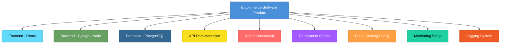
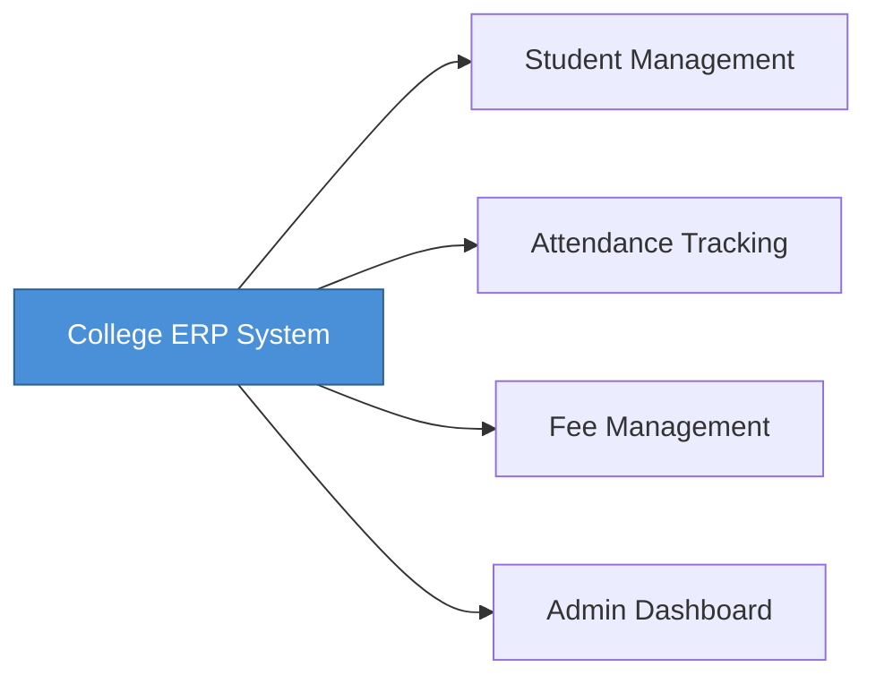

# Topic 1: Definition of Software Product

[< Index](index.md) | [Next: Characteristics of Software >](topic-02.md)

---

## 1. What is Software?

Software is **not** just a program. It is a complete deliverable that includes:

- Executable programs
- Configuration files
- Data
- Documentation (user manuals, API docs, design docs)
- Installation instructions
- Maintenance updates

> When all of this is packaged and delivered to a user or organization to solve a problem, it is called a **software product**.

---

## 2. Formal Definition

> **A software product** is a collection of computer programs, procedures, associated documentation, and data designed to deliver a specific functionality to users.

---

## 3. Real-Life Example (Non-Technical Student)

### Example: WhatsApp

When you install WhatsApp, you are **not** just installing "code". You are getting:

| Component | Description |
|---|---|
| Mobile App | The program itself |
| Server Systems | Running in data centers |
| Privacy Policy | Documentation |
| Help Center | Documentation |
| Backup System | Data management |
| Update Mechanism | Maintenance |
| Security Patches | Ongoing support |

All of this together forms the **software product**.

> **Important:** If WhatsApp only gave you a `.apk` file with no updates, no support, no backend -- it would **not** be a complete software product.

---

## 4. Real-Life Example (Computer Science Student)

### Example: An E-commerce Website (like an Amazon clone)

> That **entire ecosystem** is your software product -- not just the backend code, not just the UI -- the **complete operational system**.

---

## 5. Types of Software Products

### 1. Generic Software Product

Built for the **general market** and sold to many users.

| Examples |
|---|
| Microsoft Office |
| Photoshop |
| VS Code |

> These are built by companies and sold to everyone.

### 2. Customized (Bespoke) Software Product

Built for a **specific client** or organization.

**Example:** A college ERP system developed only for one college.

> That product is designed **specifically** for that institution.

---

## 6. Key Characteristics of a Software Product

| Characteristic | Description |
|---|---|
| **Intangible** | You cannot touch software like hardware |
| **Developed, not manufactured** | Once built, copies can be replicated at near-zero cost |
| **Does not wear out physically** | It may become obsolete, but it does not degrade physically |
| **Highly complex** | Millions of lines of code, integrations, distributed systems |
| **Easily changeable (but risky)** | Changes can introduce bugs |

---

## 7. Why This Concept Matters in Software Engineering

If you think software is just "coding," you will:

- Ignore documentation
- Ignore maintenance
- Ignore scalability
- Ignore user experience
- Ignore long-term support

> **Software Engineering treats software as a product lifecycle system, not just a coding task.**

---

## 8. Simple Analogy

| House Building | Software Product |
|---|---|
| Bricks | Code |
| Architecture Design | System Design |
| Electric Wiring | Backend Logic |
| Interior Design | UI/UX |
| Maintenance | Updates and Bug Fixes |
| **Finished House** | **Software Product** |

---

[< Index](index.md) | [Next: Characteristics of Software >](topic-02.md)