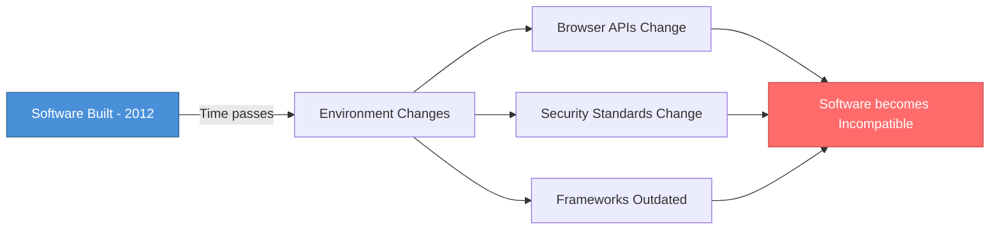
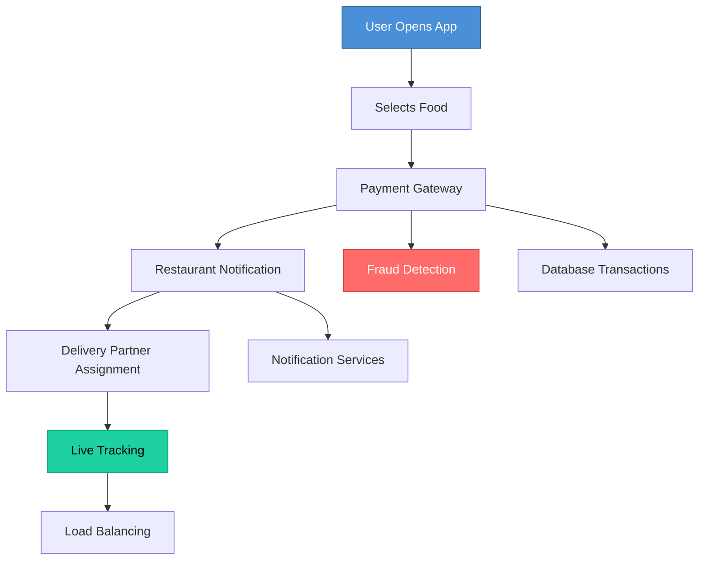
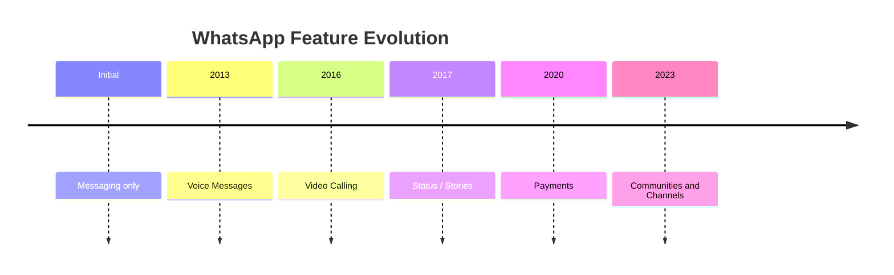
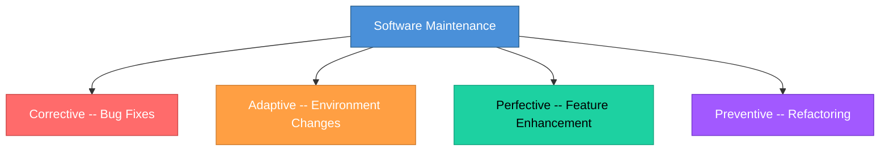

# Topic 2: Characteristics of Software

[< Prev: Definition of Software Product](topic-01.md) | [Index](index.md) | [Next: Software Engineering - Definition and Scope >](topic-03.md)

---

> To understand software engineering properly, you must understand how software is **different from physical products**. Software behaves differently from cars, buildings, or machines -- and that difference creates most engineering challenges.

---

## 1. Software is Intangible

You **cannot touch** software. You only experience its behavior.

### Non-Technical Example

> You can touch your **phone**. You cannot touch **Instagram**.
>
> Instagram exists as logic running on servers and devices. It has no physical shape.

### Technical Example

When you deploy a Node.js app to AWS:

- You cannot physically see your backend
- You only see API responses
- Bugs are **logical errors**, not physical defects

> This makes debugging more **abstract** compared to hardware repair.

---

## 2. Software is Developed, Not Manufactured

A car is **manufactured** repeatedly in factories. Software is **developed once**, then copied infinitely.

### Real-Life Example

Once Microsoft builds Windows:
- They don't rebuild it for every customer -- they **distribute copies**

| Metric | Value |
|---|---|
| Cost of 1st copy | **Extremely high** |
| Cost of 1,000,000th copy | **Almost zero** |

> This fundamentally changes **business models** and **pricing strategies**.

---

## 3. Software Does Not Wear Out

Hardware **degrades** over time. Software **does not** physically degrade.

However, software becomes **obsolete** due to:

- Environment changes
- OS updates
- Dependency changes
- Security vulnerabilities
- Business requirement changes

### Example

A website built in 2012 still runs today, **but:**

- Browser APIs changed
- Security standards changed
- Framework versions outdated

> The software did not "wear out" -- it became **incompatible**.

---

## 4. Software is Highly Complex

Modern software systems are **extremely complex**.

### Non-Technical Example -- Food Delivery App

**User sees:** Open app, select food, pay, get delivery.

**Behind the scenes:**

### Technical Example -- SaaS System

| Layer | Components |
|---|---|
| Services | Microservices architecture |
| Caching | Distributed caching (Redis) |
| Messaging | Message queues (RabbitMQ, Kafka) |
| DevOps | CI/CD pipelines |
| Observability | Monitoring systems |
| Security | Authentication servers |
| Integration | External APIs |

> Each layer **increases complexity**.

---

## 5. Software is Continuously Changing

Requirements change **constantly**:
- Business rules change
- User expectations evolve
- Security threats emerge

> Unlike a bridge, which stays **static**, software **evolves**.

### Example: WhatsApp Evolution

> This continuous evolution creates **maintenance cost**.

---

## 6. Software is Custom-Built (Often)

Unlike hardware assembled from standard parts, most software is **custom-built**.

Even if you use frameworks, the **business logic is unique**.

| E-commerce Site | Business Logic |
|---|---|
| Sells Books | ISBN tracking, reviews, recommendations |
| Sells Medicines | Prescription validation, expiry tracking, regulations |

> Architecture may be similar. **Business logic differs completely.**

---

## 7. Software Failures are Design Failures

| Type | Cause |
|---|---|
| **Hardware failure** | Physical damage |
| **Software failure** | Design / logic errors |

### Example

If your banking app shows the **wrong balance**:
- Not because the server "wore out"
- Because the **logic was incorrect**

> Quality depends heavily on **design discipline**.

---

## 8. Maintenance is Expensive

In most real systems:

| Phase | Cost Share |
|---|---|
| Maintenance | **60-70%** of total cost |
| Initial Development | **30-40%** of total cost |

### Types of Maintenance

---

## 9. Summary Table: Hardware vs Software

| Property | Hardware | Software |
|---|---|---|
| **Production** | Manufactured | Developed |
| **Degradation** | Wears out | Does not wear physically |
| **Failure Cause** | Physical | Logical errors |
| **Changeability** | Difficult | Highly changeable |
| **Tangibility** | Tangible | Intangible |
| **Complexity** | Moderate | Very high |

---

> **Key Takeaway:** These characteristics explain **why Software Engineering exists**. Without structured processes, complexity and change will **destroy projects**.

---

[< Prev: Definition of Software Product](topic-01.md) | [Index](index.md) | [Next: Software Engineering - Definition and Scope >](topic-03.md)