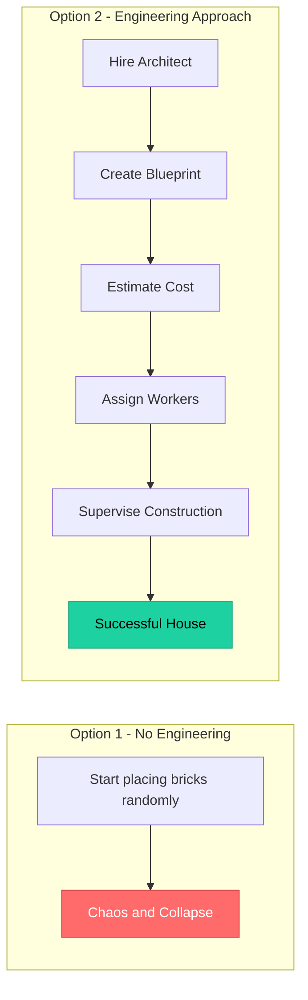
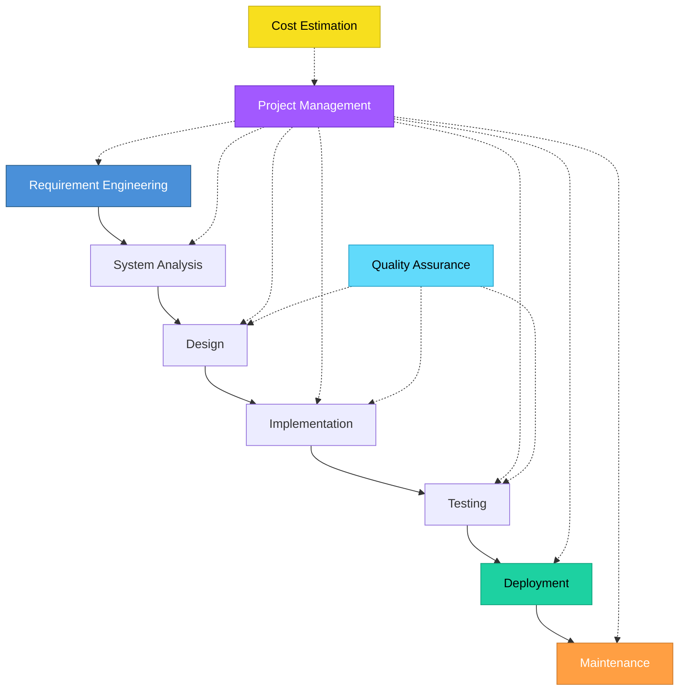
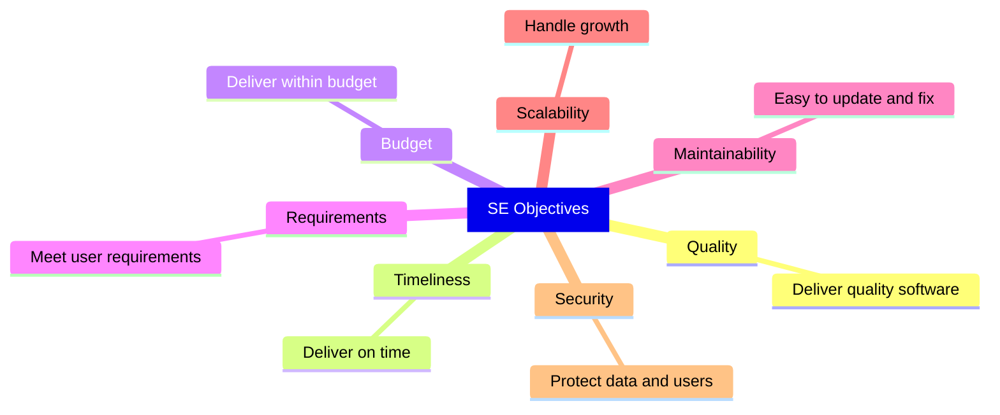

# Topic 3: Software Engineering -- Definition and Scope

[< Prev: Characteristics of Software](topic-02.md) | [Index](index.md) | [Next: Software Engineering Paradigms >](topic-04.md)

---

> Now that you understand what software is and how it behaves, we move to the core idea: **What is Software Engineering?**

---

## 1. Definition of Software Engineering

> **Software Engineering** is the application of engineering principles, methods, and tools to the development, operation, and maintenance of software.

It means building software in a **systematic**, **disciplined**, and **measurable** way.

> **It is not just coding.**

---

## 2. Why Software Engineering Exists

In the early days (1960s-70s), programmers wrote code directly **without structure**.

### Result: The Software Crisis

| Problem | Impact |
|---|---|
| Projects failed | Wasted investment |
| Budgets exceeded | Financial losses |
| Software unreliable | User dissatisfaction |
| Maintenance impossible | Technical debt |

### Software Engineering was introduced to solve:

- Uncontrolled complexity
- Poor planning
- Lack of documentation
- Cost overruns
- Schedule delays

---

## 3. Simple Real-Life Example (Non-Technical)

Suppose you want to build a house:

> **Software Engineering = Option 2 for software.**

---

## 4. Practical Example (Computer Science Student)

### Imagine building a College ERP System

| Aspect | Without SE | With SE |
|---|---|---|
| **Start** | Code directly | Gather requirements first |
| **Documentation** | None | SRS document prepared |
| **Architecture** | Ad-hoc | System architecture designed |
| **Task Management** | Random | Task breakdown created |
| **Code Quality** | Inconsistent | Coding standards defined |
| **Testing** | Manual / None | Testing strategy planned |
| **Deployment** | Manual | CI/CD pipeline created |
| **Outcome** | Bugs, Slow, Conflicts | Predictable and Scalable |

---

## 5. Scope of Software Engineering

Software Engineering covers the **entire lifecycle**:

| Phase | Description |
|---|---|
| Requirement Engineering | Understanding what to build |
| System Analysis | Studying problem and constraints |
| Design | Architecture and module structure |
| Implementation | Writing code |
| Testing | Ensuring correctness |
| Deployment | Releasing to users |
| Maintenance | Updating and improving |
| Project Management | Managing cost, time, team |
| Quality Assurance | Reliability and standards |
| Cost Estimation | Predicting effort and budget |

> So it is **much broader** than just programming.

---

## 6. Difference Between Programming and Software Engineering

| Aspect | Programming | Software Engineering |
|---|---|---|
| **Focus** | Writing code to solve a problem | End-to-end product delivery |
| **Planning** | Minimal | Extensive |
| **Design** | Ad-hoc | Structured |
| **Cost Estimation** | No | Yes |
| **Team Management** | No | Yes |
| **Quality Assurance** | No | Yes |
| **Documentation** | No | Yes |
| **Maintenance** | No | Yes |
| **Change Management** | No | Yes |

> Programming is **one activity** inside Software Engineering.

---

## 7. Example from Industry

Companies like **Google**, **Amazon**, **TCS**, and **Infosys** don't just hire coders. They use:

- Agile methodologies
- CI/CD pipelines
- Code reviews
- Automated testing
- Monitoring systems
- Incident management

> All of this **is** Software Engineering.

---

## 8. Core Objectives of Software Engineering

---

## 9. Important Insight

| Project Size | Need for SE? |
|---|---|
| Small project (personal calculator app) | May survive without structured engineering |
| Large system (banking system) | **Without engineering discipline, failure is guaranteed** |

> The larger and more critical the system, the more essential Software Engineering becomes.

---

[< Prev: Characteristics of Software](topic-02.md) | [Index](index.md) | [Next: Software Engineering Paradigms >](topic-04.md)