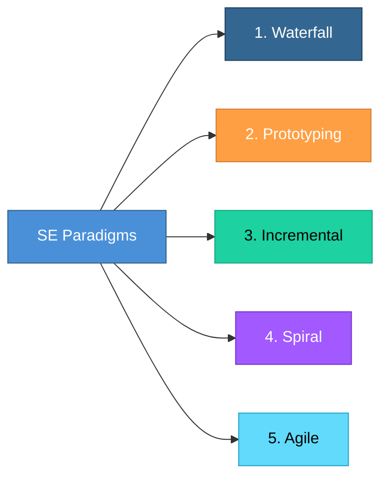
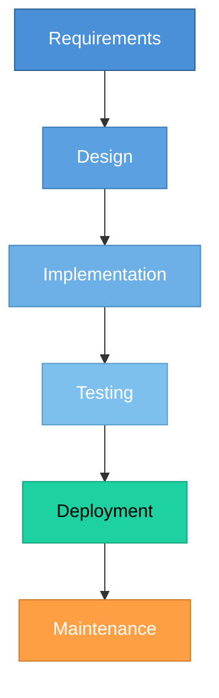
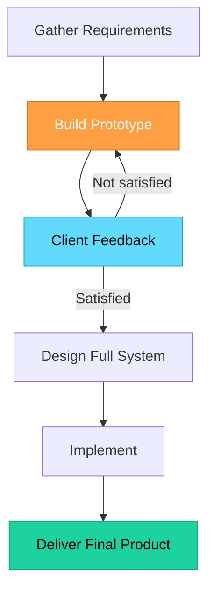
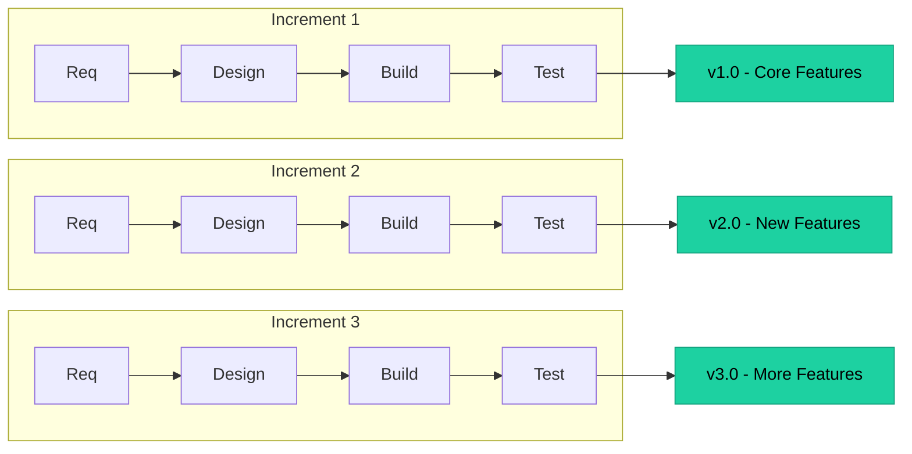
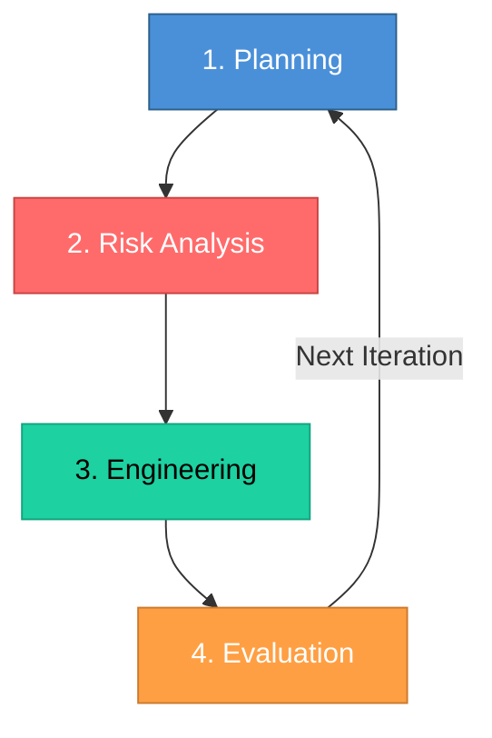

# Topic 4: Software Engineering Paradigms

[< Prev: Software Engineering - Definition and Scope](topic-03.md) | [Index](index.md) | [Next: Knowledge Engineering Approach >](topic-05.md)

---

> A **software engineering paradigm** is a structured approach or model used to develop software. It defines how development progresses from **idea to delivery**. Think of it as a **roadmap** for building software.

> Different projects require different paradigms depending on **risk**, **complexity**, and **requirement stability**.

---

## 1. Why Paradigms Are Needed

Without a defined process:

- Teams work randomly
- Requirements keep changing
- No clarity of progress
- Deadlines missed
- Quality degrades

A paradigm provides: **Order**, **Defined Stages**, **Control**, **Predictability**

---

## 2. Major Software Engineering Paradigms

---

### 2.1 Waterfall Model

The **oldest and simplest** model. Follows a **linear sequence** -- you complete one phase fully before moving to the next.

#### Non-Technical Example

**Building a bridge** -- You finalize design, approve budget, construct, inspect, open. You **cannot** change the design after construction begins.

#### Software Example

**Government payroll system** with fixed rules -- requirements are **stable**, changes are **rare**. Waterfall works well.

| Advantages | Disadvantages |
|---|---|
| Simple to understand | No flexibility |
| Easy to manage | Late discovery of errors |
| Clear documentation | Not suitable for changing requirements |

---

### 2.2 Prototyping Model

First build a small **working model** (prototype). Client sees it, gives feedback, system refined.

#### Non-Technical Example

**Tailor stitching clothes** -- first makes rough trial version, adjusts fitting, then final product.

#### Software Example

**Building a startup app** -- create basic UI demo, show to users, validate idea, then build full system.

| Type | Description |
|---|---|
| **Throwaway** | Discarded after feedback is collected |
| **Evolutionary** | Refined iteratively into the final system |

---

### 2.3 Incremental Model

Software is built in **small parts** (increments). Each increment delivers some **working functionality**.

#### Non-Technical Example

**Building a house floor by floor** -- Ground floor complete and usable, first floor added, second floor added.

#### Software Example -- Instagram

| Version | Feature Added |
|---|---|
| v1.0 | Photo upload |
| v2.0 | Stories |
| v3.0 | Reels |
| v4.0 | Messaging |

| Advantages |
|---|
| Early delivery of usable product |
| Reduced risk |
| Flexible to changes |

---

### 2.4 Spiral Model

This model focuses on **risk analysis**. Each cycle involves four phases. It is **iterative** like a spiral.

#### When Used?

For **large, complex, high-risk systems**:

| System Type | Why Spiral? |
|---|---|
| Banking Software | Security and financial risk |
| Defense Systems | Mission-critical reliability |
| Air Traffic Control | Safety-critical, zero tolerance |

---

### 2.5 Agile Model

**Modern and widely used.** Key principles:

- Small iterations (**sprints**)
- Continuous customer feedback
- **Working software** over documentation
- **Embrace change**

#### Non-Technical Example

**Building a startup product** -- instead of planning everything for 1 year: Release MVP in 2 weeks, get feedback, improve, repeat.

---

## 3. Comparison Summary

| Paradigm | Approach | Flexibility | Best For |
|---|---|---|---|
| **Waterfall** | Sequential | Rigid | Stable requirements |
| **Prototyping** | Build, Feedback, Refine | Moderate | Unclear requirements |
| **Incremental** | Feature-based delivery | Flexible | Evolving products |
| **Spiral** | Risk-driven cycles | High | Complex, high-risk systems |
| **Agile** | Iterative sprints | Very High | Customer-driven, fast-moving |

---

## 4. Important Insight

> **Choosing the wrong paradigm leads to project failure.**

| Scenario | Result |
|---|---|
| Using **Waterfall** for a startup with changing requirements | Disaster |
| Using **Agile** for nuclear defense software | Risky |

> **Paradigm must match project nature.**

---

[< Prev: Software Engineering - Definition and Scope](topic-03.md) | [Index](index.md) | [Next: Knowledge Engineering Approach >](topic-05.md)