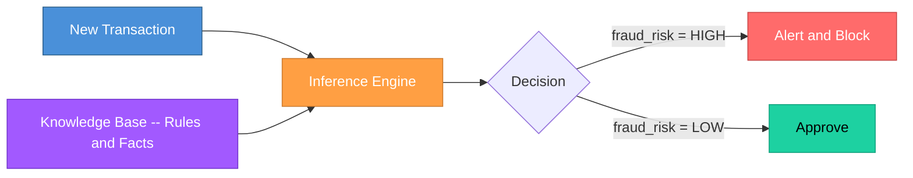
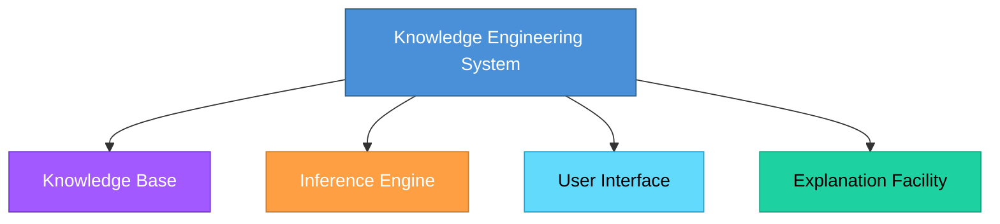
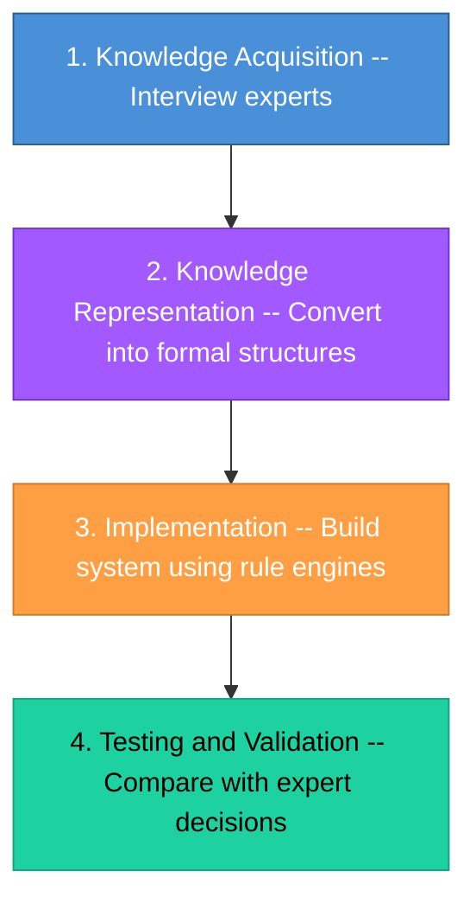
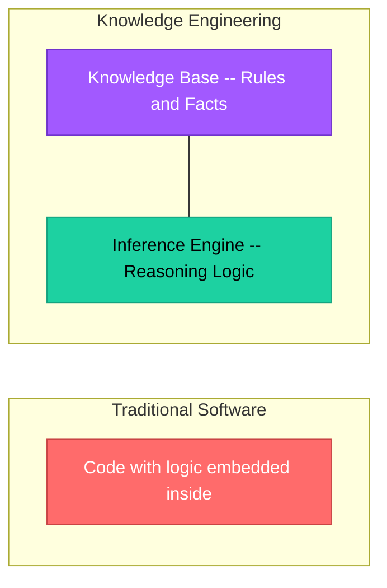

# Topic 5: Knowledge Engineering Approach

[< Prev: Software Engineering Paradigms](topic-04.md) | [Index](index.md) | [Next: End User Development >](topic-06.md)

---

> Now we move slightly into **AI-related thinking**. Knowledge Engineering is about building systems that **simulate human expertise**.

---

## 1. What is Knowledge Engineering?

Knowledge Engineering is the process of:

1. **Collecting** knowledge from domain experts
2. **Structuring** that knowledge
3. **Encoding** it into a computer system
4. **Creating** a system that can make decisions like an expert

> It is mainly used in **Expert Systems** and **AI-based systems**.

---

## 2. How It Is Different from Normal Software

| Aspect | Normal Software | Knowledge-Based Software |
|---|---|---|
| **Logic** | Fixed, algorithmic | Rule-based |
| **Data** | Static data | Facts + Rules |
| **Processing** | Sequential execution | **Inference** (reasoning) |
| **Behavior** | Deterministic | Simulates **expert reasoning** |

---

## 3. Simple Real-Life Example (Non-Technical)

**Doctor diagnosing a disease:**

| Symptoms | Diagnosis |
|---|---|
| Fever + Cough + Chest Pain | Possible **Pneumonia** |
| High Sugar Level | **Diabetes** risk |

A knowledge engineering system **captures such rules**:

```
IF fever AND cough AND chest_pain
THEN pneumonia_probability = HIGH
```

> Now the software can behave like a **medical advisor**.

---

## 4. Technical Example

### Fraud Detection System

| Approach | Method |
|---|---|
| **Traditional** | Write fixed logic rules manually |
| **Knowledge Engineering** | Collect expert banking fraud patterns and encode them |

#### Encoded Rule Example:

```
IF transaction_amount > 50,000
AND location != usual_location
AND time = midnight
THEN fraud_risk = HIGH
```



---

## 5. Components of a Knowledge Engineering System



| Component | Role |
|---|---|
| **Knowledge Base** | Stores rules and facts |
| **Inference Engine** | Applies rules to facts to derive conclusions |
| **User Interface** | Allows user interaction |
| **Explanation Facility** | Explains *why* a particular conclusion was reached |

---

## 6. Process of Knowledge Engineering



### Knowledge Representation Methods

| Method | Description |
|---|---|
| **IF-THEN Rules** | `IF condition THEN action` |
| **Semantic Networks** | Graph of related concepts |
| **Frames** | Structured data templates |
| **Logic Expressions** | Formal logical statements |

---

## 7. Where It Is Used

| Domain | Example |
|---|---|
| Medical | Diagnosis systems |
| Legal | Legal advisory systems |
| Customer Service | Chatbots |
| Finance | Financial risk assessment |
| Configuration | PC builder suggestions |

---

## 8. Real Industry Examples

| Era | System | Description |
|---|---|---|
| **Early (1970s)** | MYCIN | Medical expert system for bacterial infections |
| **Modern** | AI Credit Scoring | Automated loan approval decisions |
| **Modern** | Support Bots | Automated customer support using knowledge rules |

---

## 9. Why It Matters in Software Engineering

Knowledge engineering is used when:

- The problem requires **expert decision-making**
- The domain is **rule-based**
- Expertise must be **preserved digitally**

> Instead of hardcoding everything, we **separate knowledge from processing logic**.

---

## 10. Difference from Traditional Software



| Aspect | Traditional | Knowledge Engineering |
|---|---|---|
| **Logic Location** | Embedded in code | Stored separately in knowledge base |
| **Updating** | Rewrite code | Change rule -- no program rewrite |
| **Flexibility** | Low | High |

> Separating knowledge from logic makes **updating rules much easier** -- just change the rule, no need to rewrite the entire program.

---

[< Prev: Software Engineering Paradigms](topic-04.md) | [Index](index.md) | [Next: End User Development >](topic-06.md)