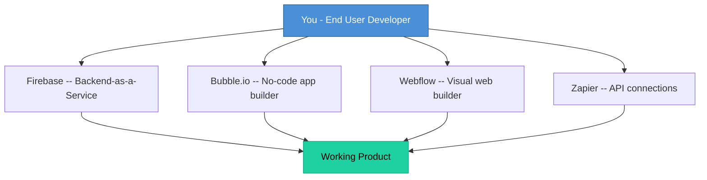
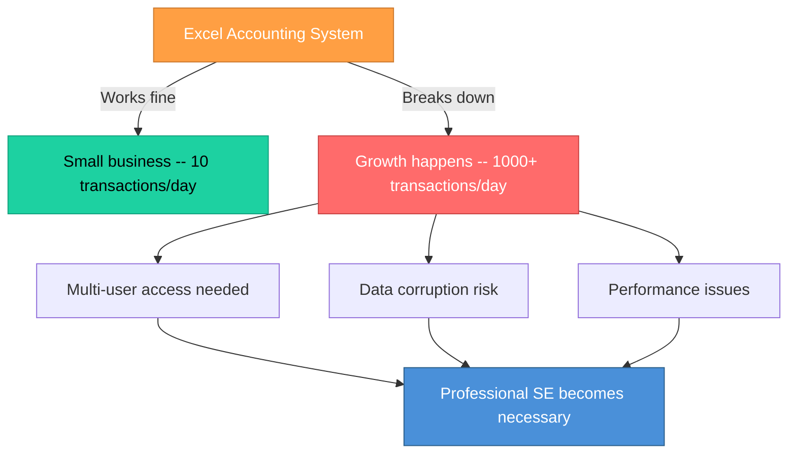
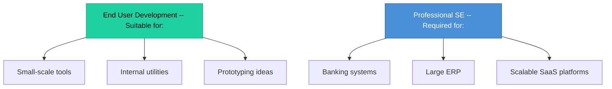

# Topic 6: End User Development (EUD) Approach

[< Prev: Knowledge Engineering Approach](topic-05.md) | [Index](index.md) | [Next: Concept of System and System Analysis >](topic-07.md)

---

> In Knowledge Engineering, **experts build intelligent systems**. In End User Development (EUD), the **users themselves** build or customize software.

---

## 1. What is End User Development?

> **End User Development** is an approach where **non-professional programmers** create or modify software to meet their own needs.

Instead of hiring software engineers, **users build small systems themselves**.

---

## 2. Simple Real-Life Example (Non-Technical)

Suppose a **shop owner** wants to track daily sales.

Instead of hiring a software company:

> He just built a small software system **without being a programmer** -- that is **End User Development**.

---

## 3. Common Examples Around You

| Tool | EUD Usage |
|---|---|
| Excel | Formulas and Macros |
| Google Sheets | Automation scripts |
| MS Access | Custom databases |
| Wix / WordPress | No-code website builders |
| Zapier | Workflow automation |
| Notion | Custom workflows and databases |

> Users **combine tools** to solve problems without writing traditional code.

---

## 4. Technical Example (CS Student Perspective)

Instead of writing backend code from scratch, you:

> You build a **working product** without writing full software architecture -- that is EUD.

---

## 5. Why EUD Exists

| Reason | Explanation |
|---|---|
| Small-scale problems | Many problems don't need full engineering |
| Domain knowledge | Users understand their domain better |
| Cost | Hiring developers is expensive |
| Tool evolution | Development tools are now user-friendly |

---

## 6. Advantages of EUD

| Advantage | Description |
|---|---|
| Fast solution | No waiting for dev team |
| Low cost | No developer salaries |
| Direct control | Users own the process |
| No communication gap | Builder = User |
| Rapid customization | Instant modifications |

---

## 7. Disadvantages of EUD

| Disadvantage | Description |
|---|---|
| Poor scalability | Can't handle growth |
| Security risks | No professional security review |
| Lack of documentation | No formal docs |
| Hard to maintain | Becomes messy over time |
| Error-prone | No formal testing |

### Example: When EUD Breaks Down

---

## 8. Comparison: Knowledge Engineering vs End User Development

| Aspect | Knowledge Engineering | End User Development |
|---|---|---|
| **Built by** | Engineers / Developers | End users |
| **Purpose** | Capture expert knowledge | Personal / small-scale solutions |
| **Systems** | Intelligent / AI systems | Spreadsheets, no-code apps |
| **Formal Process** | Yes | Often none |
| **Scalability** | High | Low |
| **Complexity** | High | Low |

---

## 9. Modern Industry Context

Today EUD is **growing** because of:

| Trend | Examples |
|---|---|
| No-code tools | Bubble, Adalo, Glide |
| Low-code platforms | OutSystems, Mendix, Power Apps |
| AI-based builders | ChatGPT-powered app builders |

### Example: Marketing Manager's EUD

A marketing manager builds -- **without touching backend code**:

- Landing page (Webflow)
- CRM workflow (HubSpot)
- Email automation (Mailchimp)

---

## 10. Important Insight

> EUD works for small needs. For **banking systems**, **large ERPs**, and **scalable SaaS platforms**, professional Software Engineering is **required**.

---

[< Prev: Knowledge Engineering Approach](topic-05.md) | [Index](index.md) | [Next: Concept of System and System Analysis >](topic-07.md)