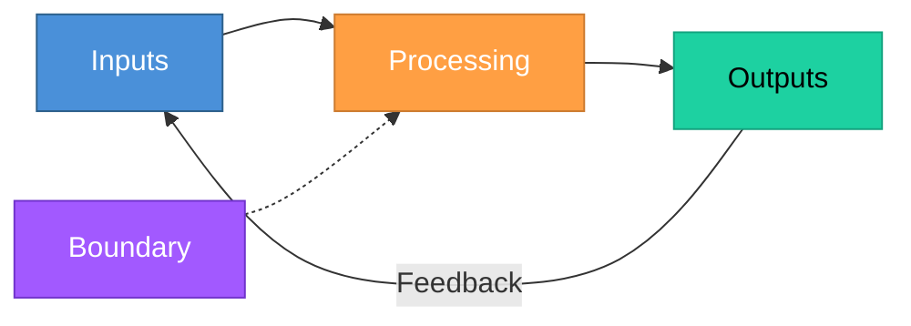
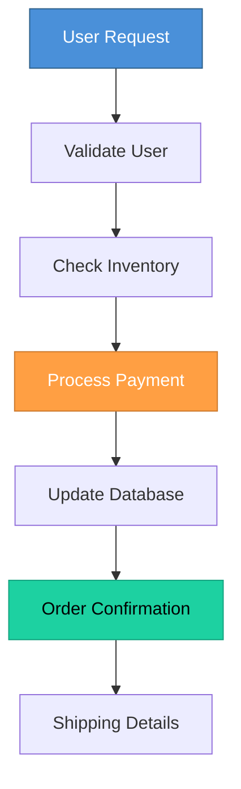
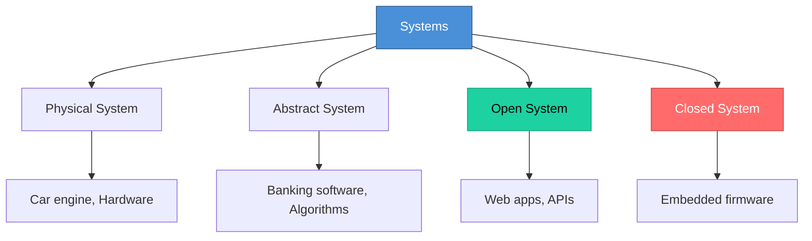
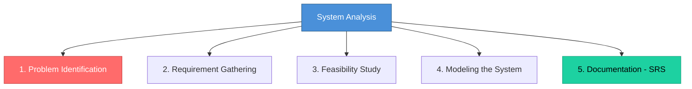

# Topic 7: Concept of System and System Analysis

[< Prev: End User Development](topic-06.md) | [Index](index.md) | [Next: Abstraction >](topic-08.md)

---

> Before building software, we must understand what a system is. Software engineering is not about coding first. It starts with understanding the **system** in which the software will operate.

---

## 1. What is a System?

A system is a **collection of interrelated components** working together to achieve a common goal.

Every system has:

- **Inputs** -- data or resources entering the system
- **Processing** -- transformation of inputs
- **Outputs** -- results produced
- **Feedback** -- information used to adjust the system
- **Boundaries** -- limits defining what is inside and outside

---

## 2. Simple Real-Life Example (Non-Technical)

### Example: A College

| Component | Details |
|---|---|
| **Inputs** | Students, Teachers, Fees, Curriculum |
| **Processing** | Teaching, Exams, Evaluation |
| **Outputs** | Results, Degrees, Skilled graduates |
| **Feedback** | Student feedback, University audits |

> The college is a system because all parts work together for education.

---

## 3. Technical Example

### Example: E-commerce Website

| Component | Details |
|---|---|
| **Inputs** | User requests, Product data, Payment information |
| **Processing** | Validate user, Check inventory, Process payment, Update database |
| **Outputs** | Order confirmation, Invoice, Shipping details |
| **Feedback** | Customer reviews, Error logs |

> The entire application ecosystem is a system.

---

## 4. Types of Systems

| Type | Description | Example |
|---|---|---|
| **Physical System** | Tangible, real-world system | Car engine |
| **Abstract System** | Conceptual or software-based | Banking software |
| **Open System** | Interacts with environment | Web application |
| **Closed System** | No interaction outside | Embedded firmware |

> Most software systems are **open systems**.

---

## 5. What is System Analysis?

> System Analysis is the process of studying a system to:
> - Understand how it works
> - Identify problems
> - Define requirements
> - Propose improvements

It happens **before** system design and coding.

---

## 6. Why System Analysis is Important

> If you misunderstand the problem, you will build the wrong solution.

### Example

College says: *"We need software for attendance."*

**Without analysis:** You may build only attendance marking.

**With analysis,** actual need may include:

| Requirement | Description |
|---|---|
| Parent notification | SMS/email alerts |
| Performance analytics | Attendance trends |
| Faculty reporting | Department-level reports |
| Integration with exam system | Attendance-exam correlation |

> Without analysis -- incomplete system.

---

## 7. Activities in System Analysis

---

## 8. Real-Life Example (Non-Technical)

Suppose a hospital complains: *"Patients wait too long."*

System Analyst investigates:

- Where is the delay? Registration? Doctor availability? Billing?

After studying the workflow, analyst may suggest:

| Solution | Impact |
|---|---|
| Token system | Organized queuing |
| Digital queue management | Real-time tracking |
| Online appointment booking | Reduced walk-in load |

> Without analysis, random solutions would fail.

---

## 9. Technical Example (CS Perspective)

Suppose you are building a **Learning Management System (LMS)**.

| Approach | Actions |
|---|---|
| **Without analysis** | Start coding dashboard and authentication |
| **With system analysis** | Ask critical questions first |

Questions to ask:

- Who are users? (Admin, teacher, student)
- What permissions do they have?
- What scale? (500 users or 50,000?)
- Cloud or on-premise?
- Data retention policy?
- Reporting needs?

> Now architecture becomes clear.

---

## 10. Role of a System Analyst

A System Analyst acts as:

| Role | Description |
|---|---|
| Bridge | Between client and developers |
| Investigator | Studies the problem |
| Clarifier | Defines requirements precisely |
| Evaluator | Assesses feasibility |

> They translate **business language** into **technical specifications**.

---

## 11. Important Insight

> Coding solves a **defined** problem. System Analysis **defines** the correct problem.

> If analysis is wrong, even perfect coding produces failure.

---

[< Prev: End User Development](topic-06.md) | [Index](index.md) | [Next: Abstraction >](topic-08.md)