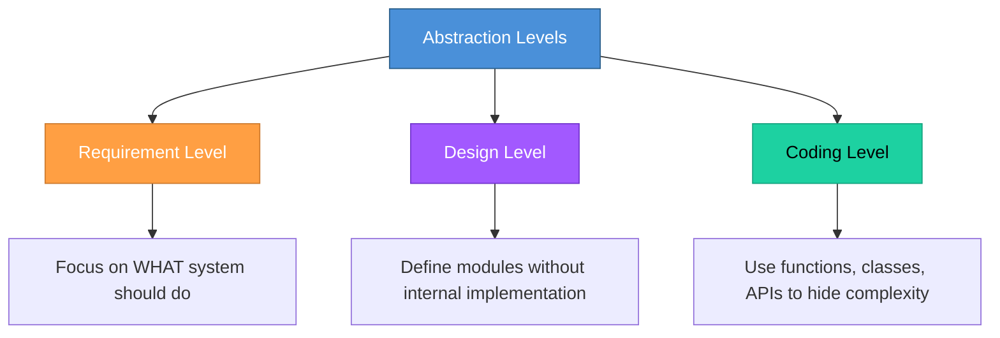

# Topic 8: Abstraction

[< Prev: Concept of System and System Analysis](topic-07.md) | [Index](index.md) | [Next: Partitioning >](topic-09.md)

---

> Abstraction is one of the most important thinking tools in software engineering. It means focusing on **essential details** while ignoring unnecessary complexity.

> **In simple words:** Hide internal complexity. Show only what matters.

---

## 1. Simple Real-Life Example (Non-Technical)

### ATM Machine

When you withdraw money:

| What You See | What You Do NOT See |
|---|---|
| Insert card | Banking server communication |
| Enter PIN | Account validation algorithms |
| Select amount | Encryption process |
| Collect cash | Transaction logs |

> All complex operations are hidden. **That is abstraction.**

---

## 2. Another Simple Example

**Driving a car.**

You press accelerator. Car moves.

You don't need to know:
- Combustion mechanics
- Fuel injection timing
- Engine calibration

> Complexity is **abstracted away**.

---

## 3. Technical Example (Programming Perspective)

When you use:

```python
list.append(10)
```

You don't know:
- Memory reallocation
- Array resizing
- Internal pointer updates

> Python **abstracts** it.

---

## 4. Abstraction in Software Engineering

During system development, abstraction helps at different levels:



---

## 5. Types of Abstraction

### 1. Functional Abstraction

Focus on **what** function does, not **how**.

**Example:**

```
calculateTax(income)
```

> You don't care how tax is calculated internally.

### 2. Data Abstraction

Hide internal data representation.

**Example:** In database, a `User` object:

| Exposed | Hidden |
|---|---|
| Name, Email | Password hashing mechanism |
| Profile data | Internal ID generation logic |

> You expose only required fields.

---

## 6. Real Software Example

### E-commerce Platform

**High-level abstraction:**


At this level, you ignore:
- Microservices
- Redis caching
- Payment gateway API
- Queue systems
- Database indexing

> Abstraction allows stakeholders to understand the system **without technical overload**.

---

## 7. Why Abstraction is Important

Without abstraction:

| Problem |
|---|
| Systems become unmanageable |
| Documentation becomes confusing |
| Developers get overwhelmed |
| Design becomes messy |

> Abstraction **reduces cognitive load**.

---

## 8. Abstraction in System Analysis

When analyzing a system, instead of modeling every tiny detail, we define:

- **Modules** -- major functional units
- **Major data flows** -- how data moves
- **Major responsibilities** -- what each part does

> Later, during design, we **refine details**.

---

## 9. Important Insight

Good engineers think in **layers of abstraction**:

| Level | Question |
|---|---|
| **High-level** | "What problem are we solving?" |
| **Mid-level** | "What modules are needed?" |
| **Low-level** | "What algorithms and data structures are required?" |

> Jumping directly to low-level details causes **bad architecture**.

---

## 10. Summary

Abstraction:

| Benefit |
|---|
| Simplifies complexity |
| Hides internal details |
| Improves clarity |
| Enables scalable design |

It is a foundational concept for:
- **OOP** (Object-Oriented Programming)
- **System design**
- **Architecture**
- **API design**

---

[< Prev: Concept of System and System Analysis](topic-07.md) | [Index](index.md) | [Next: Partitioning >](topic-09.md)