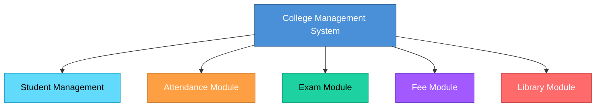
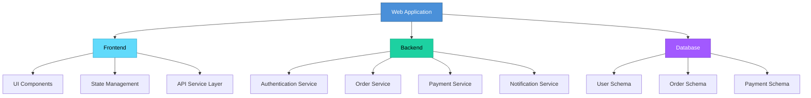
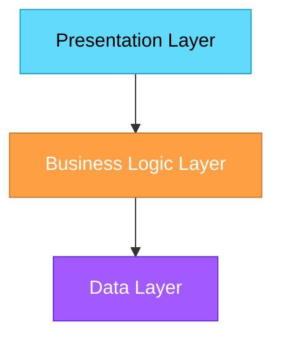
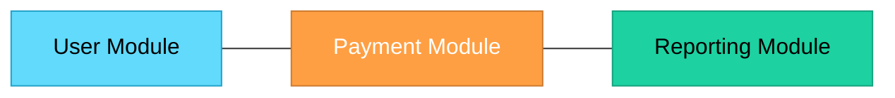

# Topic 9: Partitioning

[< Prev: Abstraction](topic-08.md) | [Index](index.md) | [Next: Projection >](topic-10.md)

---

> If abstraction reduces complexity by hiding details, **partitioning** reduces complexity by **dividing the system into smaller parts**.

> Partitioning means breaking a large system into manageable sub-systems or modules.

---

## 1. What is Partitioning?

Partitioning is the process of **dividing a system into smaller, independent components** that can be developed and managed separately.

> Instead of handling one huge problem, we handle **multiple small problems**.

---

## 2. Simple Real-Life Example (Non-Technical)

### Building a House

You do not build everything at once. You divide work into:

| Partition | Responsibility |
|---|---|
| Foundation | Structural engineers |
| Electrical | Electricians |
| Plumbing | Plumbers |
| Interior | Interior designers |
| Structure | Construction workers |

> Each team handles one part. That is **partitioning**.

---

## 3. College Example

### College Management System

Instead of one giant software block, you divide into:

> Each module handles a specific responsibility.

---

## 4. Technical Example (CS Perspective)

### Modern Web Application

Instead of writing one massive file, you partition into:

| Layer | Components |
|---|---|
| **Frontend** | UI components, State management, API service layer |
| **Backend** | Authentication service, Order service, Payment service, Notification service |
| **Database** | User schema, Order schema, Payment schema |

> In microservices architecture, partitioning becomes even clearer.

---

## 5. Why Partitioning is Important

| Without Partitioning | With Partitioning |
|---|---|
| Code becomes unreadable | Each module has clear responsibility |
| Changes break unrelated features | Easier debugging |
| Testing becomes difficult | Parallel development possible |
| Team collaboration becomes chaotic | Better scalability |

---

## 6. Types of Partitioning

### 1. Horizontal Partitioning

Dividing system into **layers**.

> Common in **layered architecture**.

### 2. Vertical Partitioning

Dividing by **features or functionality**.

> Common in **feature-based architecture**.

---

## 7. Real Industry Example

**Amazon** backend is not one giant application. It is partitioned into:

| Service | Responsibility |
|---|---|
| Product catalog service | Product listings |
| Payment service | Transactions |
| Recommendation engine | Personalized suggestions |
| Logistics service | Delivery management |

> Each is **separately deployable**.

---

## 8. Partitioning in System Analysis

When analyzing a system, we:

1. Identify major **subsystems**
2. Define **boundaries**
3. Define **interfaces** between modules

> This prevents future architecture collapse.

---

## 9. Important Insight

Partitioning supports:

| Benefit |
|---|
| Modularity |
| Scalability |
| Maintainability |
| Team collaboration |

> Without partitioning, large software systems **fail**.

---

## 10. Relationship with Abstraction

| Concept | What It Does |
|---|---|
| **Abstraction** | Hides internal complexity |
| **Partitioning** | Divides overall complexity |

> Together, they make large systems **manageable**.

---

[< Prev: Abstraction](topic-08.md) | [Index](index.md) | [Next: Projection >](topic-10.md)