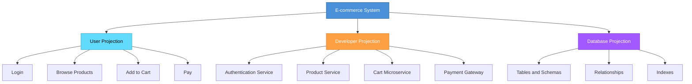
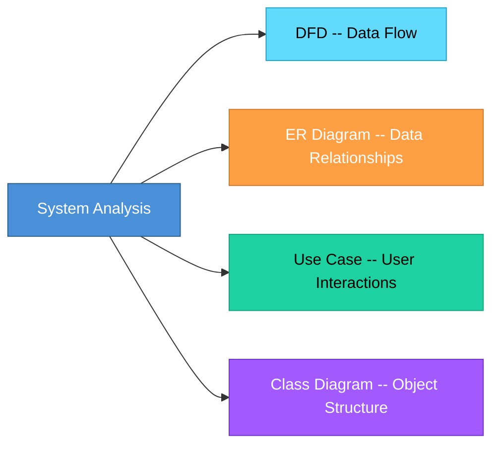
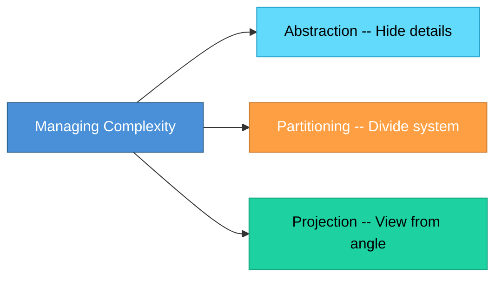

# Topic 10: Projection

[< Prev: Partitioning](topic-09.md) | [Index](index.md) | [Next: Systems Specification >](topic-11.md)

---

> If abstraction hides unnecessary details and partitioning divides the system, **projection** means looking at the system from a **specific viewpoint**.

> Projection is about focusing on **one perspective** of the system at a time.

---

## 1. What is Projection?

Projection is the technique of examining a system from a **particular angle or viewpoint** while ignoring other aspects.

> Instead of seeing the whole system at once, we analyze **one dimension**.

---

## 2. Simple Real-Life Example (Non-Technical)

### Think of a Hospital

Different people see it differently:

| Stakeholder | Their View |
|---|---|
| **Patient** | Doctors, Waiting time, Treatment |
| **Administrator** | Revenue, Staff performance, Resource allocation |
| **Government** | Compliance, Public health statistics |

> Same hospital, **different projections**.

---

## 3. Technical Example

### E-commerce System

| Perspective | Focus Areas |
|---|---|
| **User perspective** | Login, Browse products, Add to cart, Pay |
| **Developer perspective** | Authentication service, Product service, Cart microservice, Payment gateway integration |
| **Database perspective** | Tables, Relationships, Indexes |

> Each is a projection of the **same system**.

---

## 4. Why Projection is Important in Software Engineering

Large systems are too complex to analyze entirely at once.

Projection allows us to:

| Focus Area | What It Reveals |
|---|---|
| Data flow only | How information moves through the system |
| Control flow only | How decisions and sequencing work |
| User interaction only | How users experience the system |
| Performance only | Bottlenecks and optimization needs |

> Each projection **simplifies analysis**.

---

## 5. Projection in System Analysis Tools

Different modeling tools represent different projections:

| Tool / Diagram | Projection |
|---|---|
| **Data Flow Diagram (DFD)** | Shows flow of data |
| **ER Diagram** | Shows data relationships |
| **Use Case Diagram** | Shows user interactions |
| **Class Diagram** | Shows object structure |

> Each diagram is a **projection**.

---

## 6. Real Software Example

### College ERP

| Projection | Components |
|---|---|
| **Functional Projection** | Admission, Attendance, Exams, Fees |
| **Data Projection** | Student table, Course table, Enrollment relation |
| **Security Projection** | Roles, Permissions, Access rules |

> You analyze each **separately**.

---

## 7. Relationship with Abstraction and Partitioning

| Concept | What It Does |
|---|---|
| **Abstraction** | Hide unnecessary details |
| **Partitioning** | Divide into modules |
| **Projection** | View from specific perspective |

> All three are **thinking tools** to manage complexity.

---

## 8. Important Insight

> Good system design requires **multiple projections**.

| Scenario | Consequence |
|---|---|
| Only look at functionality, ignore data modeling | Database design may fail |
| Only look at features, ignore scalability | System crashes under load |

> Projection ensures **balanced design**.

---

[< Prev: Partitioning](topic-09.md) | [Index](index.md) | [Next: Systems Specification >](topic-11.md)