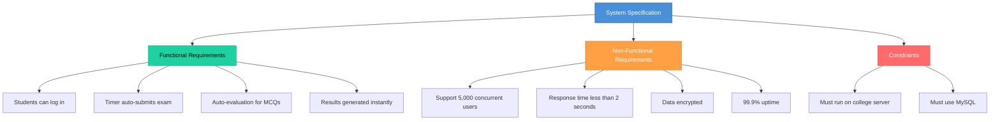
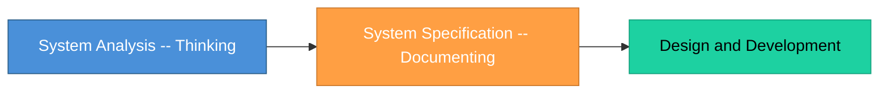

# Topic 11: Systems Specification

[< Prev: Projection](topic-10.md) | [Index](index.md) | [Next: Software Requirements Specification >](topic-12.md)

---

> After analyzing a system using abstraction, partitioning, and projection, we must **formally describe** what the system is supposed to do. That formal description is called **System Specification**.

---

## 1. What is Systems Specification?

System Specification is a detailed, structured description of:

- **What** the system should do
- **What constraints** it must follow
- **What performance level** is expected
- **How it interacts** with users and other systems

It defines the system clearly **before** design and coding begin.

> It answers: **"What exactly are we building?"**

---

## 2. Simple Real-Life Example (Non-Technical)

### School Bus Tracking System

| Approach | Actions |
|---|---|
| **Without specification** | You just build a tracking app |
| **With specification** | You define precise requirements |

**Specification details:**

| Requirement | Description |
|---|---|
| Parents can see live bus location | Real-time GPS tracking |
| Admin can assign buses to routes | Route management |
| Drivers must log in before starting trip | Authentication |
| System updates location every 10 seconds | Update frequency |
| Alerts sent if bus deviates from route | Deviation notification |
| Data stored for 30 days | Data retention |

> Now expectations are **clear**.

---

## 3. Technical Example (CS Perspective)

### Online Exam System

> Now the development team has **clear boundaries**.

---

## 4. What Does System Specification Contain?

| Section | Description |
|---|---|
| **Functional Requirements** | What system must do |
| **Non-Functional Requirements** | Performance, security, scalability |
| **Constraints** | Budget, platform, technology limitations |
| **Interfaces** | User interface, External system interfaces, APIs |
| **Data Requirements** | What data must be stored and processed |

---

## 5. Why Systems Specification is Important

Without it:

| Problem | Impact |
|---|---|
| Client-developer miscommunication | Wrong system built |
| Scope keeps changing | Feature creep |
| Features added without control | Budget increases |
| No clear agreement | Deadlines break |

> Specification creates **agreement** between client and developer. It acts like a **contract**.

---

## 6. Difference Between System Analysis and System Specification

| Aspect | System Analysis | System Specification |
|---|---|---|
| **Purpose** | Understand the problem | Write formal description of solution |
| **Activity** | Study existing system, identify needs | Document requirements precisely |
| **Nature** | Thinking | Documenting |

---

## 7. Real Industry Example

Large companies like banking institutions do **not** start coding immediately. They prepare:

| Document | Purpose |
|---|---|
| Requirement documents | Define what to build |
| Architecture documents | Define how to build |
| Compliance specifications | Meet regulatory standards |
| Security specifications | Protect data and systems |

> Only after approval does development begin.

---

## 8. Important Insight

> If system specification is weak, even the **best programmers** will **build the wrong system correctly**.

Good specification reduces:

| Factor |
|---|
| Risk |
| Rework |
| Conflict |
| Cost |

---

[< Prev: Projection](topic-10.md) | [Index](index.md) | [Next: Software Requirements Specification >](topic-12.md)