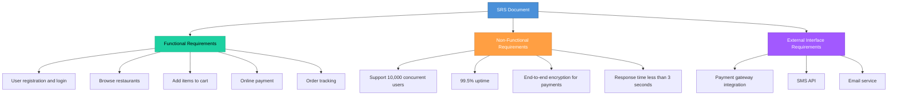

# Topic 12: Software Requirements Specification (SRS)

[< Prev: Systems Specification](topic-11.md) | [Index](index.md) | [Next: SRS Standards (IEEE Format) >](topic-13.md)

---

> Now we go deeper into one of the most important documents in Software Engineering. SRS is the **formal document** that describes what the software must do. It is more specific than general system specification.

---

## 1. What is SRS?

Software Requirements Specification (SRS) is a detailed document that describes:

- Functional requirements
- Non-functional requirements
- System constraints
- Interfaces
- Assumptions

> It acts as a **blueprint** for developers, testers, and stakeholders.

> It defines **"what"** the system should do -- **not "how"** to implement it.

---

## 2. Simple Real-Life Example (Non-Technical)

### College Student Attendance System

An SRS will clearly mention:

| Category | Requirement |
|---|---|
| **Functional** | Teacher can mark attendance |
| **Functional** | Student can view attendance percentage |
| **Functional** | Admin can generate monthly reports |
| **Non-functional** | System must respond within 2 seconds |
| **Non-functional** | Only authorized users can access |
| **Non-functional** | Data backup every 24 hours |

> Without SRS, developers may **misunderstand** expectations.

---

## 3. Technical Example (CS Perspective)

### Food Delivery App

> Now development becomes **structured**.

---

## 4. Characteristics of a Good SRS

A good SRS must be:

| Characteristic | Meaning |
|---|---|
| **Correct** | Accurately represents requirements |
| **Complete** | No missing requirements |
| **Consistent** | No contradictions |
| **Unambiguous** | Only one interpretation possible |
| **Verifiable** | Can be tested |
| **Traceable** | Each requirement can be tracked |
| **Modifiable** | Easy to update |

**Bad example:** "System should be fast"

**Good example:** "System should respond within 2 seconds under 1,000 concurrent users"

> The second is **measurable**.

---

## 5. Why SRS is Important

| Purpose |
|---|
| Acts as agreement between client and developer |
| Helps project estimation |
| Guides system design |
| Helps testing team write test cases |
| Prevents scope creep |

> Test cases are **directly derived** from SRS.

**Example:** If SRS says "Password must be minimum 8 characters" -- testing will verify that rule.

---

## 6. Real Industry Example

Large enterprise projects cannot start without:

- Requirement sign-off
- SRS approval
- Stakeholder agreement

> Without it, **legal disputes** may occur.

**Example:** If a banking app fails to include two-factor authentication and it was in SRS, the developer is responsible.

---

## 7. Important Insight

> SRS defines system behavior clearly **before** a single line of code is written.

| Stage | Cost of Change |
|---|---|
| During SRS | **Low** |
| After coding | **High** |

> Changing requirements **before** coding (during SRS stage) is cheap. Changing requirements **after** coding is expensive.

---

## 8. Relationship with System Specification

| Aspect | System Specification | SRS |
|---|---|---|
| **Level** | High-level description | Detailed, structured document |
| **Formality** | General | More formal and precise |
| **Scope** | Entire system | Software-specific |

---

[< Prev: Systems Specification](topic-11.md) | [Index](index.md) | [Next: SRS Standards (IEEE Format) >](topic-13.md)