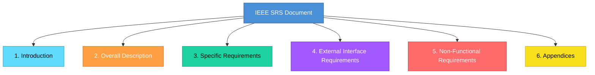

# Topic 13: SRS Standards (IEEE Format)

[< Prev: Software Requirements Specification](topic-12.md) | [Index](index.md) | [Next: Formal Specification Methods >](topic-14.md)

---

> Now that you understand what an SRS is, we discuss how it is **structured formally**. In professional environments, SRS follows standard formats. The most commonly referenced standard is the **IEEE SRS format**.

> Standardization ensures clarity, completeness, and uniform understanding across teams.

---

## 1. Why SRS Standards Are Needed

If every company writes SRS differently:

| Problem |
|---|
| Developers get confused |
| Requirements may be missing |
| Testing becomes inconsistent |
| Legal clarity is lost |

> A standard structure ensures **nothing important is skipped**.

---

## 2. IEEE SRS Standard Structure (Simplified)

---

## 3. Section 1: Introduction

This section includes:

| Component | Description |
|---|---|
| Purpose of the document | Why this SRS exists |
| Scope of the system | What the system covers |
| Definitions and abbreviations | Key terminology |
| References | Related documents |
| Overview of document structure | Guide for readers |

**Example:** For a Library Management System, this section explains who the document is for, what problem is being solved, and basic terminology like "Member", "Issue", "Return".

---

## 4. Section 2: Overall Description

This gives **high-level** system understanding.

| Component | Example (Online Exam System) |
|---|---|
| **Product perspective** | Standalone web application |
| **Product functions** | Major features summary |
| **User characteristics** | Students with low technical ability |
| **Constraints** | Must run on Chrome and Firefox |
| **Assumptions** | Users may have low internet speed |
| **Dependencies** | College authentication server |

---

## 5. Section 3: Specific Requirements

This is the **core** of SRS. Includes detailed:

| Type | Example |
|---|---|
| **Functional requirement** | "The system shall allow teachers to upload question papers" |
| **Non-functional requirement** | "The system shall support 5,000 concurrent users" |
| **Logical database requirements** | Entity definitions |
| **System behavior** | Different scenario responses |

> Each requirement should be **numbered** for traceability.

---

## 6. External Interface Requirements

Defines how the system interacts with:

| Interface Type | Example |
|---|---|
| **User interface** | Web dashboard, mobile app |
| **Hardware** | Barcode scanners, printers |
| **Other software** | Third-party APIs |
| **Communication** | Network protocols |

**Example:** "The system shall integrate with Razorpay API version X."

---

## 7. Non-Functional Requirements

| Category | Example |
|---|---|
| Performance | "Response time under 2 seconds" |
| Security | "All data encrypted at rest" |
| Reliability | "99% uptime" |
| Availability | "24/7 access" |
| Maintainability | "Modular code with documentation" |

---

## 8. Appendices

Includes:
- Supporting diagrams
- Data flow diagrams
- Glossary
- Future considerations

---

## 9. Real Industry Example

### College ERP

| Without structured SRS | With IEEE SRS |
|---|---|
| May forget role permissions | Systematically defined |
| May skip data backup frequency | Specified in non-functional section |
| May omit audit logging | Documented in specific requirements |

---

## 10. Important Insight

SRS standardization ensures:

| Benefit |
|---|
| Requirement completeness |
| Better estimation |
| Clear testing alignment |
| Reduced ambiguity |
| Legal clarity in contracts |

> In professional environments, requirement sign-off happens **only after SRS review**.

---

[< Prev: Software Requirements Specification](topic-12.md) | [Index](index.md) | [Next: Formal Specification Methods >](topic-14.md)