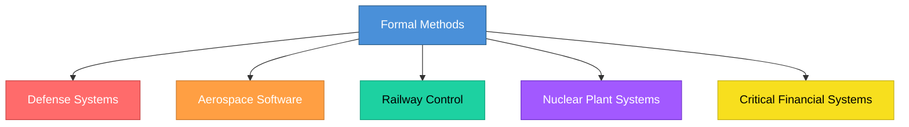

# Topic 14: Formal Specification Methods

[< Prev: SRS Standards (IEEE Format)](topic-13.md) | [Index](index.md) | [Next: Specification Tools >](topic-15.md)

---

> Until now, we discussed requirements in natural language (English sentences). The problem is: **natural language is ambiguous**. Formal Specification Methods solve this by describing system behavior using **mathematical models and logic**.

---

## 1. What is Formal Specification?

Formal specification is the process of describing system requirements using **mathematical notation** and **formal logic**.

Instead of writing:

> "The system should not allow negative balance"

You express it mathematically:

```
balance >= 0
```

> This **removes ambiguity**.

---

## 2. Why Formal Methods Are Needed

| Natural Language | Formal Specification |
|---|---|
| Ambiguous | Precise |
| Misinterpretation possible | Unambiguous |
| Incomplete descriptions | Complete definitions |
| Hard to verify | Verifiable mathematically |
| Suitable for general projects | Suitable for critical systems |

---

## 3. Simple Real-Life Example (Non-Technical)

### Railway Signal System

If requirement says: *"Train should not move when signal is red"*

This must be **precise**. Formal version:

```
IF signal_state = RED
THEN train_speed = 0
```

> There should be no interpretation confusion. **Because lives depend on it.**

---

## 4. Technical Example

### Banking Software Requirement

*"Withdrawal amount should not exceed balance."*

Formal expression:

```
FOR ALL withdrawal_amount:
    withdrawal_amount <= current_balance
```

> This **guarantees** rule clarity.

---

## 5. Where Formal Methods Are Used

| Domain | Reason |
|---|---|
| Defense systems | National security |
| Aerospace software | Flight safety |
| Railway control systems | Passenger safety |
| Nuclear plant systems | Catastrophic failure prevention |
| Critical financial systems | Financial integrity |

> Because **failure cost is extremely high**.



---

## 6. Common Formal Specification Languages

| Language | Description |
|---|---|
| **Z Notation** | Based on set theory and predicate logic |
| **VDM** (Vienna Development Method) | Used for modeling system states and operations |
| **B-Method** | Used in safety-critical systems |
| **Alloy** | Used for modeling and checking constraints |

> You do not need to memorize syntax deeply -- just understand **purpose**.

---

## 7. How Formal Specification Works

**Step 1:** Define system state

```
Account = {balance: integer}
```

**Step 2:** Define operations

```
Withdraw(amount)

Pre-condition:  amount <= balance
Post-condition: balance = balance - amount
```

> This defines behavior **mathematically**.

---

## 8. Advantages

| Advantage |
|---|
| Eliminates ambiguity |
| Allows mathematical verification |
| Detects logical errors early |
| High reliability |

---

## 9. Disadvantages

| Disadvantage |
|---|
| Requires mathematical expertise |
| Time-consuming |
| Expensive |
| Not suitable for small projects |

---

## 10. Important Insight

| System Type | Approach |
|---|---|
| Normal web apps | Natural language SRS is enough |
| Safety-critical systems | Formal specification is preferred |

> Formal methods **reduce risk** but **increase complexity and cost**.

---

[< Prev: SRS Standards (IEEE Format)](topic-13.md) | [Index](index.md) | [Next: Specification Tools >](topic-15.md)